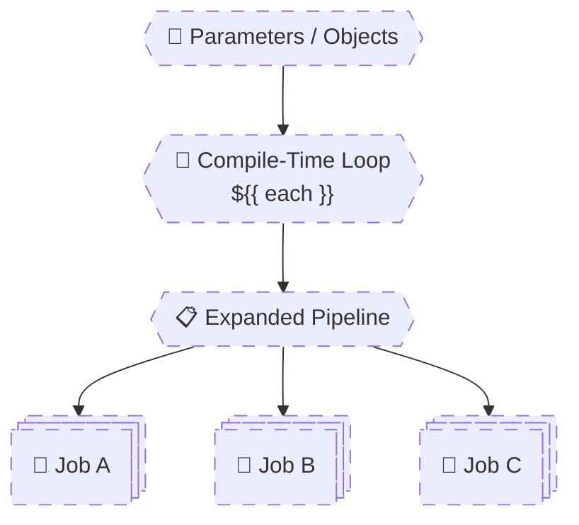

# 🧠 **Looping & Dynamic Control Flow**

## **Dynamic Pipelines with `each`, Objects & Fan-Out**

> Azure Pipelines does **not support runtime loops**.
> All looping is **compile-time only** and powered by **`${{ each }}`**.
> This means loops **generate pipeline structure**, not behavior.
> Senior engineers use loops to eliminate duplication and scale pipelines cleanly.

---


---

<div align="center" style="background-color: #2b3436ff; border-radius: 10px; border: 2px solid">



</div>

---

## 🔴 **Problem: Copy-Pasted Pipelines**

Junior pipelines look like this:

```yaml
jobs:
  - job: Build_API
  - job: Build_Web
  - job: Build_Worker
```

❌ Duplication  
❌ Error-prone  
❌ Hard to scale

---

## 🧠 **Golden Rule of Looping**

> **`each` loops run at compile-time and generate YAML.**
> They do not iterate at runtime.

If data isn’t known at compile-time → you **cannot loop over it**.

---

## 1️⃣ Basic `each` Loop (Step Level)

### 🧪 Example: Repeating Steps

```yaml
parameters:
  - name: messages
    type: object
    default:
      - Hello
      - World
      - Pipeline

steps:
  - ${{ each msg in parameters.messages }}:
      - script: echo ${{ msg }}
```

✔ Generates 3 steps  
✔ No runtime looping

---

## 2️⃣ Looping Over Jobs (Most Common Use Case)

### 🧱 Example: Dynamic Build Jobs

```yaml
parameters:
  - name: services
    type: object
    default:
      - api
      - web
      - worker

jobs:
  - ${{ each svc in parameters.services }}:
      - job: Build_${{ svc }}
        steps:
          - script: echo Building ${{ svc }}
```

✔ 3 jobs  
✔ Parallel execution  
✔ Zero duplication

---

## 3️⃣ Looping with Objects (Senior-Level Pattern)

### 🧩 Object Parameter

```yaml
parameters:
  - name: services
    type: object
    default:
      - name: api
        port: 8080
      - name: web
        port: 3000
```

---

### 🔁 Dynamic Jobs with Object Fields

```yaml
jobs:
  - ${{ each svc in parameters.services }}:
      - job: Build_${{ svc.name }}
        steps:
          - script: |
              echo Service=${{ svc.name }}
              echo Port=${{ svc.port }}
```

✔ Strongly structured  
✔ Readable  
✔ Scales cleanly

---

## 4️⃣ Conditional Logic Inside Loops (Very Powerful)

### 🧪 Example: Conditional Step per Service

```yaml
steps:
  - ${{ each svc in parameters.services }}:
      - script: echo Common step for ${{ svc.name }}
      - ${{ if eq(svc.name, 'api') }}:
          - script: echo API-only step
```

✔ Logic applied per item
✔ Clean branching

---

## 5️⃣ Fan-Out → Fan-In Pattern (Production Critical)

### 🧠 Pattern Explanation

- Fan-out: run many jobs in parallel
- Fan-in: one job depends on all

---

### 🏗️ Fan-Out Build Jobs

```yaml
jobs:
  - ${{ each svc in parameters.services }}:
      - job: Build_${{ svc.name }}
        steps:
          - script: echo Building ${{ svc.name }}
```

---

### 🔗 Fan-In Job

```yaml
- job: Aggregate
  dependsOn:
    - ${{ each svc in parameters.services }}:
        - Build_${{ svc.name }}
  steps:
    - script: echo All builds completed
```

✔ Parallel builds  
✔ Controlled convergence

---

## 6️⃣ Looping Across Stages (Advanced)

### 🧪 Dynamic Environments

```yaml
parameters:
  - name: environments
    type: object
    default:
      - dev
      - test
      - prod
```

---

### 🏗️ Dynamic Stages

```yaml
stages:
  - ${{ each env in parameters.environments }}:
      - stage: Deploy_${{ env }}
        jobs:
          - job: Deploy
            steps:
              - script: echo Deploying to ${{ env }}
```

✔ Fully dynamic CD  
✔ No duplication

---

## 7️⃣ Broken Loop Examples (Learn These)

### ❌ Trying to Loop Over Runtime Data

```yaml
- ${{ each x in variables.list }}:
```

❌ Variables don’t exist at compile-time

---

### ❌ Trying to Loop Inside Script

```yaml
- script: |
    for i in $(services); do ...
```

❌ Pipeline loop ≠ shell loop

---

### ✅ Correct Fix

Use **parameters** or **template objects**.

---

## 8️⃣ Combining `each` + Templates (Enterprise Pattern)

---

### 📄 `job-template.yml`

```yaml
parameters:
  - name: name
    type: string

jobs:
  - job: Build_${{ parameters.name }}
    steps:
      - script: echo Building ${{ parameters.name }}
```

---

### 📄 Main Pipeline

```yaml
jobs:
  - ${{ each svc in parameters.services }}:
      - template: job-template.yml
        parameters:
          name: ${{ svc.name }}
```

✔ Maximum reuse  
✔ Clean structure  
✔ Platform-team friendly

---

## 🧠 Expression Evaluation Reminder (Very Important)

Inside `each`:

- Use `${{ }}` only
- `$()` will not work
- No runtime access

---

## 🧠 Memorization Tips

### 🔑 Mnemonic: **"LEGO"**

| Letter | Meaning              |
| ------ | -------------------- |
| **L**  | Loop at compile-time |
| **E**  | Each generates YAML  |
| **G**  | Grows structure      |
| **O**  | Objects scale best   |

---

## ❌ Top Looping Mistakes

| Mistake                    | Why             |
| -------------------------- | --------------- |
| Looping over variables     | Too late        |
| Looping over outputs       | Impossible      |
| Mixing `$()` inside `each` | Wrong phase     |
| Over-nesting loops         | Unreadable YAML |
