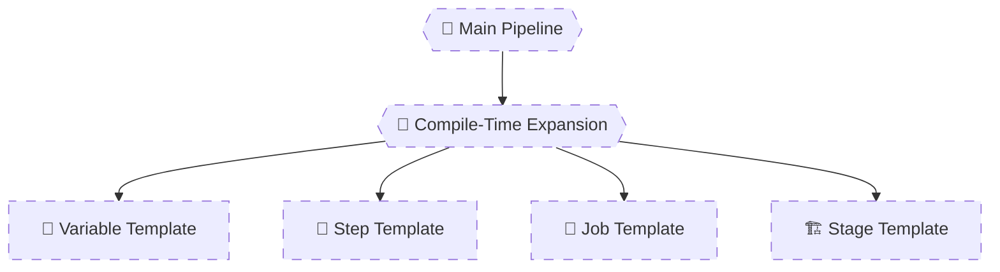

# 🧠 **Templates & Modularization**

## **Template Types – Building Reusable Pipelines**

> Templates are **compile-time YAML macros**.  
> They are expanded by the **Pipeline Service**, not executed by agents.  
> Senior engineers use templates to enforce **consistency**, **governance**, and **scale** across dozens or hundreds of pipelines.

---


---

<div align="center" style="background-color: #2b3436ff; border-radius: 10px; border: 2px solid">



</div>

---

## 🔴 **Problem: Copy-Paste Pipelines**

Typical junior pipeline:

```yaml
steps:
  - task: DotNetCoreCLI@2
  - task: DotNetCoreCLI@2
  - task: PublishBuildArtifacts@1
```

Copied into:

- 10 repos
- With tiny differences
- Impossible to maintain

❌ Duplication  
❌ Inconsistent behavior  
❌ Platform chaos

---

## 🧠 **Golden Rule of Templates**

> Templates define **structure**, not runtime behavior.  
> They are expanded using **`${{ }}` only**.

No `$()`  
No runtime variables  
No `##vso` logic inside templates

---

## 1️⃣ Step Templates (Smallest Unit)

### 🧩 When to Use

- Repeating **steps**
- Common build/test sequences
- Simple reuse

---

### 📄 `steps-build.yml`

```yaml
steps:
  - script: echo Restoring packages
  - script: echo Building project
  - script: echo Running tests
```

---

### 📄 Main Pipeline

```yaml
steps:
  - template: steps-build.yml
```

✔ Simple  
✔ Clean  
✔ Compile-time inclusion

---

### 🔥 Step Template with Parameters

```yaml
# steps-build.yml
parameters:
  - name: configuration
    type: string
    default: Release

steps:
  - script: echo Building in ${{ parameters.configuration }}
```

Usage:

```yaml
steps:
  - template: steps-build.yml
    parameters:
      configuration: Debug
```

---

## 2️⃣ Variable Templates (Configuration Layer)

> Variable templates define **defaults and shared config**, not secrets.

---

### 📄 `variables-common.yml`

```yaml
variables:
  buildConfig: Release
  timeout: 60
```

---

### 📄 Pipeline Usage

```yaml
variables:
  - template: variables-common.yml
```

Override locally:

```yaml
variables:
  - template: variables-common.yml
  - name: timeout
    value: 120
```

✔ Central defaults  
✔ Local overrides  
✔ Predictable precedence

---

## 3️⃣ Job Templates (Most Used in Real Life)

### 🧱 When to Use

- Standardized build jobs
- Shared agent configuration
- Repeatable CI logic

---

### 📄 `job-build.yml`

```yaml
parameters:
  - name: jobName
    type: string
  - name: vmImage
    type: string

jobs:
  - job: ${{ parameters.jobName }}
    pool:
      vmImage: ${{ parameters.vmImage }}
    steps:
      - script: echo Building on ${{ parameters.vmImage }}
```

---

### 📄 Main Pipeline

```yaml
jobs:
  - template: job-build.yml
    parameters:
      jobName: Build_Linux
      vmImage: ubuntu-latest

  - template: job-build.yml
    parameters:
      jobName: Build_Windows
      vmImage: windows-latest
```

✔ Zero duplication  
✔ Parallel jobs  
✔ Clean abstraction

---

## 4️⃣ Stage Templates (Enterprise Standard)

> Stage templates define **full CI or CD phases**.

---

### 🏗️ When to Use

- CI stage reused across repos
- CD stage reused across environments
- Governance and approvals

---

### 📄 `stage-deploy.yml`

```yaml
parameters:
  - name: environment
    type: string

stages:
  - stage: Deploy_${{ parameters.environment }}
    jobs:
      - job: Deploy
        steps:
          - script: echo Deploying to ${{ parameters.environment }}
```

---

### 📄 Main Pipeline

```yaml
stages:
  - template: stage-deploy.yml
    parameters:
      environment: dev

  - template: stage-deploy.yml
    parameters:
      environment: prod
```

✔ Consistent deployments  
✔ Environment clarity  
✔ Reusable CD logic

---

## 5️⃣ Broken Template Patterns (Learn These)

### ❌ Using Runtime Variables in Templates

```yaml
# template.yml
- script: echo $(env)
```

❌ Templates are expanded before runtime

---

### ✅ Correct Fix

Pass values via parameters:

```yaml
parameters:
  - name: env
    type: string
```

---

### ❌ Using `$()` in Template Conditions

```yaml
${{ if eq($(env), 'prod') }}:
```

❌ Wrong phase

---

### ✅ Correct

```yaml
${{ if eq(parameters.env, 'prod') }}:
```

---

## 6️⃣ Combining Templates + Loops (Platform-Level Pattern)

### 📄 `job-template.yml`

```yaml
parameters:
  - name: name
    type: string

jobs:
  - job: Build_${{ parameters.name }}
    steps:
      - script: echo Building ${{ parameters.name }}
```

---

### 📄 Main Pipeline

```yaml
parameters:
  - name: services
    type: object
    default: [api, web, worker]

jobs:
  - ${{ each svc in parameters.services }}:
      - template: job-template.yml
        parameters:
          name: ${{ svc }}
```

✔ Dynamic pipelines  
✔ Central logic  
✔ Massive scale

---

## 🧠 **Template Type Comparison (Quick Reference)**

| Template Type | Scope      | Use Case        |
| ------------- | ---------- | --------------- |
| Step          | Steps only | Small reuse     |
| Variable      | Variables  | Defaults/config |
| Job           | Jobs       | CI logic        |
| Stage         | Stages     | CI/CD phases    |

---

## 🧠 Memorization Tips

### 🔑 Mnemonic: **"SVJS"**

| Letter | Meaning            |
| ------ | ------------------ |
| **S**  | Step templates     |
| **V**  | Variable templates |
| **J**  | Job templates      |
| **S**  | Stage templates    |

---

## ❌ Common Modularization Mistakes

| Mistake                    | Why            |
| -------------------------- | -------------- |
| One giant template         | Unmaintainable |
| Runtime logic in templates | Wrong phase    |
| No parameters              | Rigid design   |
| Hard-coded agent info      | No reuse       |
