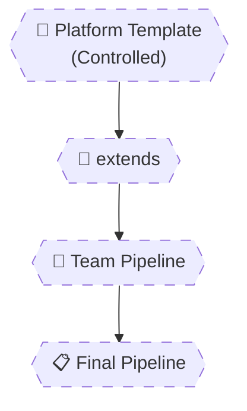

# 🧠 **Template Composition & Contracts**

## **`extends`, Template Inheritance & Versioning (Enterprise Design)**

> Template composition is about **control and governance**.  
> Senior engineers do **not** let teams assemble pipelines freely.  
> Instead, they provide **safe extension points**, **strict contracts**, and **versioned templates** that evolve without breaking consumers.

---


---

<div align="center" style="background-color: #2b3436ff; border-radius: 10px; border: 2px solid">



</div>

---

## 🔴 **Problem: Teams Assembling Pipelines Freely**

Typical junior design:

```yaml
steps:
  - task: TerraformCLI@0
  - script: rm -rf /
```

- ❌ No governance
- ❌ No standards
- ❌ Security risk
- ❌ Impossible to audit

---

## 🧠 **Two Ways to Use Templates**

Azure Pipelines gives you **two fundamentally different mechanisms**:

| Mechanism   | Purpose          | Control Level |
| ----------- | ---------------- | ------------- |
| `template:` | Include YAML     | Low           |
| `extends:`  | Inherit pipeline | **High**      |

This difference is **architectural**, not cosmetic.

---

## 1️⃣ `template:` — Composition (Loose Control)

### 🧩 What It Does

- Injects YAML at a specific point
- Caller controls structure
- Template is **optional**

---

### 🧪 Example: Job Template Inclusion

```yaml
jobs:
  - template: job-build.yml
    parameters:
      name: api
```

✔ Flexible  
✔ Composable  
✕ No enforcement

---

### ❌ Why This Is Not Enough for Platforms

Teams can still:

- Add unsafe steps
- Bypass security
- Skip scans
- Change order

This is **not governance**.

---

## 2️⃣ `extends:` — Inheritance (Strong Control)

> `extends` allows a pipeline to **inherit from a base template**.
> The base template **owns the structure**.
> The consumer only provides **inputs**.

This is the **platform-team weapon**.

---

### 🏗️ Base Platform Template

📄 `base-pipeline.yml`

```yaml
parameters:
  - name: appName
    type: string
  - name: runSecurityScan
    type: boolean
    default: true

stages:
  - stage: Build
    jobs:
      - job: Build
        steps:
          - script: echo Building ${{ parameters.appName }}

  - ${{ if eq(parameters.runSecurityScan, true) }}:
      - stage: Security
        jobs:
          - job: Scan
            steps:
              - script: echo Running security scan

  - stage: Deploy
    jobs:
      - job: Deploy
        steps:
          - script: echo Deploying ${{ parameters.appName }}
```

---

### 📄 Team Pipeline (Consumer)

```yaml
extends:
  template: base-pipeline.yml
  parameters:
    appName: payment-api
```

✔ Team cannot remove security  
✔ Team cannot change structure  
✔ Only safe inputs allowed

---

## 🔥 **Key Rule (Memorize This)**

> **If you want governance → use `extends`.** > **If you want reuse → use `template`.**

---

## 3️⃣ Parameter Inheritance & Flow (Very Important)

### 🧠 How Parameters Flow with `extends`

```ini
Team Pipeline → Base Template → Nested Templates
```

All parameters are:

- Compile-time
- Immutable
- Explicit

---

### 🧪 Passing Parameters Down

📄 `base-pipeline.yml`

```yaml
parameters:
  - name: appName
    type: string

stages:
  - stage: Build
    jobs:
      - template: job-build.yml
        parameters:
          name: ${{ parameters.appName }}
```

📄 `job-build.yml`

```yaml
parameters:
  - name: name
    type: string

jobs:
  - job: Build_${{ parameters.name }}
```

✔ Clean flow  
✔ Explicit contracts  
✔ No magic

---

## 4️⃣ Template Contracts (Critical Concept)

> A **template contract** is the **public API** of your pipeline.

If you break it → **you break every consumer**.

---

### 🧩 Good Contract Example

```yaml
parameters:
  - name: appName
    type: string
  - name: environment
    type: string
    values: [dev, test, prod]
```

✔ Strong typing  
✔ Validation  
✔ Safe inputs

---

### ❌ Bad Contract Example

```yaml
parameters:
  - name: config
    type: object
```

❌ No validation  
❌ Easy to misuse  
❌ Hard to debug

---

### 🧠 Contract Design Rules (Senior-Level)

1. Prefer **primitive types**
2. Restrict `values`
3. Provide defaults
4. Document intent
5. Never rely on implicit behavior

---

## 5️⃣ Template Versioning Strategies (Enterprise Critical)

### ❌ Naive Strategy (Very Common Mistake)

```yaml
template: templates/base-pipeline.yml
```

❌ Any change breaks everyone  
❌ No rollback  
❌ No safety

---

## ✅ Strategy 1: Repo-Level Versioning (Best Practice)

```ini
templates/
 ├─ v1/
 │   └─ base-pipeline.yml
 ├─ v2/
 │   └─ base-pipeline.yml
```

Usage:

```yaml
extends:
  template: templates/v1/base-pipeline.yml
```

✔ Safe upgrades  
✔ Parallel versions  
✔ Predictable behavior

---

## ✅ Strategy 2: Branch-Based Versioning

```yaml
resources:
  repositories:
    - repository: templates
      type: git
      name: DevOps/PipelineTemplates
      ref: refs/heads/v1
```

✔ Central platform repo  
✔ Controlled releases

---

## ❌ Strategy to Avoid: “Latest”

```yaml
ref: refs/heads/main
```

❌ Silent breaking changes  
❌ Production outages

---

## 6️⃣ Real Platform Pattern (How Big Companies Do It)

---

### 🏢 Platform Team Owns:

- Base pipeline (`extends`)
- Security stages
- Compliance rules
- Versioning

---

### 👥 Product Teams Own:

- Parameters
- App-specific values
- No structure

---

### 🧠 Result

✔ Central governance  
✔ Team autonomy  
✔ Safe evolution  
✔ Zero copy-paste

---

## 🧠 Mental Model (Lock This In)

```ini
template  = include
extends   = inherit
parameters = contract
versions  = safety
```

---

## 🧠 Memorization Tips

### 🔑 Mnemonic: **"E-C-V-G"**

| Letter | Meaning                 |
| ------ | ----------------------- |
| **E**  | extends for enforcement |
| **C**  | Contracts define inputs |
| **V**  | Version templates       |
| **G**  | Governance at scale     |

---

## ❌ Common Template Composition Mistakes

| Mistake                         | Why              |
| ------------------------------- | ---------------- |
| Using `template` for governance | No control       |
| No versioning                   | Breaking changes |
| Weak contracts                  | Runtime failures |
| Overusing objects               | Hard to debug    |
| Letting teams change structure  | Chaos            |
