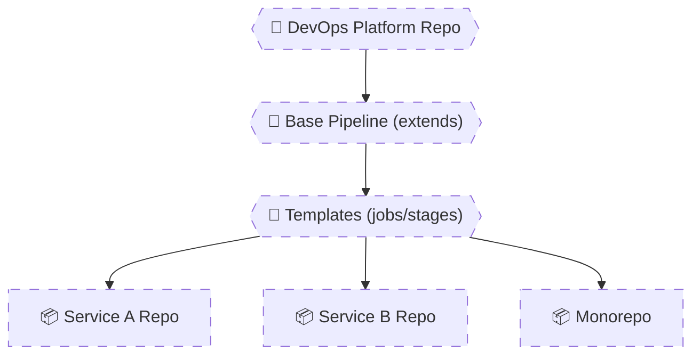

# 🧠 **Real-World Template Patterns**

## **How Azure Pipelines Are Built in Production**

> Real pipelines are **not written per repo**.
> They are **assembled from platform templates**, versioned, governed, and reused.
> The difference between a _working pipeline_ and a _scalable DevOps platform_ is **architecture**, not YAML syntax.

---


---

<div align="center" style="background-color: #2b3436ff; border-radius: 10px; border: 2px solid">



</div>

---

## 1️⃣ **Microservice Pipeline Pattern** (Most Common)

### 🧠 Problem

- 20–200 microservices
- Same CI logic
- Same security rules
- Same deployment flow

❌ Copy-paste pipelines = chaos

---

### 🏗️ Platform Template (Owned by DevOps Team)

📄 `base-microservice-pipeline.yml`

```yaml
parameters:
  - name: serviceName
    type: string
  - name: dockerImage
    type: string
  - name: deploy
    type: boolean
    default: true

stages:
  - stage: Build
    jobs:
      - job: Build
        steps:
          - script: echo Building ${{ parameters.serviceName }}

  - stage: Test
    jobs:
      - job: Test
        steps:
          - script: echo Running tests

  - ${{ if eq(parameters.deploy, true) }}:
      - stage: Deploy
        jobs:
          - job: Deploy
            steps:
              - script: echo Deploying ${{ parameters.dockerImage }}
```

---

### 📄 Service Repo Pipeline (Tiny & Safe)

```yaml
extends:
  template: templates/v1/base-microservice-pipeline.yml
  parameters:
    serviceName: orders-api
    dockerImage: orders-api:latest
```

✔ No duplication  
✔ Platform rules enforced  
✔ Easy onboarding

---

### ❌ Anti-Pattern

Each service defines its own:

- Build steps
- Security logic
- Deployment order

Result: **inconsistent releases**

---

## 2️⃣ **Monorepo Pipeline Pattern** (Advanced but Powerful)

### 🧠 Problem

One repo contains:

- `/services/api`
- `/services/web`
- `/libs/common`

You must:

- Build only what changed
- Deploy independently

---

### 🧱 Parameterized Job Template

📄 `job-build-service.yml`

```yaml
parameters:
  - name: name
    type: string
  - name: path
    type: string

jobs:
  - job: Build_${{ parameters.name }}
    steps:
      - script: |
          echo Building ${{ parameters.name }}
          echo Path: ${{ parameters.path }}
```

---

### 📄 Monorepo Pipeline

```yaml
parameters:
  - name: services
    type: object
    default:
      - name: api
        path: services/api
      - name: web
        path: services/web

jobs:
  - ${{ each svc in parameters.services }}:
      - template: job-build-service.yml
        parameters:
          name: ${{ svc.name }}
          path: ${{ svc.path }}
```

✔ Single pipeline  
✔ Multiple independent builds  
✔ Scales cleanly

---

### 🔥 Advanced Add-On (Path Filters)

```yaml
trigger:
  paths:
    include:
      - services/api/*
```

✔ Only relevant jobs run  
✔ Faster pipelines

---

## 3️⃣ **Multi-Environment Template Pattern** (Enterprise CD)

### 🧠 Problem

Deploy same app to:

- Dev
- Test
- Prod

But with:

- Different approvals
- Different variable groups
- Different protections

---

### 🏗️ Environment Stage Template

📄 `stage-deploy-env.yml`

```yaml
parameters:
  - name: env
    type: string

stages:
  - stage: Deploy_${{ parameters.env }}
    variables:
      - group: ${{ parameters.env }}-vars
    jobs:
      - deployment: Deploy
        environment: ${{ parameters.env }}
        strategy:
          runOnce:
            deploy:
              steps:
                - script: echo Deploying to ${{ parameters.env }}
```

---

### 📄 Main Pipeline

```yaml
stages:
  - template: stage-deploy-env.yml
    parameters:
      env: dev

  - template: stage-deploy-env.yml
    parameters:
      env: test

  - template: stage-deploy-env.yml
    parameters:
      env: prod
```

✔ Same logic  
✔ Different controls  
✔ Approval-ready

---

### 🔒 Production Safety

Azure DevOps Environments enforce:

- Approvals
- RBAC
- Deployment history

Templates + Environments = **safe CD**

---

## 4️⃣ **Shared DevOps Platform Repository** (Architect-Level)

### 🧠 Problem

Templates scattered across repos:

- Hard to version
- Hard to govern
- Hard to audit

---

### 🏢 Solution: Dedicated Platform Repo

```ini
devops-platform/
├─ templates/
│  ├─ v1/
│  │  ├─ base-pipeline.yml
│  │  ├─ job-build.yml
│  │  └─ stage-deploy.yml
│  └─ v2/
│     └─ base-pipeline.yml
├─ docs/
│  └─ usage.md
```

---

### 📄 Consuming Platform Templates

```yaml
resources:
  repositories:
    - repository: platform
      type: git
      name: DevOps/devops-platform
      ref: refs/heads/v1

extends:
  template: templates/base-pipeline.yml@platform
  parameters:
    serviceName: billing-api
```

✔ Central ownership
✔ Versioned rollout
✔ Safe upgrades

---

## 🧠 **Pattern Comparison (Quick Reference)**

| Pattern       | When to Use             |
| ------------- | ----------------------- |
| Microservice  | Many repos, same rules  |
| Monorepo      | Many services, one repo |
| Multi-env     | Dev/Test/Prod promotion |
| Platform repo | Org-wide governance     |

---

## ❌ **Real-World Anti-Patterns**

| Anti-Pattern            | Why It Fails     |
| ----------------------- | ---------------- |
| Copy-paste YAML         | Unmaintainable   |
| No versioning           | Breaking changes |
| Teams control structure | Security risk    |
| One pipeline per env    | Duplication      |
| Secrets in templates    | Breach risk      |

---

## 🧠 **Memorization Tips**

### 🔑 Mnemonic: **"M-M-E-P"**

| Letter | Meaning       |
| ------ | ------------- |
| **M**  | Microservices |
| **M**  | Monorepos     |
| **E**  | Environments  |
| **P**  | Platform repo |
