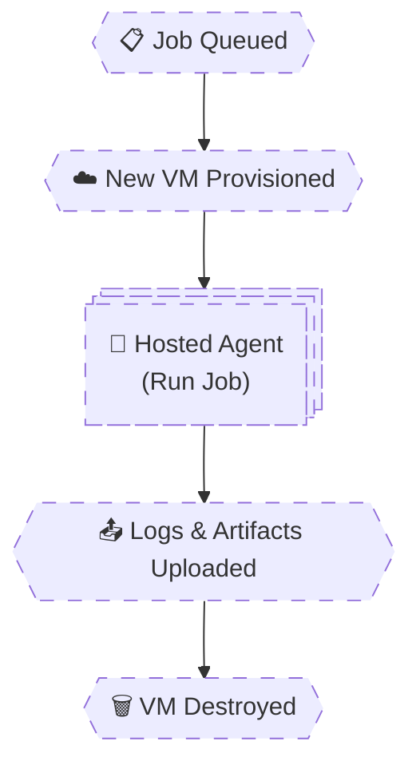

# 🧠 **Agents & Execution Infrastructure**

## **Microsoft-Hosted Agents (How Your Pipeline _Actually_ Runs)**

> Microsoft-hosted agents are **ephemeral virtual machines** provisioned **per job**, fully managed by Microsoft.
> Every job gets a **fresh machine**, executes, uploads results, and is **destroyed**.
> They optimize **simplicity and isolation**, not persistence or speed.

---


---

<div align="center" style="background-color: #2b3436ff; border-radius: 10px; border: 2px solid">



</div>

---

## 🔴 **Problem: “Why Is My Pipeline Slow / Forgetting Stuff?”**

This question almost always comes from **not understanding hosted agents**.

Common wrong assumptions:

- Agents remember previous jobs
- Tools stay installed
- Files persist
- Builds get faster over time

❌ None of this is true.

---

## 1️⃣ Microsoft-Hosted Agent Pools (What You Really Get)

### 🧠 What Is a Hosted Pool?

A **Microsoft-hosted pool** is:

- A managed pool of **on-demand VMs**
- Created **per job**
- Shared across tenants
- Isolated per execution

You **do not see** the machines.
You **do not manage** them.
You **do not keep** them.

---

### 🧪 Basic Usage Example

```yaml
pool:
  vmImage: ubuntu-latest
```

This means:

- “Give me **any fresh Ubuntu VM** with the `latest` image”
- Not a specific machine
- Not the same one next time

---

### Common Hosted Images

| Image            | OS      |
| ---------------- | ------- |
| `ubuntu-latest`  | Linux   |
| `windows-latest` | Windows |
| `macos-latest`   | macOS   |

Each maps to a **specific VM image version** behind the scenes.

---

## 2️⃣ Image Versions (Hidden but Critical)

### 🧠 Important Truth

> `ubuntu-latest` is **not a fixed OS**.

It is an **alias** that Microsoft updates over time.

---

### 🧪 Example Problem

Your pipeline worked yesterday:

```yaml
pool:
  vmImage: ubuntu-latest
```

Today it fails:

- Node version changed
- Python upgraded
- Java removed/updated

❌ Pipeline breaks without YAML changes

---

### ✅ Safer Pattern (Pin Image)

```yaml
pool:
  vmImage: ubuntu-22.04
```

✔ Predictable
✔ Stable
✔ Reproducible

---

### 🧠 Senior Rule

- **Learning / demos** → `*-latest`
- **Production CI/CD** → pin image version

---

## 3️⃣ Preinstalled Tools (What You Can Assume)

Microsoft-hosted agents come with **many tools preinstalled**:

- Git
- Docker
- .NET SDKs
- Java
- Node
- Python
- Azure CLI

But…

> **Tool versions can change at any time**.

---

### 🧪 Example: Checking Tool Versions

```yaml
steps:
  - script: |
      node --version
      python --version
      dotnet --version
```

You may see different outputs **between runs**.

---

### ❌ Dangerous Assumption

```yaml
- script: dotnet build
```

Assuming:

- Correct SDK version exists

---

### ✅ Safe Pattern

```yaml
- task: UseDotNet@2
  inputs:
    version: "8.0.x"
```

✔ Explicit
✔ Predictable
✔ Reproducible

---

## 4️⃣ Tool Caching (Why Builds Feel Slow)

### 🧠 Key Reality

> Hosted agents start **empty** (from your perspective).

Even though tools are installed:

- NuGet cache → empty
- npm cache → empty
- pip cache → empty
- Maven cache → empty

Because:

- New VM
- New disk
- Every job

---

### 🧪 Example: Slow First Build

```yaml
- task: DotNetCoreCLI@2
  inputs:
    command: restore
```

This restores **everything** every time.

---

### ✅ Fix: Pipeline Caching

```yaml
- task: Cache@2
  inputs:
    key: 'nuget | "$(Agent.OS)" | **/*.csproj'
    path: ~/.nuget/packages
```

✔ Cache survives across jobs
✔ Huge speedup
✔ Essential for hosted agents

---

### 🧠 Senior Rule

> **If you use hosted agents and don’t use caching, your pipeline is inefficient by design.**

---

## 5️⃣ Cold Start Behavior (The Hidden Cost)

### 🧠 What Is Cold Start?

Cold start includes:

1. VM provisioning
2. OS boot
3. Agent registration
4. Tool initialization

This happens **before your first step runs**.

---

### 🧪 What You See in Logs

```ini
Starting: Initialize job
Downloading task...
```

This is **not your code** — it’s infrastructure startup.

---

### Cold Start Characteristics

| Aspect     | Behavior   |
| ---------- | ---------- |
| Time       | 30s – 2min |
| Frequency  | Every job  |
| Control    | None       |
| Visibility | Minimal    |

---

### ❌ Common Misinterpretation

> “My pipeline script is slow”

Often false.

The time is spent **before your script starts**.

---

### ✅ Senior Optimization Strategy

- Fewer jobs (when possible)
- Use parallelism wisely
- Cache aggressively
- Avoid unnecessary stages

---

## 6️⃣ Real Example: Why This Pipeline Is Slow

```yaml
jobs:
  - job: Build
  - job: Test
  - job: Lint
```

Each job:

- New VM
- New cold start
- New tool downloads

---

### 🧠 Optimization Insight

If jobs share context and don’t need isolation:

- Combine them into one job
- Use steps instead

---

## 7️⃣ Hosted Agents: Strengths vs Limits

### ✅ Strengths

✔ Zero maintenance
✔ Secure isolation
✔ Easy onboarding
✔ Works everywhere

---

### ❌ Limitations

✖ Cold starts
✖ No persistent disk
✖ No private network access
✖ Limited customization
✖ Costly at scale

---

## 🧠 Mental Model (Lock This In)

```ini
Hosted Agent =
Disposable VM
Per Job
Zero Memory
Zero State
```

Or even simpler:

> **“Every job starts from nothing.”**

---

## 🧠 Memorization Tips

### 🔑 Mnemonic: **"D-I-C-C"**

| Letter | Meaning        |
| ------ | -------------- |
| **D**  | Disposable     |
| **I**  | Image-based    |
| **C**  | Cold start     |
| **C**  | Cache required |

---

## ❌ Top Hosted Agent Mistakes

| Mistake                     | Why It Hurts         |
| --------------------------- | -------------------- |
| Assuming persistence        | State lost           |
| Using `*-latest` blindly    | Breaking changes     |
| No caching                  | Slow builds          |
| Too many jobs               | Cold start explosion |
| Installing tools every time | Wasteful             |
