```mermaid
graph TD
    A@{ shape: hex, label: "🧠 Azure Pipelines Service" }
    B@{ shape: hex, label: "📡 Agent Listener" }
    C@{ shape: processes, label: "🤖 Self-Hosted Agent" }
    D@{ shape: processes, label: "🖥️ VM / Server / Container" }
    E@{ shape: rect, label: "⚙️ Tools, Files, Network" }

    A --> B
    B --> C
    C --> D
    D --> E

    classDef animate stroke-dasharray: 9,5,stroke-dashoffset: 700,animation: dash 22s linear infinite;
    class A,B,C,D,E animate
```

# 🧠 **Self-Hosted Agents – Deep Dive**

## **Agent Architecture, Security, Scaling & Pitfalls**

> A self-hosted agent is **your machine**, running **Microsoft’s agent software**, executing **pipeline jobs under your responsibility**.
> Azure DevOps controls **what** runs.
> You control **where**, **how**, and **with what privileges** it runs.

---


---

<div align="center" style="background-color: #2b3436ff; border-radius: 10px; border: 2px solid">



</div>

---

## 🔴 **Problem: “Hosted Agents Are Too Slow / Limited”**

Typical reasons teams move to self-hosted agents:

- Terraform plans take too long
- Docker builds are slow
- Builds need private network access
- Tools must be preinstalled
- Compliance forbids shared infrastructure

This is **exactly when self-hosted agents are correct**.

---

## 1️⃣ Self-Hosted Agent Architecture (What Actually Runs)

### 🧠 What Is a Self-Hosted Agent?

It consists of:

1. **A machine** (VM, bare metal, container)
2. **Azure Pipelines Agent software**
3. **An agent pool registration**

Once registered:

- Agent **polls Azure DevOps**
- Receives jobs
- Executes them locally

---

### 🧪 Installation Reality

On the machine:

```bash
./config.sh
./run.sh
```

The agent:

- Opens an **outbound HTTPS connection**
- No inbound ports required
- Long-polling for jobs

✔ Firewall-friendly  
✔ Secure by default

---

### 🔑 Key Architectural Rule

> **Azure DevOps never connects _into_ your machine.**
> The agent connects _out_.

This is why self-hosted agents work even behind:

- Firewalls
- NAT
- Corporate networks

---

## 2️⃣ Security Boundaries (EXTREMELY IMPORTANT)

### 🧨 Truth Most Teams Learn the Hard Way

> **A self-hosted agent executes pipeline code with the permissions of the machine.**

This has massive implications.

---

### ❌ Dangerous Setup (Common Mistake)

- Agent runs as **root / Administrator**
- Pipeline runs arbitrary scripts
- Any repo contributor can:

  - Delete files
  - Read secrets
  - Exfiltrate data

This is a **supply-chain vulnerability**.

---

### ✅ Secure Agent Design (Senior Pattern)

| Layer       | Best Practice                   |
| ----------- | ------------------------------- |
| OS user     | Dedicated low-privilege user    |
| Agent pool  | Restricted to trusted pipelines |
| Repo access | Protected branches              |
| Secrets     | Key Vault, not files            |
| Network     | Scoped access                   |

---

### 🧪 Example: Least Privilege Agent

- Linux user: `azagent`
- No sudo
- Access only to required folders
- Network access limited via NSGs

✔ Safer  
✔ Auditable  
✔ Compliant

---

## 3️⃣ Agent Pools & Trust Boundaries

### 🧠 Critical Design Rule

> **Agent pools are trust boundaries.**

Never mix:

- Prod deployments
- Dev builds
- Untrusted repos

---

### ❌ Bad Design

```ini
Agent Pool: Default
Used by:
- All pipelines
- All repos
- All environments
```

❌ One compromised pipeline = full access

---

### ✅ Correct Design

```ini
Agent Pools:
- build-linux
- build-windows
- deploy-prod
- deploy-nonprod
```

Each pool:

- Has limited permissions
- Serves a specific purpose

---

## 4️⃣ Scaling Strategies (Where Most Fail)

Self-hosted agents **do not scale automatically** unless you design them to.

---

### 🧱 Strategy 1: Static Agents (Simplest)

- Fixed number of VMs
- One agent per VM

✔ Easy  
❌ Queues build up  
❌ Underutilization

Used for:

- Low-volume pipelines
- Stable environments

---

### 🧠 Strategy 2: VM Scale Set (VMSS) Agents (Enterprise Standard)

> Azure DevOps can **automatically scale agents** using VMSS.

---

#### How It Works

1. Pipeline queues job
2. Azure DevOps requests VM
3. VM boots from image
4. Agent auto-registers
5. Job runs
6. VM is deleted

✔ Elastic
✔ Cost-efficient
✔ Secure

This gives you **hosted-agent behavior** on **your infrastructure**.

---

### 🧪 Real Example Use Case

- Terraform pipelines
- Docker-heavy builds
- Private registry access
- On-demand scale

---

### 🔥 Senior Insight

> VMSS agents are the **default choice** for serious self-hosted setups.

---

## 5️⃣ Maintenance Pitfalls (Where Teams Suffer)

Self-hosted agents **shift responsibility to you**.

---

### ❌ Pitfall #1 – Tool Drift

- Node version upgraded
- Terraform changed
- Docker updated

Pipelines start failing **randomly**.

---

### ✅ Fix: Immutable Images

- Bake tools into VM image
- Version the image
- Roll out changes deliberately

Same principle as:

- Docker images
- AMIs

---

### ❌ Pitfall #2 – Dirty Agents

- Leftover files
- Cached credentials
- Broken workspaces

Causes:

- Flaky builds
- Security leaks

---

### ✅ Fix

- Clean work directories
- Use disposable agents (VMSS)
- Periodic rebuilds

---

### ❌ Pitfall #3 – Agent Starvation

Symptoms:

- Jobs stuck in queue
- “Waiting for agent…”

Cause:

- Too few agents
- No autoscaling

---

### ✅ Fix

- Monitor queue length
- Scale pools
- Use VMSS or containers

---

## 6️⃣ Self-Hosted vs Hosted (Reality Comparison)

| Aspect      | Hosted      | Self-Hosted         |
| ----------- | ----------- | ------------------- |
| Setup       | None        | Required            |
| Control     | Low         | High                |
| Performance | Medium      | High                |
| Security    | Managed     | Your responsibility |
| Network     | Public only | Full access         |
| Scaling     | Automatic   | Manual / VMSS       |

---

## 🧠 Mental Model (Lock This In)

```ini
Hosted Agent  = Convenience
Self-Hosted   = Responsibility
VMSS Agent    = Best of both
```

---

## 🧠 Memorization Tips

### 🔑 Mnemonic: **"A-S-S-M"**

| Letter | Meaning                       |
| ------ | ----------------------------- |
| **A**  | Agent runs as OS user         |
| **S**  | Security is yours             |
| **S**  | Scaling is manual unless VMSS |
| **M**  | Maintenance is mandatory      |

---

## ❌ Top Self-Hosted Agent Mistakes

| Mistake             | Consequence     |
| ------------------- | --------------- |
| Running as root     | Security breach |
| One pool for all    | Trust collapse  |
| No image versioning | Random failures |
| No autoscaling      | Queue backlog   |
| Ignoring cleanup    | Flaky builds    |
