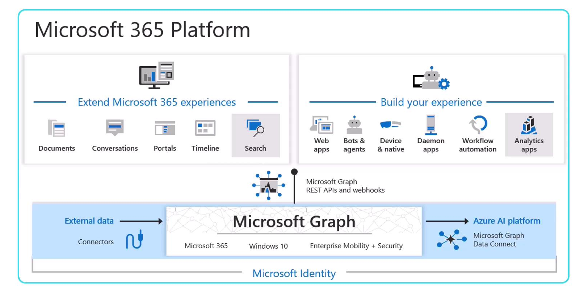
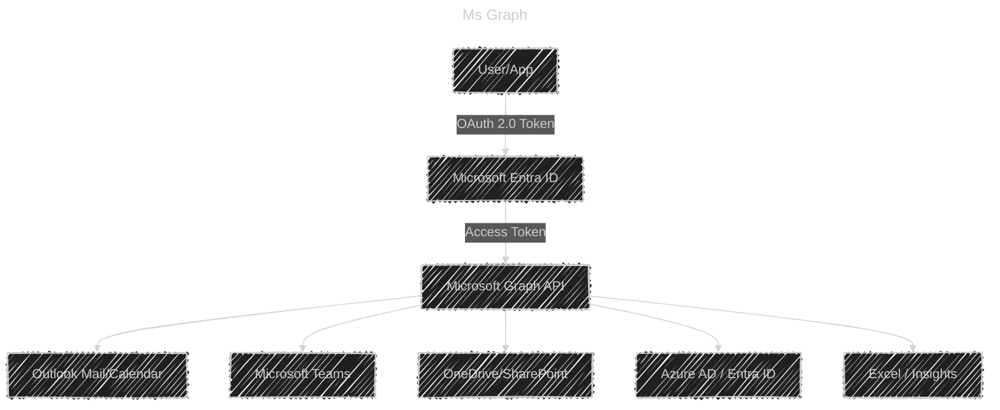

# 🌐 Microsoft Graph — The Gateway to Microsoft 365 Data

## 📖 What is Microsoft Graph?

- **Definition**: Microsoft Graph is a **unified API endpoint** (`https://graph.microsoft.com`) that lets you access **data and insights across Microsoft 365 services** (like Azure AD, Outlook, Teams, SharePoint, OneDrive).
- Instead of learning 10+ different APIs (Mail API, Calendar API, Teams API…), you use **one consistent REST API**.

> 👉 Think of it as the **“front door”** to Microsoft 365 and Entra ID resources.  
> [📖 MS Graph Docs](https://learn.microsoft.com/en-us/graph/overview)

---

<div align="center">
  
</div>

---

## 🎯 Why Microsoft Created It

1. **Unification**: Before Graph, each product had its own API → messy for developers.
2. **Cross-service insights**: You can **connect data** between services (e.g., find a user → get their manager → check their calendar → post a Teams chat).
3. **Security & compliance**: Graph uses **Microsoft Identity Platform** for secure OAuth 2.0 + permissions.

---

## 🔑 Core Concepts

### 1. **Endpoint**

- All requests start at:

  ```ini
  https://graph.microsoft.com/v1.0/   → Production (stable APIs)
  https://graph.microsoft.com/beta/   → Preview (new APIs, may change)
  ```

### 2. **Resources**

Examples:

- `/users` → Users in Microsoft Entra ID
- `/me` → Current signed-in user
- `/me/messages` → User’s Outlook messages
- `/groups` → Microsoft 365 groups/Teams

### 3. **Permissions (via Microsoft Identity Platform)**

- **Delegated permissions** → App acts **on behalf of a user** (e.g., read user’s emails).
- **Application permissions** → App runs **without a user**, app identity only (e.g., nightly job exports all calendars).

### 4. **Authentication**

- Uses **OAuth 2.0 + Microsoft Authentication Library (MSAL)**.
- You request a token from Entra ID → attach it as `Authorization: Bearer <token>` header in Graph API calls.

### 5. **Query Parameters**

Enhance query results with filters like `$filter` and `$select` to choose specific fields.

---

<div align="center">
  
</div>

## 🏗 Example Requests

### Get my profile:

```http
GET https://graph.microsoft.com/v1.0/me
Authorization: Bearer <token>
```

Response:

```json
{
  "id": "f8cdef31-a31e-4b4a-93e4-5f571e91255a",
  "displayName": "John Doe",
  "mail": "john.doe@contoso.com",
  "userPrincipalName": "john.doe@contoso.com"
}
```

---

### Send an email:

```http
POST https://graph.microsoft.com/v1.0/me/sendMail
Content-Type: application/json
Authorization: Bearer <token>

{
  "message": {
    "subject": "Hello Graph!",
    "body": { "contentType": "Text", "content": "Graph is awesome!" },
    "toRecipients": [
      { "emailAddress": { "address": "friend@contoso.com" } }
    ]
  }
}
```

---

### List Teams I’m a member of:

```http
GET https://graph.microsoft.com/v1.0/me/joinedTeams
Authorization: Bearer <token>
```

---

## 🧩 Microsoft Graph SDKs

Instead of hand-writing REST calls, you can use official SDKs:

- **.NET, Java, JavaScript, Python, Go**
- They wrap HTTP calls, handle auth, and give you IntelliSense.

Example in **.NET**:

```csharp
GraphServiceClient graphClient = new GraphServiceClient(authProvider);

// Get my profile
var me = await graphClient.Me.Request().GetAsync();
Console.WriteLine(me.DisplayName);
```

Full Example:

```cs
using Microsoft.Graph;
using Microsoft.Identity.Client;
using System;
using System.Net.Http;
using System.Net.Http.Headers;
using System.Threading.Tasks;


class Program
{
    // Replace these with your actual application details.
    private static string clientId = "a967af23-c786-47a2-a2ed-5eb9da7b157a";
    private static string tenantId = "1e0fa212-37dc-455f-bb0f-d66867cac64b";
    private static string[] scopes = new[] { "User.Read" };


    static async Task Main(string[] args)
    {
        var publicClientApp = PublicClientApplicationBuilder
            .Create(clientId)
            .WithAuthority($"https://login.microsoftonline.com/{tenantId}")
            .WithRedirectUri("http://localhost")
            .Build();


        var authResult = await publicClientApp
            .AcquireTokenWithDeviceCode(scopes, deviceCodeResult =>
            {
                Console.WriteLine(deviceCodeResult.Message);
                return Task.FromResult(0);
            })
            .ExecuteAsync();


        using var httpClient = new HttpClient();
        httpClient.DefaultRequestHeaders.Authorization =
            new AuthenticationHeaderValue("Bearer", authResult.AccessToken);


        var graphClient = new GraphServiceClient(httpClient);
        var user = await graphClient.Me.GetAsync();


        Console.WriteLine($"Display Name: {user.DisplayName}");
        Console.WriteLine($"User Principal Name: {user.UserPrincipalName}");
        Console.WriteLine($"Job Title: {user.JobTitle ?? "N/A"}");
        Console.WriteLine($"Mobile Phone: {user.MobilePhone ?? "N/A"}");
    }
}
```

> 🚨 In this example, the client ID, tenant ID, and scopes are defined as variables. The device code authentication flow prompts the user via the terminal to visit [microsoft.com/devicelogin](https://login.microsoftonline.com/common/oauth2/deviceauth) for authentication. Once authenticated, the access token is retrieved and used to execute a Microsoft Graph API call to obtain the user profile.

---

> ⚠️ App Registration Considerations  
> Before using the service principal or app registration, ensure that the authentication settings in your Azure portal app registration are correctly configured for device code flow.
>
> 🚨 Important  
> Ensure that the device code flow setting is enabled in your app registration configuration. Failing to do so will cause the authentication process to fail.

## 🏛️ Architecture View



---

## 📚 Common Use Cases (for AZ-204)

- 🔑 **Identity** → get user profiles, groups, roles.
- 📧 **Mail & Calendar** → read/send emails, check events.
- 📂 **Files** → manage OneDrive & SharePoint documents.
- 💬 **Collaboration** → integrate with Microsoft Teams.
- 📊 **Insights** → activity trends, presence.

---

## ✅ Key Takeaways

- **Microsoft Graph = One API for all Microsoft 365 + Entra ID data.**
- Uses **OAuth 2.0** and **MSAL** for authentication.
- **Delegated vs Application permissions** decide if a **user** or the **app** is in control.
- Available via **REST endpoints** or **SDKs**.

---

👉 Exam tip: If you see a question like:

- “How to access a user’s calendar without exposing account keys?” → **Microsoft Graph** with delegated permissions.
- “How to sync org-wide directory data nightly without user interaction?” → **Graph API with application permissions**.
