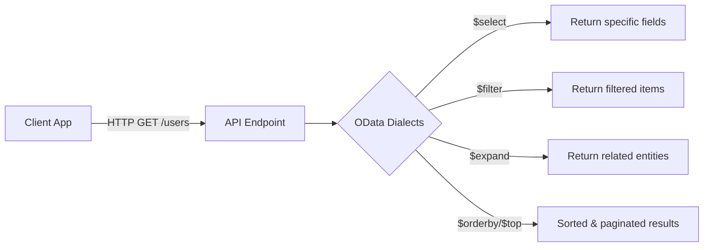

# 🔎 OData (Open Data Protocol) — Explained in Your Style

Think of **OData** as the _universal remote control_ for APIs. It’s a **RESTful query language** standard that lets you filter, sort, expand, and project data **directly in the URL**, without needing new endpoints for every use case. Microsoft Graph, Dynamics 365, SharePoint, and even custom APIs use OData.

---

## 🧩 What OData Actually Is

- **Protocol**: Open standard maintained by OASIS.
- **REST + Query Dialects**: Works on top of plain HTTP (`GET /users`), but adds **query options** (`$filter`, `$select`, `$expand`, …).
- **Interoperability**: Makes APIs predictable. If you know OData once, you can talk to many APIs.
- **Serialization**: Usually JSON (`application/json;odata.metadata=minimal`), but can also be XML.

---

## 🧰 Core OData Query Options

Here are the **knobs** you’ll use the most:

| Option     | Purpose                                                | Example                                        |
| ---------- | ------------------------------------------------------ | ---------------------------------------------- |
| `$select`  | Project specific fields                                | `/users?$select=id,displayName`                |
| `$filter`  | Filter by condition (eq, ne, gt, lt, startswith, etc.) | `/users?$filter=startswith(displayName,'Ali')` |
| `$orderby` | Sort results                                           | `/users?$orderby=createdDateTime desc`         |
| `$top`     | Limit results (page size)                              | `/users?$top=5`                                |
| `$skip`    | Skip results (for paging)                              | `/users?$skip=20`                              |
| `$expand`  | Include related entity inline                          | `/me?$expand=manager`                          |
| `$count`   | Include total number of matching records               | `/users?$count=true`                           |
| `$search`  | Full-text search (Graph specific)                      | `/users?$search="displayName:alex"`            |
| `$format`  | Force return format                                    | `/users?$format=json`                          |

---

## 🧪 Operators for `$filter`

- `eq` → equal to
- `ne` → not equal to
- `gt`, `lt`, `ge`, `le` → comparisons
- `startswith(field,'x')`, `endswith(field,'y')`, `contains(field,'z')`
- Boolean: `and`, `or`, `not`
- Date-time comparisons are ISO 8601 (`2025-09-29T00:00:00Z`).

---

## 📖 Examples You’ll See Everywhere

### 1) Select only names + mails

```http
GET /users?$select=id,displayName,mail
```

### 2) Filter users by domain

```http
GET /users?$filter=endswith(userPrincipalName,'@contoso.com')
```

### 3) Order newest first

```http
GET /users?$orderby=createdDateTime desc&$top=10
```

### 4) Get my manager (expand relation)

```http
GET /me?$select=displayName,mail&$expand=manager($select=displayName,mail)
```

### 5) Count + filter

```http
GET /users?$count=true&$filter=accountEnabled eq true
ConsistencyLevel: eventual
```

---

## 🏗 How OData Helps APIs

Without OData, developers need separate endpoints:

- `/users` → all users
- `/users/active` → only active
- `/users/sorted` → sorted list
- `/users/with-manager` → expand relation

With OData → **one endpoint, many queries**:

```http
GET /users?$filter=accountEnabled eq true&$orderby=displayName&$expand=manager
```

---

## 📦 Versions & Compatibility

- **OData v2** → XML-heavy, legacy (SharePoint classic).
- **OData v3/v4** → JSON, widely adopted (Graph, Dynamics, SAP).
- **Microsoft Graph** = OData v4 flavor + extra (`$search`, `$count`, `$delta`).

---

## 🔐 Security / Billing Side of OData

- OData only **shapes data**, doesn’t secure it.
- Security = **tokens/permissions** (OAuth2, API keys).
- Billing = OData queries can be **more expensive** (e.g., `$expand` pulls big nested graphs). Some APIs rate-limit or disallow complex filters.

---

## 📊 Diagram: Why OData Rocks



---

## ✅ TL;DR

- **OData = Query language for REST APIs.**
- Key dials: `$select`, `$filter`, `$expand`, `$orderby`, `$top`.
- Saves you from creating _too many endpoints_.
- Microsoft Graph is the best real-world playground.
- **Security ≠ OData** → you still need OAuth2, API keys, etc.

---

👉 Do you want me to next build you a **hands-on OData playground** using Microsoft Graph (like: try `$filter`, `$expand`, `$delta`) with **curl + .NET SDK examples**? That way you’ll see OData live in action, not just theory.
