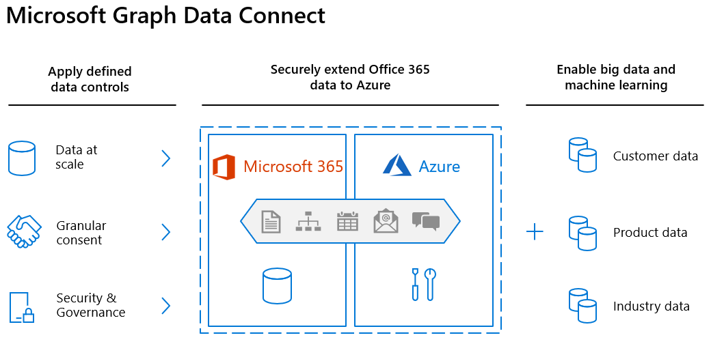

# 🔗 **Microsoft Graph Data Connect**

**Microsoft Graph Data Connect** is a service that allows secure, high-volume data extraction from Microsoft 365 into Azure-based analytics and storage solutions. It enables organizations to process and analyze Microsoft 365 data, including user profiles, emails, and collaboration patterns, for business intelligence, reporting, and AI-driven insights. The key feature of Microsoft Graph Data Connect is its administrative control and consent model, ensuring data governance, security, and compliance.

  

---
