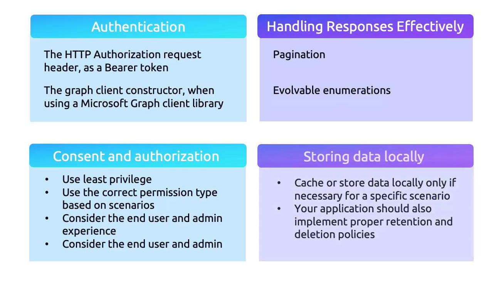

# 🏆 Microsoft Graph — Best Practices

Working with Microsoft Graph is not just about hitting an endpoint — it’s about doing it **securely, efficiently, and future-proofed**.

---

<div align="center" style="background-color: #ffffffff ;border-radius: 10px;border: 2px solid white">
  
</div>

---

## 🔐 1. Authentication Best Practices

- Always use **OAuth 2.0 Bearer tokens** in the `Authorization` header.
- Use **MSAL** (Microsoft Authentication Library) to acquire and refresh tokens securely.
- **Initialize GraphServiceClient properly** — avoid building ad-hoc HTTP clients.

👉 Exam Tip: If you see a question about “how to securely connect to Microsoft Graph”, the answer is **MSAL + Bearer token**.

---

## 📦 2. Handling Responses

### ✅ Pagination

- Large datasets (users, groups, messages) come in **pages**.
- Use the `@odata.nextLink` property to fetch the next page.
- Don’t assume you get all results in one call.

### 🔄 Evolvable Enumerations

- Microsoft Graph **adds new enum values over time** (e.g., Teams roles, presence states).
- Always handle **unexpected enum values gracefully** → don’t hardcode switch cases without defaults.

---

## 🔑 3. Consent & Authorization

### 🛡️ Principle of Least Privilege

- Request only the permissions you need.
- Example: If you only need to read mail, request `Mail.Read`, not `Mail.ReadWrite`.

### 👥 Permission Types

- **Delegated permissions** → App acts **on behalf of a signed-in user**.
- **Application permissions** → App runs **without a user**, using its own identity.
- Match the permission type to your scenario.

### 🧑‍💼 User & Admin Consent

- **Static consent** → one-time, fixed at sign-in.
- **Incremental consent** → ask for new permissions when needed.
- **Admin consent** → required for sensitive org-wide access (e.g., `User.Read.All`).

👉 Design consent prompts to be **clear & minimal** so users/admins trust your app.

---

## 💾 4. Local Data & Caching

- Minimize local storage of Graph data.
- If caching is necessary:

  - Encrypt data at rest.
  - Implement retention and deletion policies.

- For tokens, always use **secure storage** (Key Vault, environment variables, OS credential store).

---

## 🔍 5. Query Optimization

Microsoft Graph supports **OData query parameters** to reduce payloads:

- `$select` → return only needed fields

  ```http
  GET /me?$select=displayName,userPrincipalName
  ```

- `$filter` → filter results

  ```http
  GET /users?$filter=startswith(displayName,'John')
  ```

- `$top` → limit results

  ```http
  GET /users?$top=10
  ```

- Combine `$select`, `$filter`, `$orderby`, `$expand` for efficiency.

👉 Smaller responses = faster apps + less throttling.

---

## 🧪 6. Use Microsoft Graph Explorer

- A **playground** to test queries quickly.
- Sign in with your tenant or use demo tenants.
- Useful for:

  - Checking query syntax
  - Inspecting API responses
  - Trying `$select`, `$filter`, `$top`
  - Debugging permissions issues

👉 Tip: In the exam, if they mention “tool to test Graph queries interactively”, the answer is **Graph Explorer**.

---

## 📚 Summary Table

| Area           | Best Practice                               |
| -------------- | ------------------------------------------- |
| Authentication | Use MSAL & Bearer tokens                    |
| Responses      | Handle pagination & unknown enums           |
| Permissions    | Apply least privilege, match scenario       |
| Consent        | Use incremental consent when possible       |
| Local Data     | Encrypt, minimize, purge regularly          |
| Queries        | Use OData parameters (`$select`, `$filter`) |
| Tools          | Graph Explorer for testing/debugging        |

---

✅ **Key Takeaway**:
When dealing with Microsoft Graph → **secure the connection, minimize permissions, optimize queries, and always handle evolving APIs gracefully**.
