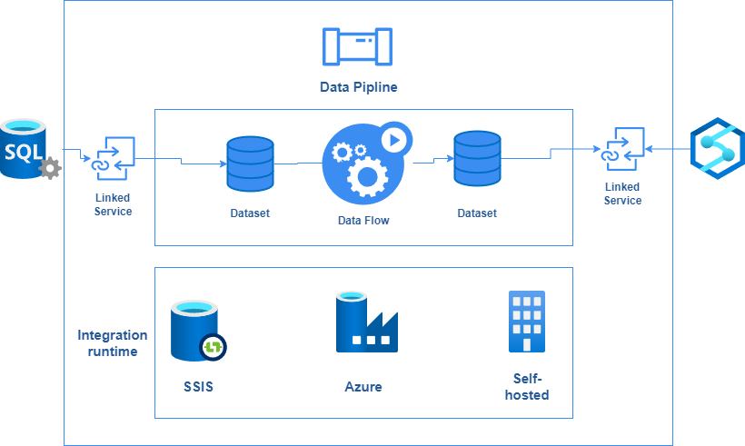
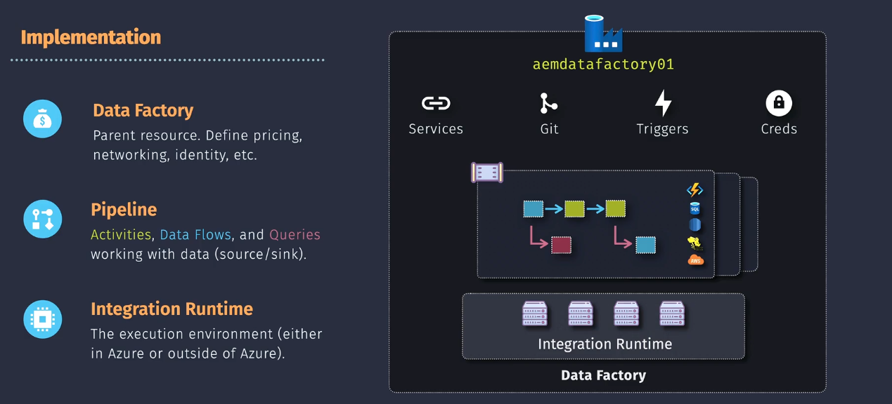
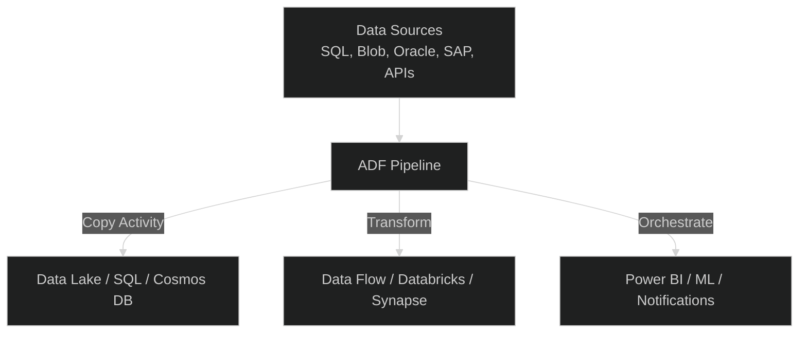
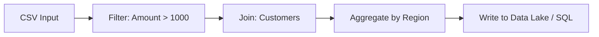
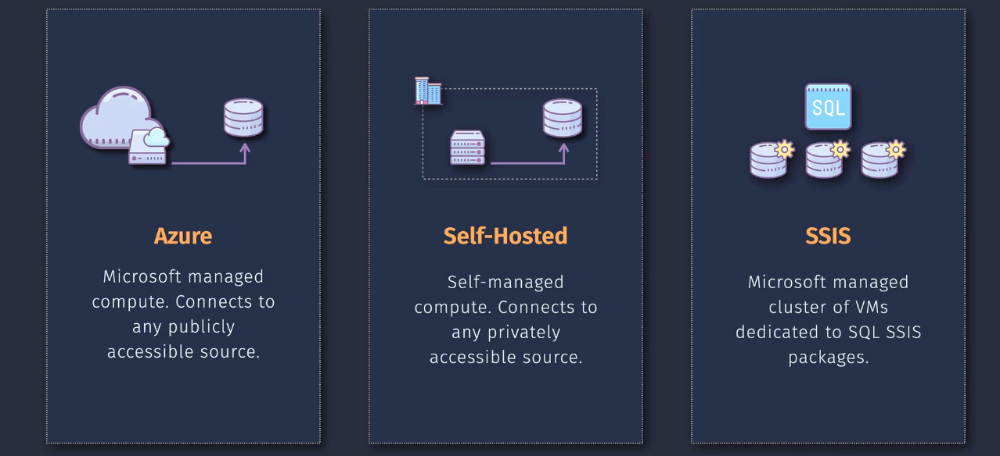
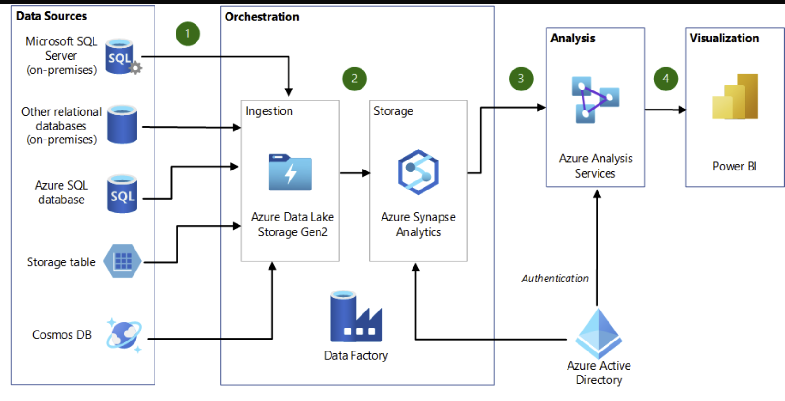
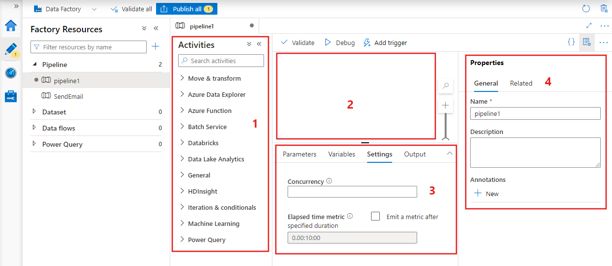
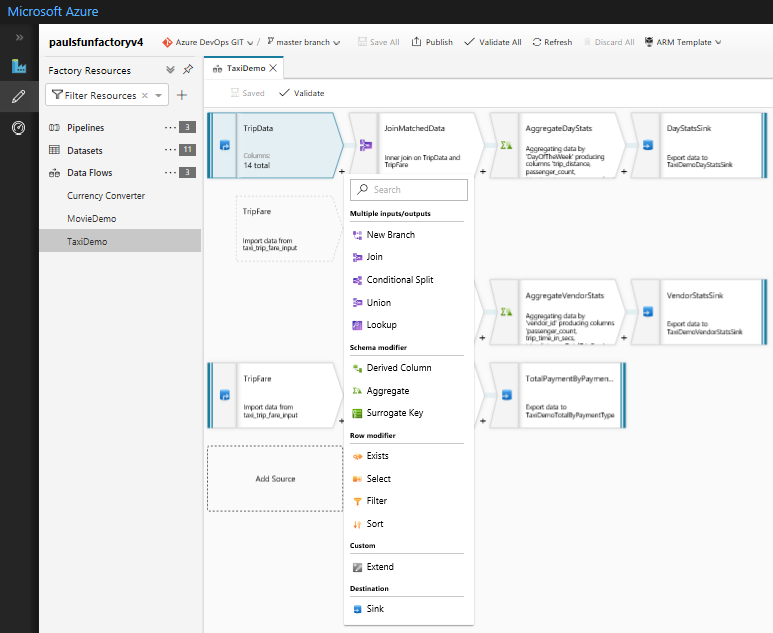
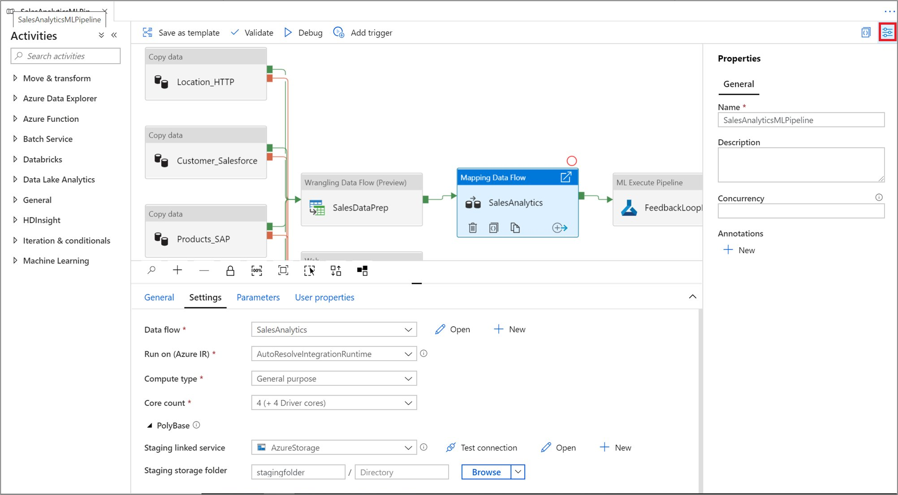

# 🏗️ Azure Data Factory (ADF) — The Cloud Data Orchestrator ⚙️

## 🌍 What Is Azure Data Factory?

> **Azure Data Factory (ADF)** is a **fully managed, serverless data integration service** that lets you **ingest, transform, and orchestrate data flows** across **on-premises, multi-cloud, and SaaS** systems.

---

> 💬 In simple terms:  
> ADF is like an **air traffic controller ✈️** for all your data pipelines —  
> telling each dataset _when_, _where_, and _how_ to move and transform.

---

---

## 🧠 Why Use Azure Data Factory?

| Problem                                              | ADF Solution                        |
| ---------------------------------------------------- | ----------------------------------- |
| You have data in 10 different systems                | ADF connects them all               |
| You need to run daily ETL jobs                       | ADF schedules and orchestrates them |
| You need to move data from on-prem to cloud securely | ADF uses Integration Runtime (IR)   |
| You need visual data transformations                 | ADF Data Flows                      |
| You want to trigger Databricks / SQL / API workflows | ADF activities                      |

---

## ⚙️ ADF = Integration + Transformation + Orchestration

ADF combines three main layers:

| Layer              | Description                             | Example                       |
| ------------------ | --------------------------------------- | ----------------------------- |
| **Integration**    | Connect to 100+ data sources            | SQL, Oracle, Salesforce, Blob |
| **Transformation** | Transform with Data Flows or Databricks | Clean, aggregate, enrich      |
| **Orchestration**  | Schedule, monitor, retry                | Run daily 2AM jobs            |

---

## 🧩 Azure Data Factory Components

Here’s how the pieces fit together:

| Component                    | Description                                | Analogy           |
| ---------------------------- | ------------------------------------------ | ----------------- |
| **Pipeline**                 | Logical container of activities            | Recipe            |
| **Activity**                 | Single task (copy, run notebook, call API) | Step in recipe    |
| **Linked Service**           | Connection info to a data source           | Kitchen appliance |
| **Dataset**                  | Structure or schema of data                | Ingredients       |
| **Trigger**                  | Defines when pipeline runs                 | Alarm clock       |
| **Integration Runtime (IR)** | The compute engine to execute              | Chef              |

---

---

## 🧱 Visual Overview

🧠 So ADF acts as your **data workflow conductor**, integrating all services.

---

## 🧩 Supported Connectors (Over 100+)

ADF can connect to nearly any data source:

| Category         | Examples                                    |
| ---------------- | ------------------------------------------- |
| **Azure**        | Blob, Data Lake, SQL DB, Synapse, Cosmos DB |
| **On-premises**  | SQL Server, Oracle, Teradata, MySQL         |
| **SaaS Apps**    | Salesforce, Dynamics, SAP, ServiceNow       |
| **Other Clouds** | AWS S3, Redshift, Google BigQuery           |
| **NoSQL & File** | MongoDB, Cassandra, FTP, API endpoints      |

✅ **No need to write code** — just configure via UI or JSON.

---

## 🧪 Hands-On Walkthrough

Let’s create your **first data pipeline** step by step 👇

---

### 🪜 Step 1️⃣ — Create Azure Data Factory

1. Go to **Azure Portal → Create a Resource → Data Factory**
2. Fill in:

   - **Name:** `my-adf-pipeline`
   - **Region:** same as your data
   - **Version:** V2 (current)
   - **Git Integration (optional):** enable if using GitHub/Azure Repos

3. Click **Review + Create → Create**

✅ Once deployed → open **ADF Studio** from the portal.

---

### 🪜 Step 2️⃣ — Create a Pipeline

1. In ADF Studio, go to **Author → Pipelines → + New pipeline**
2. Name it: `CopySalesData`
3. From the **Activities pane**, drag **Copy Data** into the canvas.

---

### 🪜 Step 3️⃣ — Define Source & Destination

1. In the **Source tab**, click “+ New” to create a **Linked Service**
   → choose **Azure Blob Storage** (your raw data).
2. In the **Sink tab**, add another linked service:
   → choose **Azure SQL Database** or **Synapse SQL Pool**.
3. Set **input dataset** (CSV) and **output dataset** (SQL Table).

---

### 🪜 Step 4️⃣ — Add Mapping (Optional)

- Map CSV columns → SQL columns manually if names differ.

Example:

| CSV Column  | SQL Column  |
| ----------- | ----------- |
| ProductName | ProductName |
| Quantity    | Qty         |
| Amount      | Total       |

---

### 🪜 Step 5️⃣ — Publish and Run

- Click **Publish All**
- Click **Debug** (for test run) or **Add Trigger → Now** to execute.
- Check **Monitor** tab for run status.

✅ You just built your first pipeline — no code, all visual.

---

## ⚡ Data Flow (Visual Transformations)

When you need **data cleaning or transformation** (not just copying), use **Mapping Data Flows**.

It’s a **visual ETL designer** (no Spark coding needed).
Behind the scenes — it runs on **Azure Databricks Spark clusters**.

### Example transformations:

- Filter rows
- Join datasets
- Aggregate values
- Derive new columns
- Write to destination

---

## 🧩 Control Flow Activities

ADF also lets you manage logic — like **if-else, loops, variables** — similar to programming.

| Activity             | Description                      |
| -------------------- | -------------------------------- |
| **If Condition**     | Branch logic based on expression |
| **ForEach**          | Loop over list of items          |
| **Wait**             | Pause pipeline for a duration    |
| **Execute Pipeline** | Call another pipeline            |
| **Set Variable**     | Manage runtime variables         |

Example:

> For each region → copy the data → clean it → load to SQL.

---

## 🕒 Triggers

| Type                | Description             | Example                     |
| ------------------- | ----------------------- | --------------------------- |
| **Manual**          | Run manually            | Ad-hoc run                  |
| **Schedule**        | Time-based              | Every night at 2 AM         |
| **Tumbling Window** | Periodic, with catch-up | Every 15 mins               |
| **Event-based**     | File arrival            | When new file lands in Blob |

---

## 🧠 Integration Runtime (IR)

| Type                   | Description                | Use Case                 |
| ---------------------- | -------------------------- | ------------------------ |
| **Azure IR (default)** | Fully managed by Azure     | Cloud-to-cloud copy      |
| **Self-hosted IR**     | Installed on your VM       | On-prem to cloud         |
| **Azure-SSIS IR**      | Run SSIS packages in Azure | Lift & shift legacy SSIS |

---

💡 ADF **automatically chooses** the right IR for you unless you customize it.

---

## 🔐 Security in ADF

| Feature                   | Description                        |
| ------------------------- | ---------------------------------- |
| **Managed Identity**      | Connect to Azure services securely |
| **Private Endpoints**     | Keep traffic inside VNet           |
| **Key Vault Integration** | Store secrets safely               |
| **RBAC + Azure AD**       | Control who can run pipelines      |

---

## 💸 Pricing Model (Simple!)

| Category                | Pricing Unit           | Example                     |
| ----------------------- | ---------------------- | --------------------------- |
| **Pipeline Runs**       | Per activity execution | \$0.25 per 50 runs          |
| **Data Flow Compute**   | Per vCore-hour         | Pay for transformation time |
| **Integration Runtime** | Per hour               | Only for self-hosted IR     |
| **Triggers**            | Free                   | Scheduling is free          |

🧠 **Tip:**
Pause or delete unnecessary triggers — ADF doesn’t charge when idle!

---

## 🧩 ADF vs Synapse Pipelines

| Feature         | **Azure Data Factory**          | **Synapse Pipelines**        |
| --------------- | ------------------------------- | ---------------------------- |
| **Scope**       | Enterprise-wide ETL             | Analytics-focused ETL        |
| **Integration** | Works across 100+ systems       | Tight with Synapse workspace |
| **UI**          | ADF Studio                      | Synapse Studio               |
| **Engine**      | Same (ADF engine)               | Same engine                  |
| **Best For**    | Hybrid, multi-cloud integration | Analytics pipelines          |
| **Pricing**     | Pay per activity                | Pay per activity             |

🧭 **Rule of Thumb:**

- Use **ADF** for _enterprise-scale data movement_ (ERP, CRM, on-prem).
- Use **Synapse Pipelines** for _analytics-specific data workflows_.

---

## 🧩 Real-World Example

| Step | Task                                           | Tool                  |
| ---- | ---------------------------------------------- | --------------------- |
| 1️⃣   | Copy daily sales from on-prem SQL → Azure Blob | Copy Activity         |
| 2️⃣   | Clean data (remove nulls, rename cols)         | Data Flow             |
| 3️⃣   | Enrich with region data                        | Join Activity         |
| 4️⃣   | Load to Synapse SQL                            | Sink Activity         |
| 5️⃣   | Refresh Power BI dataset                       | Web Activity          |
| 6️⃣   | Email success/failure report                   | Logic App integration |

✅ This entire pipeline is automated and monitored in ADF Studio.

---

## 🧾 Summary

| Concept             | Description                                        |
| ------------------- | -------------------------------------------------- |
| **ADF Purpose**     | Data integration & orchestration across systems    |
| **Core Components** | Pipelines, Datasets, Linked Services, IR, Triggers |
| **Transformation**  | Visual Data Flows / Notebooks                      |
| **Security**        | Managed Identity + Key Vault                       |
| **Cost**            | Pay per pipeline execution                         |
| **Integration**     | Works with Synapse, Databricks, Power BI           |
| **Type**            | Serverless, PaaS                                   |

---

✅ **In one line:**

> **Azure Data Factory** is your **data transport and transformation engine** —
> it automates, moves, and cleans data from anywhere to anywhere — no servers, no maintenance, all orchestrated in the cloud.

---

