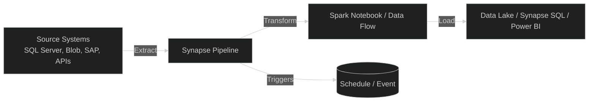
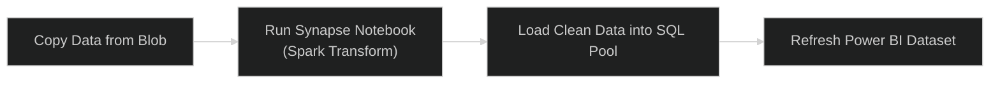

# 🪈 **Azure Synapse Pipelines** — The ETL Engine of Synapse

## 🌍 What Are Synapse Pipelines?

> **Synapse Pipelines** are the **data orchestration and integration** component inside Azure Synapse Analytics.
> They’re built on top of **Azure Data Factory (ADF)** — but live directly _inside_ your Synapse workspace.

You can think of them as:

> “**ADF inside Synapse**” — same engine, same activities, but natively integrated with Synapse SQL, Spark, and Data Lake.

---

## 🧠 Why Do We Need Pipelines?

Imagine you have:

- Raw data coming from **on-prem SQL Server**
- Clean data stored in **Azure Data Lake**
- Aggregated data hosted in **Synapse SQL Pool**
- Dashboards running in **Power BI**

👉 Synapse Pipelines **automate** all the movement and transformation between these systems.

---

## ⚙️ ETL vs. ELT in Synapse Pipelines

| Pattern                            | Description                                            | Typical Use               |
| ---------------------------------- | ------------------------------------------------------ | ------------------------- |
| **ETL (Extract, Transform, Load)** | Transform data _before_ loading into Synapse           | Using Spark or Data Flow  |
| **ELT (Extract, Load, Transform)** | Load data _first_, then transform _inside Synapse SQL_ | For large structured data |

🧩 Synapse Pipelines can do both, depending on your scenario.

---

## 🧩 Key Components of a Synapse Pipeline

| Component                    | Description                                                     | Analogy              |
| ---------------------------- | --------------------------------------------------------------- | -------------------- |
| **Pipeline**                 | A logical group of activities (the full workflow)               | Recipe               |
| **Activity**                 | A single operation (copy, run notebook, execute SQL, etc.)      | Step in recipe       |
| **Linked Service**           | Connection info for data sources (like credentials + endpoints) | Kitchen appliance    |
| **Dataset**                  | Structure of input/output data (schema, file path)              | Ingredients          |
| **Trigger**                  | Schedule or event that starts pipeline                          | Timer or alarm clock |
| **Integration Runtime (IR)** | Compute engine that executes data movement                      | Chef                 |

---

## 🧱 Visual Architecture



---

## 🧩 Common Activities (Building Blocks)

| Category                | Example Activity                   | Purpose                   |
| ----------------------- | ---------------------------------- | ------------------------- |
| **Data Movement**       | Copy Data                          | Move data between sources |
| **Data Transformation** | Data Flow / Spark Notebook         | Clean or aggregate data   |
| **Control Flow**        | ForEach, If, Until                 | Logic and looping         |
| **Execution**           | Stored Procedure, Synapse Notebook | Run SQL or code           |
| **Monitoring**          | Set Variable, Web Activity         | Manage state and logs     |

---

## 🧪 Example 1: Copy Data from Blob to Synapse SQL

### Step 1️⃣ — Create Linked Services

- One for **Azure Blob Storage**
- One for **Synapse SQL Pool**

### Step 2️⃣ — Create Datasets

- Input dataset → Blob CSV
- Output dataset → SQL table

### Step 3️⃣ — Add **Copy Data Activity**

- Source → Blob
- Sink → SQL
- Map columns automatically or manually

### Step 4️⃣ — Publish and Run

- Click **“Publish All”**
- Run the pipeline manually or attach a trigger

✅ Data moves from Blob → Synapse automatically.

---

### Example SQL Table

```sql
CREATE TABLE Sales (
  Id INT,
  ProductName NVARCHAR(100),
  Amount DECIMAL(10,2)
);
```

---

## ⚙️ Example 2: Orchestrate a Full ETL Workflow

**Goal:**

1. Copy raw files from Blob → Data Lake
2. Trigger a Databricks or Synapse Spark notebook for cleaning
3. Load results into Synapse SQL
4. Refresh Power BI dataset



✅ You can control all 4 steps in one pipeline — no manual work.

---

## ⚙️ Example 3: Trigger a Databricks or Synapse Notebook

```json
{
  "name": "RunSparkNotebook",
  "type": "SynapseNotebook",
  "dependsOn": [],
  "policy": { "timeout": "01:00:00" },
  "typeProperties": {
    "notebook": {
      "referenceName": "clean_sales_notebook",
      "type": "NotebookReference"
    }
  }
}
```

✅ This runs your Databricks or Synapse Spark notebook automatically after data is copied.

---

## 🕒 Triggers — How Pipelines Start

| Type                 | Description                | Example                           |
| -------------------- | -------------------------- | --------------------------------- |
| **Manual Trigger**   | Run on demand              | “Run Now” button                  |
| **Schedule Trigger** | Run by time                | Every day at 2 AM                 |
| **Tumbling Window**  | Repeats with intervals     | Every 15 min for real-time ingest |
| **Event Trigger**    | Starts when a file arrives | When new CSV is uploaded to Blob  |

---

## 📊 Monitoring Pipelines

- Navigate to **Synapse Studio → Monitor → Pipeline Runs**
- You’ll see:

  - ✅ Success/failure status
  - ⏱ Duration
  - ⚠️ Error messages (if any)

- You can click any activity to drill down into logs.

---

## 🧱 Integration Runtime (IR) — The Compute Engine

| Type                | Use Case                   |                                |
| ------------------- | -------------------------- | ------------------------------ |
| **Auto-resolve IR** | Default; Azure-managed     | Works for cloud data transfers |
| **Self-hosted IR**  | For on-prem data sources   | Installed on your VM           |
| **Azure-SSIS IR**   | Run existing SSIS packages | For legacy workloads           |

✅ You rarely need to worry — Synapse usually uses _Auto-resolve IR_ automatically.

---

## 🧮 Example End-to-End Pipeline (Simplified JSON)

```json
{
  "name": "DailySalesPipeline",
  "activities": [
    { "name": "CopySalesData", "type": "Copy", "inputs": ["RawBlob"], "outputs": ["StagingLake"] },
    { "name": "CleanData", "type": "SynapseNotebook", "dependsOn": ["CopySalesData"] },
    { "name": "LoadToWarehouse", "type": "SqlServerStoredProcedure", "dependsOn": ["CleanData"] }
  ]
}
```

✅ This pipeline copies, cleans, and loads daily sales data — all scheduled automatically.

---

## 🧩 Synapse Pipelines vs Azure Data Factory (ADF)

| Feature         | **Synapse Pipelines**               | **Azure Data Factory**            |
| --------------- | ----------------------------------- | --------------------------------- |
| **Interface**   | Inside Synapse Studio               | Standalone portal                 |
| **Engine**      | Same as ADF                         | Same as Synapse                   |
| **Best For**    | Analytics pipelines tied to Synapse | Enterprise-wide ETL orchestration |
| **Integration** | Direct with Synapse SQL & Spark     | Broad across Azure services       |
| **Cost**        | Pay per run / per activity          | Same pricing model                |

🧠 **In short:**
If your goal is analytics inside Synapse, use **Synapse Pipelines**.
If your goal is enterprise ETL orchestration across 50 systems, use **ADF**.

---

## 🔐 Security & Governance

| Feature                     | Description                               |
| --------------------------- | ----------------------------------------- |
| **Azure AD Authentication** | Secure connections and RBAC               |
| **Managed Identity**        | Avoid storing credentials                 |
| **Private Endpoints**       | Secure communication                      |
| **Activity Logging**        | Monitor via Azure Monitor & Log Analytics |

---

## 💸 Cost Model

| Item                    | Pricing Basis               | Example                  |
| ----------------------- | --------------------------- | ------------------------ |
| **Pipeline Runs**       | Per activity execution      | Copy, notebook, SQL job  |
| **Data Movement**       | Volume-based                | e.g., \$0.25 per 50 runs |
| **Integration Runtime** | Pay per hour if self-hosted | Based on compute size    |

✅ For most Synapse users, cost is minimal unless pipelines run 24/7.

---

## 🧠 Typical Real-World Use Case

| Step | Task                          | Service              |
| ---- | ----------------------------- | -------------------- |
| 1️⃣   | Copy raw CSV from on-prem SQL | Pipeline (Copy Data) |
| 2️⃣   | Clean data using PySpark      | Synapse Notebook     |
| 3️⃣   | Store clean data in Delta     | Data Lake            |
| 4️⃣   | Load summary to SQL Pool      | Stored Procedure     |
| 5️⃣   | Refresh Power BI dataset      | REST / API Activity  |

All steps automated. No manual work. No cron jobs. Just **pipelines**.

---

## ✅ Summary

| Concept               | Description                                                |
| --------------------- | ---------------------------------------------------------- |
| **Synapse Pipelines** | Visual, code-free ETL engine inside Synapse                |
| **Built on**          | Azure Data Factory                                         |
| **Core parts**        | Pipelines, Activities, Linked Services, Datasets, Triggers |
| **Purpose**           | Move and transform data between Azure sources              |
| **Integrates with**   | SQL Pools, Spark, Data Lake, Power BI                      |
| **Pricing**           | Pay per run / per activity                                 |
| **Security**          | Azure AD + Managed Identity                                |

---

💬 **In one line:**

> **Synapse Pipelines** are your automated data movers —
> They extract, transform, and load your data across Azure in a scheduled, monitored, and fully managed way.
