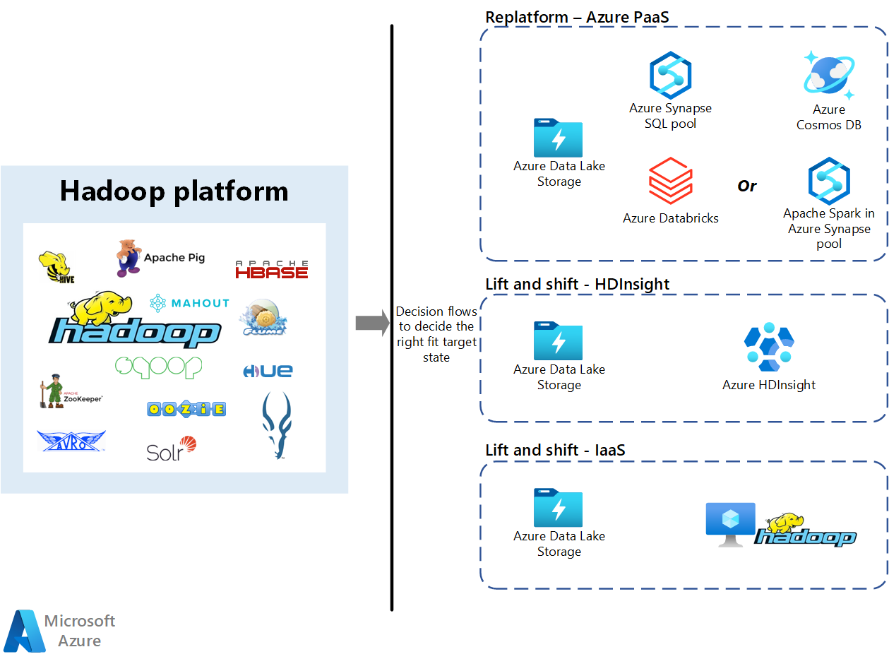

# 🧠 Azure HDInsight — The Beginner-Friendly Deep Dive

Azure **HDInsight** is one of the **core Big Data analytics services** in Azure — and I’ll explain it like we’re starting from zero, assuming you have **no background in data engineering or data analysis**.

By the end of this, you’ll know:  
✅ What Azure HDInsight is  
✅ Why it exists  
✅ How it works internally  
✅ The prerequisites (what you need to know before using it)  
✅ Real-world examples and comparisons

---

## 🌍 What Is HDInsight?

Let’s start simple.

> **Azure HDInsight** is a **cloud service that lets you easily run big data frameworks like `Hadoop`, `Spark`, `Hive`, `Kafka`, and more — without needing to install or manage them manually.**

In short:

- You get **ready-to-use clusters** for processing big data.
- You can run **data analytics, machine learning, or ETL** jobs at scale.
- Microsoft handles all the **setup, maintenance, and scaling** for you.

Think of it like:

> “You get a full data analytics environment in minutes instead of spending days setting it up manually.”

---

## ⚙️ Why HDInsight Exists

Before HDInsight, companies had to:

- 💸 Buy servers
- 🧑🏻‍💻 Install Hadoop manually
- 📃 Manage cluster configurations
- ⚠️ Handle node failures

Azure HDInsight solved this by offering **managed Hadoop/Spark clusters** — where Azure automates:

- Node setup
- Network configuration
- Scaling
- Security & patching

You just focus on **analyzing data**, not managing infrastructure.

---

## 🧩 HDInsight Is Built on Open-Source Big Data Frameworks

HDInsight supports multiple **open-source frameworks** — so depending on your need, you pick the right engine.

| Framework            | Purpose                      | Example Use                                   |
| -------------------- | ---------------------------- | --------------------------------------------- |
| 🐘 **Apache Hadoop** | Batch data processing        | Process terabytes of logs overnight           |
| 🔥 **Apache Spark**  | In-memory fast computation   | Machine Learning or Real-time analytics       |
| 🐝 **Apache Hive**   | SQL-like queries on big data | Analysts query data using SQL                 |
| 🦄 **Apache HBase**  | NoSQL key-value store        | Store IoT sensor data                         |
| 🐧 **Apache Kafka**  | Event streaming              | Stream data from devices or apps in real-time |
| 🧬 **Apache Storm**  | Real-time stream processing  | Fraud detection, clickstream analysis         |

So HDInsight = **one platform → many engines** 👇

---

---

## 🏗️ HDInsight Architecture Overview

Here’s the simplified structure of how HDInsight works:

---

### 🧠 What happens:

1. **Data Ingestion** → Data comes from sources like IoT, Data Lake, logs, etc.
2. **HDInsight Cluster** → Runs your big data jobs (batch, stream, ML).
3. **Results** → Sent to Synapse, SQL Database, Power BI, or Azure Storage.

---

## 🚀 Example: What You Can Do with HDInsight

| Scenario                               | What You Use             |
| -------------------------------------- | ------------------------ |
| 🧾 Analyze petabytes of log files      | Hadoop or Spark          |
| 📊 Run SQL queries on big data         | Hive                     |
| ⚙️ Build Machine Learning pipelines    | Spark MLlib              |
| 📡 Stream real-time IoT data           | Kafka + Spark Streaming  |
| 🕵️ Fraud detection / anomaly detection | Spark + Python notebooks |

💡 Example:
A retail company uses HDInsight (Spark) to process millions of sales transactions from Azure Data Lake every hour, find trends, and push summaries to Power BI dashboards.

---

## 💵 Pricing Concept

- You pay for the **cluster while it’s running** (per node/hour).
- You can **pause or delete** clusters after jobs finish to save cost.
- Storage (ADLS/Blob) is **billed separately** but much cheaper.

👉 Always **detach compute (HDInsight)** from **storage (ADLS)** so you don’t lose data when deleting the cluster.

---

## 🔐 Security & Governance

| Feature                               | Description                               |
| ------------------------------------- | ----------------------------------------- |
| **Azure AD Integration**              | Authentication for users                  |
| **Network Isolation (VNet)**          | Private communication                     |
| **Encryption (at rest & in transit)** | Protects data everywhere                  |
| **Role-based access**                 | Controls who can submit jobs or view logs |

---

## 🧩 HDInsight vs Other Azure Analytics Options

| Service                     | Type                                         | Use Case                                       |
| --------------------------- | -------------------------------------------- | ---------------------------------------------- |
| **HDInsight**               | Open-source frameworks (Hadoop, Spark, etc.) | When you want flexibility or OSS compatibility |
| **Azure Databricks**        | Modern Spark environment                     | When you want managed, collaborative Spark     |
| **Azure Synapse Analytics** | Data warehouse                               | For SQL-based analytics and reporting          |

🟢 **HDInsight** is best when you need to use **open-source engines directly (Kafka, Hive, Hadoop)**  
🟢 **Databricks** is best for **modern analytics and ML** (easier, more integrated).

---

## 🧪 Quick Hands-On Overview (No Code)

You can try it easily in the portal:

1. Go to **Azure Portal** → “Create a Resource”
2. Search **HDInsight**
3. Select **Cluster type** (Spark / Hadoop / Kafka / Hive)
4. Choose **Storage Account (ADLS or Blob)**
5. Review + Create
6. Connect using **Ambari UI** or **SSH**
7. Run your first sample job!

---

## 🏁 Summary Table

| Concept             | Description                                                          |
| ------------------- | -------------------------------------------------------------------- |
| **Service Name**    | Azure HDInsight                                                      |
| **Purpose**         | Managed platform for big data & analytics                            |
| **Built On**        | Open-source frameworks like Hadoop, Spark, Hive, Kafka               |
| **Integrates With** | ADLS, Synapse, Databricks, Power BI                                  |
| **Best For**        | Data engineers, analysts, and scientists processing large-scale data |
| **Prerequisites**   | Basic cloud concepts, data understanding, and optional SQL/Python    |
