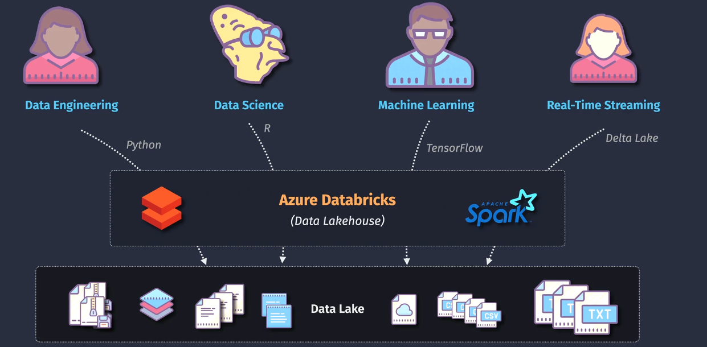
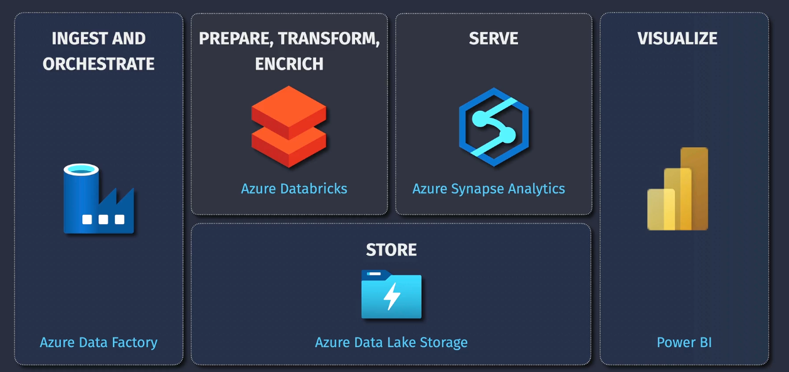
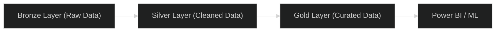

# 🧱 Azure Databricks — The Smart Big Data & AI Platform

## 🌍 What Is Azure Databricks?

> **Azure Databricks** is a **unified analytics and AI platform** that helps you **store, process, clean, analyze, and visualize** large amounts of data — using **Apache Spark** under the hood.

In simple words:

> It’s like a _superpowered data lab_ in Azure where data engineers and data scientists can collaborate on big data and machine learning.

---

## 🧠 The Core Idea

Databricks takes **Apache Spark** (the fastest big data engine)
and makes it:

- ☁️ **Fully managed** by Azure
- 👨‍💻 **Easy to use** through notebooks (like Jupyter)
- 🤝 **Collaborative** for teams (data engineers, analysts, ML engineers)
- ⚡ **Integrated** with all Azure services (ADLS, Synapse, ML, Power BI)

So you don’t have to worry about servers, clusters, or setup.
You just focus on your **data pipelines, analysis, and models**.

---

## 🧩 Databricks = 3 Worlds in One

| Role              | What They Do in Databricks                      | Language           |
| ----------------- | ----------------------------------------------- | ------------------ |
| 👷‍♂️ Data Engineer  | Build ETL pipelines (Extract, Transform, Load)  | Python, SQL, Scala |
| 🔬 Data Scientist | Build and train ML models                       | Python, R          |
| 📊 Data Analyst   | Query data using SQL or visualize with Power BI | SQL                |

It’s literally a “collaboration playground” for data teams.

<div style="text-align:center; background-color:#292E3F; border-radius: 20px;border: 2px solid #444;">

</div>

---

## 🏗️ Azure Databricks Architecture (Visualized)

<div style="text-align:center; background-color:#292E3F; border-radius: 10px;border: 2px solid #444;">

</div>

---

### 🔹 Key Components:

| Component      | Description                                                      |
| -------------- | ---------------------------------------------------------------- |
| **Workspace**  | The main Databricks environment (like your control center)       |
| **Cluster**    | Group of VMs where Spark runs jobs                               |
| **Notebooks**  | Interactive environment to write code (Python, SQL, Scala, R)    |
| **Jobs**       | Automated workflows (ETL pipelines, ML tasks)                    |
| **Delta Lake** | Storage layer for reliable, versioned, ACID-compliant data lakes |

---

## ⚙️ Core Components Explained

### 1️⃣ **Workspace**

- Where all notebooks, jobs, clusters, and libraries are managed.
- Shared among your team.

### 2️⃣ **Cluster**

- A cluster = a group of virtual machines that execute Spark code.
- Azure automatically handles scaling, memory, and configuration.

Example:

```python
# Run this in a Databricks notebook
spark.read.csv("/mnt/data/sales.csv").show()
```

✅ Databricks automatically runs it on a distributed Spark cluster.

### 3️⃣ **Notebooks**

- Interactive coding notebooks (like Jupyter but cloud-based).
- You can mix **Python + SQL + Markdown + visualizations** in one place.

### 4️⃣ **Delta Lake**

- A special data format built into Databricks.
- Adds **ACID transactions**, **time travel**, and **schema enforcement** to your data lake.
- It’s what turns a **“data swamp” into a clean data lake.”**

### 5️⃣ **Jobs**

- Used for automation — schedule pipelines, run nightly ETL, etc.

---

## 🧮 Example: Retail Company Use Case

A company collects terabytes of sales, web clicks, and customer feedback.

1. Raw data stored in **Azure Data Lake Storage (ADLS)**.
2. Azure Databricks:

   - Reads raw data 🧾
   - Cleans it (remove duplicates, fix formats) 🧹
   - Aggregates data for reporting 📊

3. Writes the processed data back to **ADLS** (Silver/Gold zones).
4. **Power BI** or **Synapse Analytics** reads that cleaned data for dashboards.

✅ Entire flow is serverless, automated, and scalable.

---

## 🔥 Why Databricks Is Better than HDInsight

| Feature           | HDInsight                                 | Databricks                      |
| ----------------- | ----------------------------------------- | ------------------------------- |
| Management        | Manual setup (you configure Hadoop/Spark) | Fully managed                   |
| Speed             | Slower (disk I/O)                         | Faster (in-memory Spark)        |
| Ease of Use       | Needs Linux & Hadoop knowledge            | Easy GUI + notebooks            |
| Collaboration     | Limited                                   | Multi-user, real-time notebooks |
| Machine Learning  | External setup needed                     | Built-in ML runtime             |
| Cost Optimization | Static                                    | Auto-scaling clusters           |

💡 **Databricks replaced HDInsight** in most modern Azure data architectures.

---

## 💾 Integration Power (Databricks Works With Everything!)

| Service                    | Integration                           |
| -------------------------- | ------------------------------------- |
| **Azure Data Lake**        | Read/write raw and curated data       |
| **Azure Synapse**          | Load processed data for BI            |
| **Power BI**               | Visualize directly via connector      |
| **Azure Machine Learning** | Train and deploy ML models            |
| **Event Hubs / Kafka**     | Stream real-time data into Databricks |
| **Azure Key Vault**        | Secure secrets and credentials        |

---

<div style="text-align:center; background-color:#292E3F; border-radius: 10px;border: 2px solid #444;">

</div>

---

## 🧠 Data Lifecycle in Databricks (Medallion Architecture)

Databricks promotes the **Bronze → Silver → Gold** data flow pattern.

| Layer         | Description                     | Example Folder              |
| ------------- | ------------------------------- | --------------------------- |
| 🟤 **Bronze** | Raw ingested data               | `/mnt/raw/sales/`           |
| ⚪ **Silver** | Cleaned & filtered data         | `/mnt/clean/sales/`         |
| 🟡 **Gold**   | Aggregated, business-ready data | `/mnt/final/sales_summary/` |

---



---

## 💡 Databricks Languages Supported

| Language             | Used For                   |
| -------------------- | -------------------------- |
| **Python (PySpark)** | Data engineering & ML      |
| **SQL**              | Data querying              |
| **Scala**            | Performance-intensive jobs |
| **R**                | Statistical analysis       |
| **Markdown**         | Documentation              |

---

## 🧰 Example SQL + Python in One Notebook

```sql
-- SQL cell
SELECT COUNT(*) FROM sales_data
WHERE country = 'UAE';
```

```python
# Python cell
df = spark.read.format("delta").load("/mnt/silver/sales/")
df.filter(df.country == "UAE").groupBy("product").count().show()
```

Databricks allows you to mix languages in a single workflow 😎

---

## 🧑‍💻 Prerequisites for You (as a Beginner)

You **don’t need to be a data engineer** yet — but here’s what helps:

| Skill                   | Why                                        |
| ----------------------- | ------------------------------------------ |
| Basic Python            | To use PySpark & ML features               |
| Basic SQL               | To query data in notebooks                 |
| Azure Storage knowledge | To understand where your data lives        |
| Optional: Pandas        | For small-scale data analysis before Spark |

You can start learning with **no code** and gradually move up.

---

## 💵 Pricing Concept (Simplified)

You pay for:

1. **Compute (cluster time)** — charged per DBU (Databricks Unit/hour)
2. **Storage** — where data lives (ADLS or Blob)
3. **Optional premium features** — e.g., job scheduling or high availability

💡 Always **shut down clusters** after use to avoid costs.

---

## 🧩 Databricks Tiers

| Tier           | Description                                    |
| -------------- | ---------------------------------------------- |
| **Standard**   | Basic Spark, SQL, notebooks                    |
| **Premium**    | Security (RBAC, ACLs), jobs, API integration   |
| **Enterprise** | Compliance, high security, advanced governance |

For most learning and real-world use — **Premium Tier** is standard.

---

## 🧭 Summary Table

| Concept             | Description                                              |
| ------------------- | -------------------------------------------------------- |
| **Service Name**    | Azure Databricks                                         |
| **Purpose**         | Unified platform for data engineering, analytics, and AI |
| **Core Engine**     | Apache Spark                                             |
| **Main Components** | Workspace, Cluster, Notebooks, Delta Lake                |
| **Integrations**    | ADLS, Synapse, Power BI, AML                             |
| **Best For**        | ETL, analytics, ML, real-time data pipelines             |
| **Prerequisites**   | Python, SQL, basic Azure Storage knowledge               |

---

## 🚀 Next Step for You

If you want to **master Azure Databricks**, here’s a practical 3-step path:

1. **Create a Databricks Workspace** in Azure Portal.
2. **Connect it to Azure Data Lake Storage (ADLS)**.
3. **Run your first notebook** to load, clean, and display sample data.
