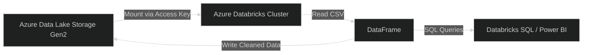

# 🧠 Hands-on Guide: Connect Azure Databricks to Azure Data Lake Storage (ADLS Gen2)

## 🧱 Step 1. Create the Prerequisites

### ✅ You’ll Need:

| Resource                              | Purpose                          |
| ------------------------------------- | -------------------------------- |
| **Azure Storage Account (ADLS Gen2)** | Where your data files live       |
| **Azure Databricks Workspace**        | Your data processing environment |
| **Resource Group**                    | Logical container for both       |

---

### 🪜 1.1 Create a Storage Account (ADLS Gen2)

1. Go to **Azure Portal → Create a resource → Storage Account**

2. Fill these important fields:

   - **Resource Group:** `rg-databricks-demo`
   - **Storage account name:** `stdataengdemo`
   - **Region:** Same as where you’ll create Databricks (e.g., East US)
   - **Performance:** Standard
   - **Redundancy:** LRS
   - **Enable hierarchical namespace:** ✅ (this makes it _Data Lake Storage Gen2_)

3. Click **Review + Create → Create**

4. After deployment → open the storage account and note down:

   - `Storage account name`
   - `Container name` (create one, e.g., `rawdata`)

---

### 🪜 1.2 Create an Azure Databricks Workspace

1. Go to **Azure Portal → Create a resource → Databricks**
2. Fill:

   - **Workspace name:** `adb-demo`
   - **Region:** Same as your storage account
   - **Pricing tier:** _Premium_ (so you can use access controls)

3. Click **Review + Create → Create**
4. When ready → click **Launch Workspace**

You’re now inside **Databricks UI** 🎉

---

## ⚙️ Step 2. Create a Databricks Cluster

### Why?

A **cluster** is a group of virtual machines that runs your Spark jobs.

### Steps:

1. In Databricks, go to **Compute → Create Cluster**
2. Set:

   - **Cluster name:** `demo-cluster`
   - **Cluster mode:** Standard
   - **Runtime version:** Latest _Databricks Runtime (with Apache Spark and Scala)_
   - **Auto-termination:** 15 min (to save cost)

3. Click **Create Cluster**
4. Wait 5–10 minutes until it’s _running_

---

## 📦 Step 3. Mount the Data Lake to Databricks

Now we’ll make the Data Lake accessible like a **local folder** inside Databricks.

There are **two methods**:

1. 🔐 Using **Account Key** (simpler for learning)
2. 🛡️ Using **Service Principal (AAD)** (for production)

We’ll use method 1 now.

---

### 🪜 3.1 Get the Storage Access Key

- Go to your **Storage Account → Access Keys**
- Copy one of the **keys**

---

### 🪜 3.2 Create a Notebook in Databricks

1. Click **Workspace → Create → Notebook**
2. Name it `mount_adls_demo`
3. Language: `Python`
4. Attach your running cluster.

---

### 🪜 3.3 Run the Following Code

```python
# Replace these values
storage_account_name = "stdataengdemo"
container_name = "rawdata"
storage_account_key = "<paste-your-access-key>"

# Mount the ADLS Gen2 container
dbutils.fs.mount(
  source = f"wasbs://{container_name}@{storage_account_name}.blob.core.windows.net/",
  mount_point = f"/mnt/{container_name}",
  extra_configs = {f"fs.azure.account.key.{storage_account_name}.blob.core.windows.net": storage_account_key}
)

print("✅ ADLS mounted successfully!")
```

🧩 Result:
A virtual folder `/mnt/rawdata` appears inside Databricks — representing your ADLS container.

---

## 📊 Step 4. Test Reading and Writing Data

Let’s make sure your Databricks can actually access the lake.

### 🧾 Upload a file to ADLS

In your storage account:

- Go to **Containers → rawdata → Upload**
- Upload a sample CSV (e.g., `sales.csv`)

---

### 💻 In Databricks Notebook:

```python
# Read the CSV file
df = spark.read.csv("/mnt/rawdata/sales.csv", header=True, inferSchema=True)
display(df)
```

✅ You’ll see your CSV as a dataframe table.

Now, write it back after cleaning 👇

```python
# Write cleaned data to a new location
df.write.mode("overwrite").parquet("/mnt/rawdata/cleaned_sales")
print("✅ Data written back to ADLS as Parquet")
```

✅ Check in Azure Portal → container → you’ll find a folder `cleaned_sales/`.

---

## 🧮 Step 5. (Optional) Query Data Using SQL

You can run SQL queries directly in Databricks!

1. Create a new cell → change language to **SQL**
2. Run this:

```sql
CREATE OR REPLACE TEMP VIEW sales_view
USING parquet
OPTIONS (path "/mnt/rawdata/cleaned_sales")

SELECT country, SUM(amount) AS total_sales
FROM sales_view
GROUP BY country
ORDER BY total_sales DESC;
```

✅ You’ll instantly get summarized results — just like SQL Server or Power BI.

---

## 🧠 What You Just Learned

| Concept            | What Happened                        |
| ------------------ | ------------------------------------ |
| **Mounting**       | Connected ADLS Gen2 to Databricks    |
| **Dataframe**      | Loaded data from CSV to Spark memory |
| **Transformation** | Processed and saved data as Parquet  |
| **SQL View**       | Queried data using SQL syntax        |
| **Cluster**        | Ran all the Spark jobs for you       |

---

## 🏁 Summary Diagram



---

## 💬 What’s Next

Now that your Databricks and Data Lake are connected, you can:

1. **Automate the job** using **Databricks Jobs**
2. **Use Delta Lake** format to track data versions (next-level reliability)
3. **Connect Power BI** directly to visualize your cleaned datasets

---

Would you like me to teach you **Delta Lake (in Databricks)** next —
so you can understand how data versioning, ACID transactions, and "time travel" work inside a Data Lake?
That’s the next key concept in becoming a real Data Engineer 🚀
