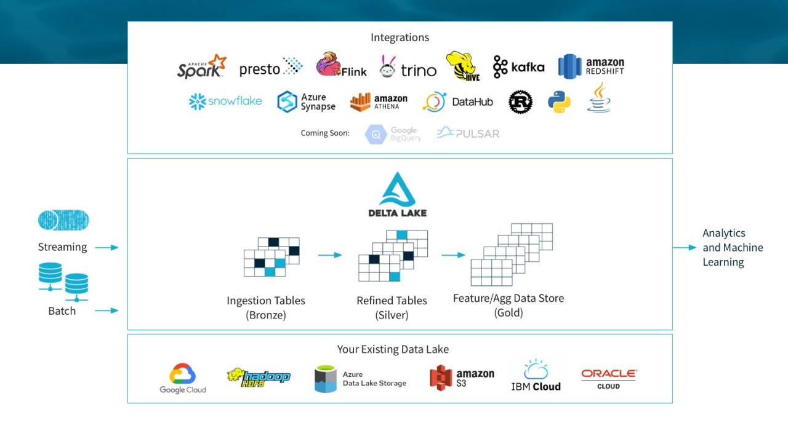
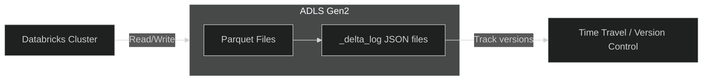

# 🧩 Delta Lake in Azure Databricks — The Backbone of Reliable Data Lakes

## 🌍 What Is Delta Lake?

> **Delta Lake** is an **open-source storage layer** built on top of **Parquet files** that adds reliability, consistency, and performance to your **Azure Data Lake Storage (ADLS)**.

Think of it as:

> Turning your “data lake” (raw files) into a **“lakehouse”** — a hybrid of data lake + data warehouse.

---

<div style="text-align:center; background-color:#ffff; border-radius: 20px;border: 2px solid #444;">

</div>

---

> 🚨 Azure Delta Lake is a transactional storage layer built on top of cloud object stores like Azure Data Lake Storage (ADLS) or Amazon S3—it cannot work alone without a backing storage system.

---

## 🧠 The Problem Before Delta Lake

Without Delta Lake, data lakes had 3 big issues:

| Problem                  | Description                               |
| ------------------------ | ----------------------------------------- |
| ❌ No ACID transactions  | Partial writes could corrupt files        |
| ❌ No version control    | You couldn’t revert to old data           |
| ❌ No schema enforcement | Accidental column changes broke pipelines |

So your data lake could become a **data swamp** 💧🐊  
Delta Lake fixes all of this.

---

## ⚙️ What Delta Lake Adds

| Feature                | Description                                    |
| ---------------------- | ---------------------------------------------- |
| **ACID transactions**  | Reliable writes/updates even during failures   |
| **Schema enforcement** | Prevents bad or missing columns                |
| **Time Travel**        | Query old versions of data (like Git for data) |
| **Upserts (MERGE)**    | Update existing records directly               |
| **Scalability**        | Handles petabytes of data efficiently          |
| **Integration**        | Works directly in Databricks notebooks         |

---

## 💡 Architecture Overview



### Explanation:

- Data is stored as **Parquet files**
- Delta Lake adds a **\_delta_log** folder to track every change
- This log enables **atomic operations** (commit/rollback) and **versioned queries**

---

## 🔧 Example: Create and Query Delta Table

### 🧱 Step 1. Write Data to Delta Format

```python
data = [("UAE", 1200), ("KSA", 900), ("Qatar", 450)]
columns = ["Country", "Sales"]

df = spark.createDataFrame(data, columns)
df.write.format("delta").mode("overwrite").save("/mnt/silver/sales_delta")

print("✅ Delta table created in /mnt/silver/sales_delta")
```

---

### 🔍 Step 2. Read Data Back

```python
df2 = spark.read.format("delta").load("/mnt/silver/sales_delta")
display(df2)
```

✅ Output shows your data with schema and metadata tracked.

---

## 🕒 Step 3. Delta Lake Time Travel (Versioning)

Every change creates a **new version** in the `_delta_log`.

You can **go back in time**:

```python
# Query previous versions
df_old = spark.read.format("delta").option("versionAsOf", 0).load("/mnt/silver/sales_delta")
display(df_old)
```

or by **timestamp**:

```python
df_old = spark.read.format("delta").option("timestampAsOf", "2025-10-09T12:00:00").load("/mnt/silver/sales_delta")
```

---

## 🔁 Step 4. Update or Merge Data

Delta supports SQL-like **MERGE INTO** (upsert):

```sql
MERGE INTO delta.`/mnt/silver/sales_delta` AS target
USING (SELECT 'UAE' AS Country, 2000 AS Sales) AS updates
ON target.Country = updates.Country
WHEN MATCHED THEN UPDATE SET target.Sales = updates.Sales
WHEN NOT MATCHED THEN INSERT *
```

✅ This updates existing rows or inserts new ones — just like SQL Server.

---

## 🧩 Step 5. Register a Delta Table in Databricks Metastore

This lets you query it like a database table:

```sql
CREATE TABLE sales_delta
USING DELTA
LOCATION '/mnt/silver/sales_delta';
```

Now you can run:

```sql
SELECT * FROM sales_delta WHERE Sales > 1000;
```

---

## 🧱 Delta Lake File Structure (Inside ADLS)

If you check `/mnt/silver/sales_delta`, you’ll see:

```ini
/sales_delta/
├── part-00000-abc.parquet
├── part-00001-def.parquet
└── _delta_log/
     ├── 00000000000000000000.json
     ├── 00000000000000000001.json
```

📂 `_delta_log` stores metadata & transaction logs
📁 `.parquet` files store the actual data

---

## 🧮 Delta Lake in the Medallion Architecture

Delta Lake fits beautifully into the **Bronze → Silver → Gold** pattern:

| Layer         | Description                         | Example                   |
| ------------- | ----------------------------------- | ------------------------- |
| 🟤 **Bronze** | Raw ingested data (JSON, CSV)       | `/mnt/bronze/sales_raw`   |
| ⚪ **Silver** | Cleaned + standardized Delta tables | `/mnt/silver/sales_delta` |
| 🟡 **Gold**   | Aggregated, analytics-ready tables  | `/mnt/gold/sales_summary` |

Each layer is a Delta table → reliable and queryable with SQL.

---

## 🧩 Integration with Azure Services

| Service                     | Integration                                      |
| --------------------------- | ------------------------------------------------ |
| **Azure Data Lake Storage** | Stores all Delta tables                          |
| **Azure Synapse Analytics** | Reads Delta tables directly using serverless SQL |
| **Power BI**                | Connects directly for dashboards                 |
| **Azure Data Factory**      | Can orchestrate Delta jobs                       |
| **Azure ML**                | Trains ML models from Delta tables               |

---

## 🔐 Security and Governance

| Feature                     | Description                            |
| --------------------------- | -------------------------------------- |
| **RBAC & ACLs**             | Control access to notebooks and tables |
| **Data Masking**            | Protect sensitive columns              |
| **Auditing**                | Track all changes through `_delta_log` |
| **Lineage (Unity Catalog)** | See how datasets are connected         |

---

## ⚡ Performance Boosters

| Optimization        | Description                          |
| ------------------- | ------------------------------------ |
| **Z-Ordering**      | Sorts files for faster queries       |
| **Data Skipping**   | Skips unnecessary file reads         |
| **Caching**         | Keeps frequently used data in memory |
| **Auto Compaction** | Merges small files automatically     |

Example:

```sql
OPTIMIZE sales_delta
ZORDER BY (Country);
```

---

## 🧭 Summary Table

| Concept                | Description                                   |
| ---------------------- | --------------------------------------------- |
| **Service**            | Delta Lake (on Azure Databricks)              |
| **Storage**            | Parquet files + transaction logs on ADLS      |
| **ACID**               | Yes                                           |
| **Schema enforcement** | Yes                                           |
| **Time travel**        | Yes                                           |
| **Integration**        | Synapse, Power BI, ADF, AML                   |
| **Best Use**           | Reliable, large-scale data pipelines          |
| **Real-world Role**    | Replaces fragile CSV/Parquet-based data lakes |

---

## 🧩 Think of Delta Lake Like This

| Layer         | Analogy                             |
| ------------- | ----------------------------------- |
| 🧱 Parquet    | The “data warehouse” tables         |
| 🪪 \_delta_log | The “version control” (like Git)    |
| ⚙️ Spark SQL  | The “query engine”                  |
| 🧠 Databricks | The “IDE” that ties it all together |

---

## ❓ FAQs

## 📌 1. Can Delta Lake Work Alone?

**No—it needs a cloud object store underneath.** Delta Lake is a _protocol_ and _file format_ that sits on top of:

| Storage Backend                  | Supported? | Notes                                |
| -------------------------------- | ---------- | ------------------------------------ |
| **Azure Data Lake Storage Gen2** | ✅         | Most common on Azure                 |
| **Amazon S3**                    | ✅         | Common in AWS setups                 |
| **Google Cloud Storage (GCS)**   | ✅         | Supported via connectors             |
| **Local disk (for dev/test)**    | ⚠️         | Possible, but not scalable or secure |

Delta Lake stores data in **Parquet format** and maintains a **transaction log (_delta log_)** in the same directory. So it needs a filesystem or object store to persist both.

---

### 🔧 How It Works in Azure

- You create a **Delta table** in Databricks or Spark.
- The table is stored in a folder on **ADLS Gen2**.
- Delta Lake writes:
  - **Parquet files** for actual data.
  - **\_delta_log/** folder for transaction history.
- You query/update the table using Spark SQL or DataFrames.

Example:

```python
df.write.format("delta").save("abfss://mycontainer@myaccount.dfs.core.windows.net/delta/mytable")
```

---

### 🧪 Why Use Delta Lake?

- **Faster queries**: Avoids expensive file listing by using the transaction log.
- **Reliable pipelines**: Handles schema changes and concurrent writes.
- **Lakehouse architecture**: Combines flexibility of data lakes with reliability of data warehouses.

---

Would you like me to continue next with **Azure Synapse Analytics** —
so you can learn how to query your Delta Lake data in _serverless SQL_ and visualize it with _Power BI_ (the final step of the modern Azure Data Pipeline)? 🚀
