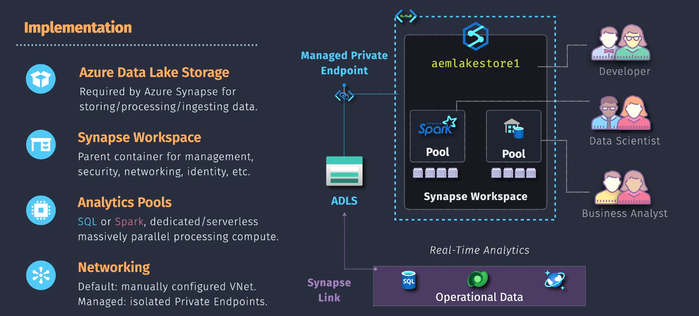
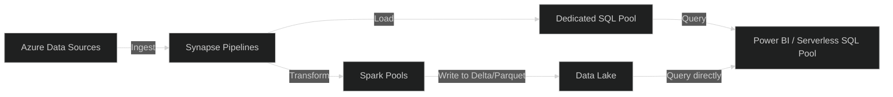

# 🏗️ **Azure Synapse Analytics** — The Heart of Azure Data Analytics

## 🌍 What Is Azure Synapse Analytics?

> **Azure Synapse Analytics** is Microsoft’s **unified analytics platform** that brings together **data ingestion, big data processing, data warehousing, and data visualization** — all in one place.

Think of it as the **command center** for your data —
where you can **analyze anything**, from raw files in a Data Lake to structured tables in a Data Warehouse.

---

## 💡 Simple Analogy

> Imagine your **Azure Data Lake** as a huge library 📚 full of raw books (data).
>
> **Synapse** is the **librarian + reading room + analysis tool** 🧑‍💼 —
> letting you _organize_, _query_, _analyze_, and _share insights_ — without moving the data anywhere.

---

## 🧩 Synapse = Integration of 4 Big Worlds

| Area                    | What It Does                          | Example                             |
| ----------------------- | ------------------------------------- | ----------------------------------- |
| 🗂️ **Data Integration** | Ingest and orchestrate data pipelines | Copy data from SQL, Blob, Cosmos DB |
| ⚙️ **Data Processing**  | Big data processing using Spark       | Transform JSON/CSV/Delta data       |
| 🧮 **Data Warehousing** | Store structured, relational data     | Fact/Dimension tables for BI        |
| 📊 **Data Analytics**   | Query data interactively              | Run SQL queries or connect Power BI |

---

<div style="text-align:center; background-color:#292E3F; border-radius: 20px;border: 2px solid #444;">

</div>

## 🧱 Synapse Components (Products Inside Synapse)

Azure Synapse is actually a **bundle of services** under one umbrella.
Here’s the full breakdown 👇

---

### 1️⃣ Synapse **SQL Pools**

#### 🧩 a. **Dedicated SQL Pool** (formerly SQL Data Warehouse)

- A **massively parallel processing (MPP)** data warehouse engine.
- You **load structured data** into it (tables, schema).
- It’s **provisioned** — you pay for reserved compute (DWUs).
- Best for **large-scale data warehousing and BI**.

✅ Example:
You load billions of sales transactions, then run analytical queries like:

```sql
SELECT Region, SUM(SalesAmount)
FROM Sales
GROUP BY Region;
```

#### 🧩 b. **Serverless SQL Pool**

- No need to provision compute.
- You query **data directly from your Data Lake** (ADLS / Delta).
- You **pay only per query (per TB processed)**.
- Great for **ad-hoc analytics** and **cost savings**.

✅ Example:
You can query a CSV/Parquet/Delta file directly from the lake:

```sql
SELECT TOP 10 *
FROM OPENROWSET(
    BULK 'https://storageaccount.dfs.core.windows.net/raw/sales.csv',
    FORMAT='CSV',
    PARSER_VERSION='2.0'
) AS rows;
```

🧠 Think of it like: _Power BI querying your Data Lake via SQL instantly._

---

### 2️⃣ Synapse **Apache Spark Pools**

- Built-in **Spark clusters** managed by Azure (no setup required).
- Ideal for **data transformation**, **machine learning**, and **ETL jobs**.
- Supports **Python, Scala, Java, and SQL**.
- Auto-scales and auto-pauses to save cost.

✅ Example:
Use Spark code to clean and write data to Delta format:

```python
df = spark.read.csv("abfss://raw@storageaccount.dfs.core.windows.net/sales.csv", header=True)
df.write.format("delta").mode("overwrite").save("abfss://silver@storageaccount.dfs.core.windows.net/sales_delta")
```

---

### 3️⃣ Synapse **Data Integration (Pipelines)**

- Think of it as **Azure Data Factory inside Synapse**.
- Used to **move and orchestrate data flows** across services.
- You can design **ETL/ELT pipelines** using visual interface or code.
- Connects to **on-prem**, **cloud**, or **SaaS** sources.

✅ Example:

- Copy data from an on-prem SQL Server to a Synapse table.
- Then trigger a Spark notebook to clean data.
- Finally, refresh Power BI reports.

---

### 4️⃣ Synapse **Studio**

- The **web-based UI** for everything Synapse does.
- Combines multiple tools into one interface:

  - SQL Editor (for SQL Pools)
  - Spark Notebook (for data engineering)
  - Pipeline Designer (for integration)
  - Data Explorer (for lake browsing)
  - Power BI integration (for visualization)

✅ Access it from:
👉 [portal.azure.com → Synapse Workspace → Open Synapse Studio](https://portal.azure.com)

---

## 🏗️ Synapse Architecture Overview



### 💬 Explanation:

- Pipelines **move** the data
- Spark Pools **transform** the data
- SQL Pools **analyze** the data
- Power BI **visualizes** it
- Everything is managed inside **Synapse Studio**

---

## 🧱 Synapse vs. Databricks (Clear Comparison)

| Feature           | **Azure Synapse**           | **Azure Databricks**           |
| ----------------- | --------------------------- | ------------------------------ |
| **Type**          | Analytics & BI Platform     | Data Engineering & ML Platform |
| **Language**      | SQL (mostly)                | Python, Scala, SQL             |
| **Main Engine**   | MPP SQL                     | Apache Spark                   |
| **Best For**      | Querying & Warehousing      | Data Processing & ML           |
| **Integration**   | Power BI, Data Factory      | Delta Lake, MLflow             |
| **Compute Model** | Dedicated or Serverless SQL | Cluster-based Spark            |
| **Cost Model**    | Pay per DWU or per query    | Pay per cluster usage          |

🧠 In short:

- **Databricks** cleans and prepares data.
- **Synapse** queries and visualizes data.
  Together → they form a **Modern Azure Data Platform** 💎.

---

## 💾 Storage Underneath

All Synapse components store or query data from **Azure Data Lake Storage Gen2**.
So your ADLS is the _single source of truth_ — the same place Databricks used.

---

## 🔐 Security and Access Control

| Feature                         | Description                             |
| ------------------------------- | --------------------------------------- |
| **Azure AD Authentication**     | Centralized login and RBAC              |
| **Managed VNETs**               | Isolate compute from public internet    |
| **Private Endpoints**           | Secure communication                    |
| **Data Encryption**             | Always encrypted at rest and in transit |
| **Auditing & Threat Detection** | Log access and detect anomalies         |

---

## 💸 Pricing Model

| Component               | Pricing Type         | Notes                                |
| ----------------------- | -------------------- | ------------------------------------ |
| **Dedicated SQL Pool**  | Pay per DWU/hour     | Scale up/down or pause               |
| **Serverless SQL Pool** | Pay per TB processed | Cost-effective for on-demand queries |
| **Spark Pool**          | Pay per vCore/hour   | Auto-pause saves cost                |
| **Pipelines**           | Pay per run          | Like Azure Data Factory pricing      |

---

## 🧠 Real-World Use Cases

| Use Case                  | Description                            |
| ------------------------- | -------------------------------------- |
| 🧾 **Data Warehousing**   | Store structured sales or finance data |
| 📈 **Ad-hoc Analysis**    | Query files directly from Data Lake    |
| ⚙️ **ETL Automation**     | Transform and load data into Delta/SQL |
| 📊 **Power BI Reporting** | Create dashboards from Synapse SQL     |
| 🤖 **ML Integration**     | Train models on curated data via Spark |

---

## 🧩 Summary

| Component               | Type        | Best Use                         |
| ----------------------- | ----------- | -------------------------------- |
| **Dedicated SQL Pool**  | Provisioned | Enterprise-grade data warehouse  |
| **Serverless SQL Pool** | On-demand   | Ad-hoc querying on Data Lake     |
| **Spark Pool**          | Compute     | Big Data transformation / ML     |
| **Pipelines**           | Integration | ETL / ELT orchestration          |
| **Synapse Studio**      | UI          | Unified management and analytics |

---

✅ **In one line:**

> **Azure Synapse = A full data analytics factory — integrating ingestion, transformation, storage, querying, and visualization into one service.**
