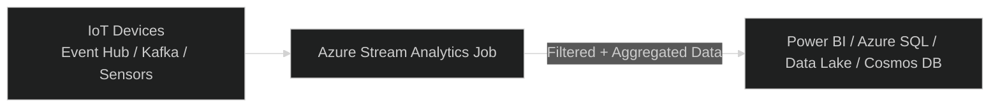

# ⚡ Azure Stream Analytics (ASA)

## 🧠 What It Is

> **Azure Stream Analytics (ASA)** is a **real-time data stream processing service** that lets you **analyze, filter, and transform data in motion** — from sources like IoT devices, event hubs, and logs — and output the results instantly to dashboards, databases, or storage.

---

> 💬 In simple terms:  
> Stream Analytics = analyzes **data in motion**

---

## 🔍 Real-World Analogy

Imagine a **security camera system** 🎥:

- You don’t want to analyze footage after 10 hours — you want to **react instantly** when motion is detected.
  That’s what **Azure Stream Analytics** does —
  it **processes data as it arrives**, not after it’s stored.

---

## 🧩 Architecture Overview

<div align="center" style="background-color: #000; border-radius: 20px; border: solid">



</div>

---

## ⚔️ ASA vs Apache Products

Azure Stream Analytics (ASA) most closely resembles **Apache Flink**, **Apache Storm** and **Apache Spark Streaming** but with a simplified, serverless experience. Here's how they compare:

### 🔍 ASA vs Apache Flink

<div align="center" style="background-color: #000; border-radius: 20px; border: solid">

| Feature         | Azure Stream Analytics                   | Apache Flink                                        |
| --------------- | ---------------------------------------- | --------------------------------------------------- |
| Origin          | Proprietary (Microsoft)                  | Open-source (Apache)                                |
| Language        | SQL-like query language                  | Java, Scala, SQL                                    |
| Deployment      | Fully managed (PaaS)                     | Self-hosted or managed (e.g., via Kubernetes)       |
| Use Case        | Real-time filtering, aggregation, alerts | Complex event processing, stateful stream analytics |
| Windowing       | Built-in (tumbling, sliding, hopping)    | Advanced windowing and state management             |
| ML Integration  | Azure ML scoring                         | Custom ML via libraries                             |
| Fault Tolerance | Built-in                                 | Requires setup (e.g., checkpoints)                  |

</div>

**ASA is like Flink-lite**: it handles many of the same tasks (windowing, joins, real-time processing), but abstracts away the complexity of cluster management and coding.

---

### 🔍 ASA vs Apache Storm

<div align="center" style="background-color: #000; border-radius: 20px; border: solid">

| Feature      | Azure Stream Analytics     | Apache Storm                           |
| ------------ | -------------------------- | -------------------------------------- |
| Language     | SQL-like                   | Java                                   |
| Architecture | Declarative query model    | Topology-based (spouts and bolts)      |
| Complexity   | Low (no infra to manage)   | High (manual scaling, fault tolerance) |
| Use Case     | Simple real-time analytics | Custom stream processing logic         |

</div>

Storm is more low-level and flexible, but ASA is easier to use and integrates tightly with Azure services.

---

### 🔍 Azure Stream Analytics vs Apache Spark Streaming

<div align="center" style="background-color: #000; border-radius: 20px; border: solid">

| Feature                 | **Azure Stream Analytics**            | **Apache Spark Streaming**                       |
| ----------------------- | ------------------------------------- | ------------------------------------------------ |
| **Origin**              | Proprietary (Microsoft)               | Open-source (Apache)                             |
| **Language**            | SQL-like query language               | Scala, Python, Java, SQL                         |
| **Deployment**          | Fully managed (PaaS)                  | Requires cluster (self-hosted or via Databricks) |
| **Latency**             | Sub-second (event-driven)             | Micro-batch (typically seconds)                  |
| **Windowing**           | Built-in (tumbling, sliding, hopping) | Supported via structured streaming               |
| **Stateful Processing** | Limited (via reference data)          | Advanced (state stores, watermarking)            |
| **ML Integration**      | Azure ML scoring                      | Full MLlib, custom models                        |
| **Fault Tolerance**     | Built-in, abstracted                  | Requires checkpointing and recovery setup        |
| **Ease of Use**         | Very high (no infra, declarative SQL) | Moderate to complex (code + infra)               |
| **Use Case Fit**        | Real-time dashboards, alerts, IoT     | Complex ETL, ML, multi-source joins              |

</div>

---

### 🧪 Summary

If you’re looking for Apache analogies:

- ASA ≈ **Apache Flink** (real-time SQL + windowing)
- ASA ≈ **Apache Storm** (stream processing, but simpler)
- ASA ≠ **Apache Spark Streaming** (Spark is more batch-oriented and ML-heavy)

---

## 🧱 Core Components

| Component  | Description                         | Example                               |
| ---------- | ----------------------------------- | ------------------------------------- |
| **Input**  | Where data is coming from           | Event Hub, IoT Hub, Blob              |
| **Query**  | SQL-like transformation logic       | `SELECT * FROM input WHERE temp > 50` |
| **Output** | Where processed data goes           | Power BI, SQL DB, Data Lake           |
| **Job**    | The pipeline that ties all together | The entire stream processing workflow |

---

## 💬 Stream Analytics = Streaming SQL Engine

Yes! You can write **SQL-like queries** to filter and aggregate real-time data streams.

Example:

```sql
SELECT
    DeviceId,
    AVG(Temperature) AS AvgTemp
INTO
    outputSql
FROM
    inputStream TIMESTAMP BY EventTime
GROUP BY
    DeviceId,
    TumblingWindow(minute, 5)
```

🧠 Explanation:

- Reads data continuously from `inputStream`
- Groups readings into **5-minute windows**
- Calculates average temperature per device
- Sends results to SQL DB (output)

---

## 🧠 Data Flow

1️⃣ **Input sources** — IoT devices, apps, sensors send data to Event Hub or IoT Hub  
2️⃣ **Stream Analytics Job** — runs continuously, applying filters, aggregations, joins  
3️⃣ **Output sinks** — results flow into Power BI, SQL, Cosmos DB, or Blob Storage

---

## 🔗 Common Input Sources

| Input Type                  | Description                                |
| --------------------------- | ------------------------------------------ |
| **Azure Event Hub**         | High-volume event ingestion (millions/sec) |
| **Azure IoT Hub**           | For IoT sensor telemetry                   |
| **Azure Blob Storage**      | For hybrid (batch + stream) processing     |
| **Azure Data Lake Storage** | Optional for replay or historical analysis |

---

## 📤 Common Output Sinks

| Output                 | Purpose                          |
| ---------------------- | -------------------------------- |
| **Power BI**           | Real-time dashboards             |
| **Azure SQL Database** | Save results for business apps   |
| **Cosmos DB**          | For fast query on JSON documents |
| **Data Lake / Blob**   | Long-term storage                |
| **Event Hub**          | Send back to other pipelines     |

---

## 🧮 Windowing Concepts (Key for Stream Processing)

Unlike batch analytics (which processes all data at once), stream analytics uses **time windows** ⏰ to group data.

| Window Type         | Description                 | Example                              |
| ------------------- | --------------------------- | ------------------------------------ |
| **Tumbling Window** | Fixed-size, non-overlapping | Every 1 min calculate average        |
| **Hopping Window**  | Overlapping windows         | Every 5 sec, look at last 1 min      |
| **Sliding Window**  | Event-driven                | Trigger whenever event condition met |
| **Session Window**  | Based on activity sessions  | Group by user inactivity timeout     |

Example:

```sql
SELECT COUNT(*)
FROM inputStream
GROUP BY TumblingWindow(second, 10)
```

→ Counts number of events every 10 seconds.

---

## 💪 Hands-On Example

### 🎯 Scenario

You have IoT devices sending temperature data every second.
You want to:

- Detect when temperature > 50°C
- Save result to SQL DB
- Show it instantly in Power BI

---

### 🪜 Step-by-Step

#### 1️⃣ Create Input Source

- Go to **Azure Portal → Event Hubs → Create**
- Devices send events (JSON) like:

  ```json
  { "deviceId": "Sensor1", "temperature": 55, "timestamp": "2025-10-09T10:00:00Z" }
  ```

#### 2️⃣ Create Azure Stream Analytics Job

- Portal → **Create Resource → Stream Analytics Job**
- Set:

  - **Job Name:** `temperature-monitor`
  - **Streaming Units (SU):** 3 (default)
  - **Hosting:** Cloud or Edge
  - Click **Review + Create**

#### 3️⃣ Add Input

- In the job → **Inputs → + Add stream input → Event Hub**
- Select your event hub.

#### 4️⃣ Add Output

- **Outputs → + Add → Azure SQL Database** (or Power BI)
- Configure connection string.

#### 5️⃣ Add Query

Paste this:

```sql
SELECT
    deviceId,
    temperature,
    System.Timestamp AS EventTime
INTO
    outputSQL
FROM
    inputStream
WHERE
    temperature > 50
```

#### 6️⃣ Start Job

- Click **Start → Now**
- Data flows continuously!

✅ Real-time high-temp alerts will now appear in SQL or Power BI instantly.

---

## 🧠 Hosting Options

| Mode                | Description                                          |
| ------------------- | ---------------------------------------------------- |
| **Cloud (Default)** | Runs in Azure’s managed environment                  |
| **Edge (IoT Edge)** | Runs on IoT devices for low-latency local processing |

💡 Use **Edge** when:

- You need offline processing
- Devices can’t depend on cloud connection

---

## 🧩 Integrations

| Service             | Role                         |
| ------------------- | ---------------------------- |
| **IoT Hub**         | Stream input                 |
| **Event Hub**       | Event ingestion pipeline     |
| **Blob / ADLS**     | Backup or replay data        |
| **SQL / Cosmos DB** | Output destinations          |
| **Power BI**        | Real-time visualization      |
| **Azure Functions** | Trigger alerts or automation |

---

## 🔐 Security

| Feature              | Description                                      |
| -------------------- | ------------------------------------------------ |
| **Managed Identity** | Securely connect to outputs without credentials  |
| **VNet Integration** | Private communication with input/output services |
| **RBAC + AD**        | Job-level access control                         |
| **Encryption**       | Data encrypted in transit and at rest            |

---

## ⚙️ Performance Scaling

| Concept                   | Description                              |
| ------------------------- | ---------------------------------------- |
| **Streaming Units (SUs)** | Measure of compute power (scale up/down) |
| **Parallelism**           | Distributes input streams across SUs     |
| **Late Arrival Policy**   | Handles delayed events gracefully        |
| **Event Ordering**        | You can reorder based on timestamps      |

💡 Example:

- If you expect millions of events/sec → increase to 6–12 SUs.
- You can scale **without stopping** the job.

---

## 💸 Pricing

| Resource                  | Description                     |
| ------------------------- | ------------------------------- |
| **Streaming Units (SUs)** | Charged per hour per SU         |
| **Inputs/Outputs**        | Billed by data volume processed |
| **Idle Jobs**             | Not billed when stopped         |

🧠 Example:

- 3 SUs × 1 hour ≈ few dollars/hour
- Pay only while job is running

---

## 🧾 Summary

| Concept      | Description                                     |
| ------------ | ----------------------------------------------- |
| **Purpose**  | Real-time stream data processing                |
| **Language** | Streaming SQL                                   |
| **Input**    | IoT Hub, Event Hub, Blob                        |
| **Output**   | Power BI, SQL, Cosmos DB                        |
| **Scaling**  | Streaming Units (SUs)                           |
| **Hosting**  | Cloud or Edge                                   |
| **Pricing**  | Pay per SU-hour                                 |
| **Best Use** | IoT analytics, fraud detection, live dashboards |

---

✅ **In one line:**

> **Azure Stream Analytics (ASA)** lets you **analyze and act on real-time data streams** using **SQL-like queries**, powering dashboards, alerts, and automation within seconds of the event.

---

Would you like me to continue next with
👉 **“Azure Stream Analytics Hands-On with IoT Hub + Power BI Dashboard”**
(a full step-by-step demo showing real-time temperature monitoring end-to-end)?
