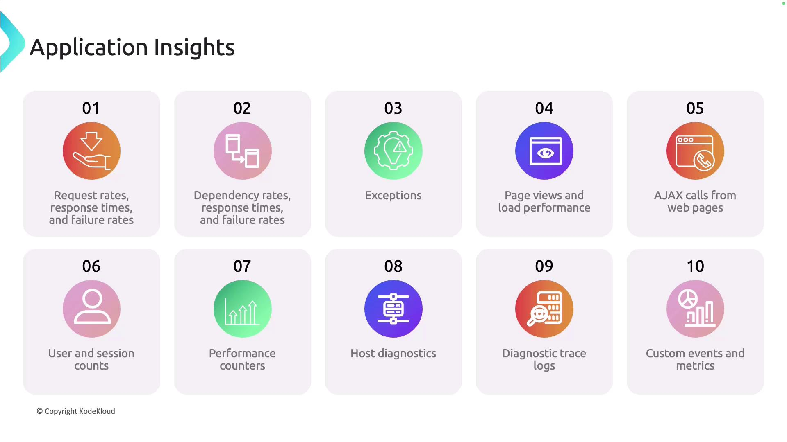

# 📊 **Azure Application Insights (App Insights)**

Application Insights (part of **Azure Monitor**) is an **APM (Application Performance Monitoring)** service.
It helps you **detect, diagnose, and understand** issues in your application automatically.

- Works with **.NET, Java, Node.js, Python, JavaScript, Azure Functions, AKS**, etc.
- Tracks **requests, dependencies, exceptions, performance, usage analytics, and availability**.
- Backed by **Kusto Query Language (KQL)** for deep querying.

Think of it as the **doctor 🩺 for your app**:

- Watches your app’s health & performance
- Catches errors before your users do
- Helps you understand **users & usage**

---

<div align="center" style="background-color: #ffffffff ;border-radius: 10px;border: 2px solid white">
  
</div>

---

## 🩺 **What Data It Collects**

Application Insights collects a wide array of performance indicators and diagnostic data to help you monitor and optimize your application. Key metrics include:

> 🔹 **Request Rates, Response Times, and Failure Rates**: Track how quickly your application responds and monitor error frequencies over time.  
> 🔹 **Dependency Metrics**: Measure the performance and reliability of external dependencies such as databases, storage accounts, and third-party services.  
> 🔹 **Exceptions**: Access detailed exception logs to diagnose and troubleshoot issues effectively.  
> 🔹 **Page Views and Load Performance**: Monitor web page traffic and load times to ensure an optimal user experience.  
> 🔹 **AJAX Calls**: Evaluate the performance of asynchronous calls to ensure smooth interactions on your webpages.  
> 🔹 **User and Session Counts**: Understand user engagement by analyzing the number of active users and their session behaviors.  
> 🔹 **Performance Counters**: Track system resources including CPU, memory, disk, and network usage for comprehensive performance monitoring.  
> 🔹 **Host Diagnostics**: Inspect the health of the underlying infrastructure that powers your application.  
> 🔹 **Diagnostic Trace Logs**: Follow detailed trace logs to pinpoint specific events or errors.  
> 🔹 **Custom Events and Metrics**: Capture unique business events to gain tailored insights into your application's performance.
>
<div align="center" style="background-color: #ffffffff ;border-radius: 10px;border: 2px solid white">
>   
> </div>

---

## 🧠 Memory Hack – The **“MUSCLE” Rule**

To remember App Insights features, think of **MUSCLE** 💪 (because it strengthens your app):

- **M** → **Metrics & Monitoring** (performance counters, custom metrics, live metrics stream)
- **U** → **Usage Analytics** (user flows, funnels, retention, events)
- **S** → **Smart Detection** (AI-powered anomaly detection, failure patterns, performance issues)
- **C** → **Correlation** (distributed tracing, dependency maps, Application Map)
- **L** → **Logs & Live Metrics** (KQL queries, real-time telemetry, dashboards)
- **E** → **End-to-End Diagnostics** (request traces, exceptions, snapshots, profiling)

---

## 🔎 **Investigation Features**

These are your “workbench” 🛠 for troubleshooting:

- **📍 Application Map** -
  - Visual graph of app + dependencies (SQL, APIs, queues)
- **🤖 Smart Detection**
  - Alerts on anomalies (e.g. sudden spike in failures or latency)
- **📡 Live Metrics**
  - Real-time throughput, CPU, memory, failure rates (streaming view)
- **🔍 Transaction Search**
  - Search by URL, user ID, operation name, **correlation ID**
- **🌍 Availability**
  - Global ping tests + **Synthetic transactions** (multi-region uptime)
- **💥 Failures**
  - Drill into failed requests, exceptions, stack traces, affected users
- **⏱️ Performance**
  - P50/P95/P99 latency by endpoint, dependency, or operation
- **📑 Logs (KQL)**
  - Write queries across telemetry tables (requests, dependencies, traces)

---

## 📈 **Usage & Behavior Features**

Understand which features are popular with users and how users interact and use your application:

- **🧑‍💻 Users**
  - Unique users tracked by session, device, geo, and custom dimensions
- **📆 Sessions**
  - Grouped telemetry per user visit (duration, actions, entry/exit pages)
- **🎯 Events**
  - Custom actions (e.g. button clicks, form submits, business logic triggers)
- **🧭 Funnels**
  - Multi-step conversion paths (e.g. login → search → checkout)
- **🔄 User Flows**
  - Navigation paths across pages/events (entry → exit → loops)
- **👥 Cohorts**
  - Segment users by behavior (e.g. users who triggered “AddToCart”)
- **📊 Retention**
  - Tracks how often users return after first visit (day/week/month)
- **📌 Impact Analysis** -
  - helps you analyze how different factors, like page load time, impact the user experience, including conversion rates.
  - This makes it ideal for understanding the correlation between performance and user behavior.
- **💡 Feature Adoption**
  - See which features are used, skipped, or abandoned
- **📈 Custom Dashboards**
  - Pin charts, metrics, and queries for team visibility

---

## ⚙️ **Architecture (How It Works)**

```mermaid
---
config:
  look: handDrawn
  theme: dark
title: "🔍 Azure Application Insights: Telemetry Flow"
---

flowchart TD
    A["🧩 Your App <br/>(.NET / Node / Java / Python)"]
    B["📦 App Insights SDK / Agent"]
    C["🚀 App Insights Endpoint"]
    D["🧠 Azure Monitor Backend"]
    E["📊 App Insights Resource <br/>in Azure Portal"]
    F["📈 Dashboards, Alerts, Logs <br/>(KQL Queries)"]

    A --> B
    B -->|📡 Telemetry Data| C
    C --> D
    D --> E
    E --> F

    %% Styling
    classDef app color:#fff,fill:#4b8bbe,stroke:#333,stroke-width:2px,font-size:14px;
    classDef sdk color:#fff,fill:#f9a825,stroke:#333,stroke-width:2px,font-size:14px;
    classDef endpoint color:#fff,fill:#00acc1,stroke:#333,stroke-width:2px,font-size:14px;
    classDef backend color:#fff,fill:#7cb342,stroke:#333,stroke-width:2px,font-size:14px;
    classDef portal color:#fff,fill:#ab47bc,stroke:#333,stroke-width:2px,font-size:14px;
    classDef output color:#fff,fill:#ef6c00,stroke:#333,stroke-width:2px,font-size:14px;

    class A app
    class B sdk
    class C endpoint
    class D backend
    class E portal
    class F output
```

<div align="center" style="background: #363f43ff; border-radius: 20px">



</div>

---

## 🏗 **Implementing in .NET MVC**

1. **Create an Application Insights resource** in Azure. Copy its **Connection String** (workspace-based is the current default).
2. **Add package**:

   ```bash
   dotnet add package Microsoft.ApplicationInsights.AspNetCore
   ```

3. **Wire up in `Program.cs`**:

   ```csharp
   var builder = WebApplication.CreateBuilder(args);

   // Option 1: from configuration (appsettings.json / env)
   builder.Services.AddApplicationInsightsTelemetry();

   // Option 2: set explicitly
   // builder.Services.AddApplicationInsightsTelemetry("InstrumentationKey=...;IngestionEndpoint=...");

   // optional: enrich logs with AI
   builder.Logging.AddApplicationInsights();

   var app = builder.Build();
   app.MapDefaultControllerRoute();
   app.Run();
   ```

4. **appsettings.json** (recommended):

   ```json
   {
     "ApplicationInsights": {
       "ConnectionString": "InstrumentationKey=xxxx;IngestionEndpoint=https://<region>.in.applicationinsights.azure.com/"
     },
     "Logging": { "LogLevel": { "Default": "Information" } }
   }
   ```

5. **Correlate your logs**  
   `ILogger` logs automatically flow as **trace** telemetry and are correlated to the current request.

6. **Track custom events** (anywhere in your code):

   ```csharp
   using Microsoft.ApplicationInsights;

   public class OrdersController : Controller
   {
       private readonly TelemetryClient _telemetry;
       public OrdersController(TelemetryClient telemetry) => _telemetry = telemetry;

       public IActionResult Checkout(string plan)
       {
           _telemetry.TrackEvent("CheckoutStarted", new() { ["plan"] = plan });
           // ... your logic
           return View();
       }
   }
   ```

7. **Capture SQL, HTTP dependencies**

   - Core SDK auto-collects outbound HTTP and EF Core SQL timings.
   - For **SqlClient**/EF6, ensure the proper diagnostic listeners are enabled (default in modern .NET).

---

---

## 🌍 **Availability Tests**

- Configure in **Azure Portal → Availability**
- Runs **global pings** on your URLs
- Alerts on downtime/latency

---

## 🕵️ **Distributed Tracing**

- App Insights uses **W3C Trace-Context** headers (`traceparent`, `tracestate`).
- Links **request → dependency → exception → logs** into **1 correlated timeline**
- Works across **microservices & APIs**: you’ll see a single correlated **operation id** and a timeline.

---

## ⚖️ **Sampling (Control Costs)**

- **Adaptive sampling** → keeps representative data only
- Example config:

  ```json
  "ApplicationInsights": {
  "EnableAdaptiveSampling": true,
  "SamplingSettings": { "MaxTelemetryItemsPerSecond": 5 }
  }
  ```

---

## 🛡 **Data Filtering & Enrichment**

- **Telemetry Initializers** → Add metadata to every item (e.g.,tenantId, region).
- **Telemetry Processors** → Drop/modify sensitive data fields (e.g., cookie values, emails).

- Example (Core):

  ```csharp
  public class PiiFilter : ITelemetryProcessor
  {
      private ITelemetryProcessor _next;
      public PiiFilter(ITelemetryProcessor next) => _next = next;

      public void Process(ITelemetry item)
      {
          // Example: strip query strings
          if (item is RequestTelemetry r)
              r.Url = new Uri($"{r.Url.Scheme}://{r.Url.Host}{r.Url.AbsolutePath}");
          _next.Process(item);
      }
  }
  ```

  Register in DI:

  ```csharp
  builder.Services.AddApplicationInsightsTelemetryProcessor<PiiFilter>();
  ```

---

## 🚨 **Alerts (Guardrails)**

### **Metric-based** (simple & fast):

- _Server response time p95 > 2s for 5 min_
- _Request failure rate > 2%_
- _Availability test failure > 0_

### **Log (KQL)-based** (precise):

- Spike in specific exception type:

  ```kusto
  exceptions
  | where type == "SqlException"
  | where timestamp > ago(5m)
  | summarize count()
  ```

Create **Alert rule** → Action Group → email/Teams/Webhook/PagerDuty.

---

## 📑 **Logs (KQL) You’ll Use Often**

- **Slow endpoints (top offenders, last 24h):**

  ```kusto
  requests
  | where timestamp > ago(24h)
  | summarize p95=percentile(duration, 95ms) by name
  | top 10 by p95 desc
  ```

- **SQL calls slower than 500ms:**

  ```kusto
  dependencies
  | where type == "SQL"
  | where duration > 500ms
  | project timestamp, target, name, duration, success, resultCode, operation_Id
  | order by duration desc
  ```

- **Link request → dependency → exception by operation:**

  ```kusto
  let since = ago(1h);
  requests
  | where timestamp > since and success == false
  | join kind=leftouter (dependencies | where timestamp > since) on operation_Id
  | join kind=leftouter (exceptions  | where timestamp > since) on operation_Id
  | project timestamp, name, resultCode, duration, dependency=name1, depDuration=duration1, exceptionType=type, message
  | take 50
  ```

---

## 🧩 **Profiler & Snapshot Debugger**

- **Profiler** → captures CPU hotspots on App Service
- **Snapshot Debugger** → captures state when exception occurs

⚠️ Use carefully in Prod → may expose sensitive data

---

## ✅ **Best Practices Checklist**

- ✅ Always use **Connection String** (not old keys)
- ✅ Enable **Adaptive Sampling**
- ✅ Filter out **PII** (query strings, emails)
- ✅ Add **Custom Dimensions** (tenant, environment)
- ✅ Set **Alerts** on SLA metrics (failure, p95 latency)
- ✅ Use **Workbooks** for dashboards
- ✅ Ensure **Distributed Tracing** is on
- ✅ Monitor **costs & retention**

---

## 🧩 Compare with Competitors

- **New Relic / Dynatrace / Datadog** → 3rd party APMs.
- **Azure App Insights** → best if you’re already in Azure (tight integration with Functions, AKS, Logic Apps).

---

## 🏁 **Summary**

Azure App Insights = **MUSCLE for your app** 💪

- **M** → Metrics
- **U** → Usage analytics
- **S** → Smart detection
- **C** → Correlation (tracing + map)
- **L** → Logs & live metrics
- **E** → End-to-end diagnostics

Memorize **MUSCLE** and you’ll never forget the full power set of Application Insights.
