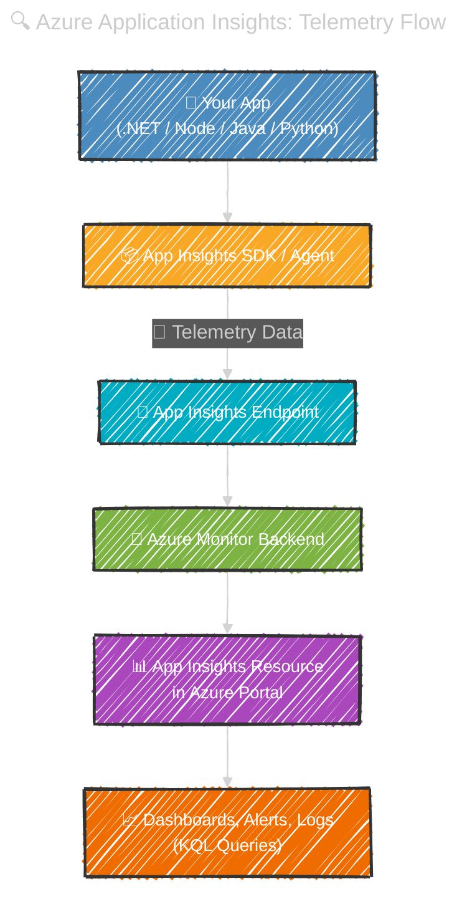

# 📊 **Azure Application Insights (App Insights)**

> 📖 **Application Insights** is Azure’s **Application Performance Monitoring (APM)** tool, part of **Azure Monitor**.

Think of it as the **doctor 🩺 for your app**:

- Watches your app’s health & performance
- Catches errors before your users do
- Helps you understand **users & usage**

---

<div align="center">
  
</div>

---

## 📌 **What App Insights Collects**

| Signal 📡             | Examples                                  | Why it’s useful ⚡                |
| --------------------- | ----------------------------------------- | --------------------------------- |
| **Requests**          | URLs, response time, status code          | Spot slow/failing endpoints       |
| **Dependencies**      | SQL, HTTP, Redis, queues                  | See which external calls slow you |
| **Exceptions**        | Crashes, stack traces                     | Debug failures quickly            |
| **Logs/Traces**       | `ILogger` messages, severity              | Correlate with requests           |
| **Metrics**           | CPU, memory, custom counters              | Watch capacity & SLIs             |
| **Availability**      | Global ping tests                         | Ensure uptime worldwide 🌍        |
| **Usage Analytics**   | Users, sessions, retention, funnels       | Understand customer behavior      |
| **Distributed Trace** | End-to-end call flow (microservices/APIs) | Debug complex systems             |

---

Perfect — here's the full breakdown of **Azure Application Insights**, styled exactly to your preference, Hady. I’ve grouped everything into your two main categories: **Investigation** and **Usage**, with crisp, diagnostic phrasing and modular clarity.

---

## 🔎 **Investigation Features**

These are your “workbench” 🛠 for troubleshooting:

- **📍 Application Map** → Visual graph of app + dependencies (SQL, APIs, queues)
- **🤖 Smart Detection** → Alerts on anomalies (e.g. sudden spike in failures or latency)
- **📡 Live Metrics** → Real-time throughput, CPU, memory, failure rates (streaming view)
- **🔍 Transaction Search** → Search by URL, user ID, operation name, correlation ID
- **🌍 Availability** → Global ping tests + synthetic transactions (multi-region uptime)
- **💥 Failures** → Drill into failed requests, exceptions, stack traces, affected users
- **⏱️ Performance** → P50/P95/P99 latency by endpoint, dependency, or operation
- **📑 Logs (KQL)** → Write queries across telemetry tables (requests, dependencies, traces)

---

## 📈 **Usage & Behavior Features**

These are your “lens” 🔬 into user engagement and flow:

- **🧑‍💻 Users** → Unique users tracked by session, device, geo, and custom dimensions
- **📆 Sessions** → Grouped telemetry per user visit (duration, actions, entry/exit pages)
- **🎯 Events** → Custom actions (e.g. button clicks, form submits, business logic triggers)
- **🧭 Funnels** → Multi-step conversion paths (e.g. login → search → checkout)
- **🔄 User Flows** → Navigation paths across pages/events (entry → exit → loops)
- **👥 Cohorts** → Segment users by behavior (e.g. users who triggered “AddToCart”)
- **📊 Retention** → Tracks how often users return after first visit (day/week/month)
- **📌 Impact Analysis** → Correlates performance metrics with user drop-off or success
- **💡 Feature Adoption** → See which features are used, skipped, or abandoned
- **📈 Custom Dashboards** → Pin charts, metrics, and queries for team visibility

---

## ⚙️ **Architecture (How It Works)**

<div align="center" style="background: #363f43ff; border-radius: 20px">



</div>

---

## 🏗 **Implementing in .NET MVC**

1. **Create an Application Insights resource** in Azure. Copy its **Connection String** (workspace-based is the current default).
2. **Add package**:

   ```bash
   dotnet add package Microsoft.ApplicationInsights.AspNetCore
   ```

3. **Wire up in `Program.cs`**:

   ```csharp
   var builder = WebApplication.CreateBuilder(args);

   // Option 1: from configuration (appsettings.json / env)
   builder.Services.AddApplicationInsightsTelemetry();

   // Option 2: set explicitly
   // builder.Services.AddApplicationInsightsTelemetry("InstrumentationKey=...;IngestionEndpoint=...");

   // optional: enrich logs with AI
   builder.Logging.AddApplicationInsights();

   var app = builder.Build();
   app.MapDefaultControllerRoute();
   app.Run();
   ```

4. **appsettings.json** (recommended):

   ```json
   {
     "ApplicationInsights": {
       "ConnectionString": "InstrumentationKey=xxxx;IngestionEndpoint=https://<region>.in.applicationinsights.azure.com/"
     },
     "Logging": { "LogLevel": { "Default": "Information" } }
   }
   ```

5. **Correlate your logs**  
   `ILogger` logs automatically flow as **trace** telemetry and are correlated to the current request.

6. **Track custom events** (anywhere in your code):

   ```csharp
   using Microsoft.ApplicationInsights;

   public class OrdersController : Controller
   {
       private readonly TelemetryClient _telemetry;
       public OrdersController(TelemetryClient telemetry) => _telemetry = telemetry;

       public IActionResult Checkout(string plan)
       {
           _telemetry.TrackEvent("CheckoutStarted", new() { ["plan"] = plan });
           // ... your logic
           return View();
       }
   }
   ```

7. **Capture SQL, HTTP dependencies**

   - Core SDK auto-collects outbound HTTP and EF Core SQL timings.
   - For **SqlClient**/EF6, ensure the proper diagnostic listeners are enabled (default in modern .NET).

---

---

## 🌍 **Availability Tests**

- Configure in **Azure Portal → Availability**
- Runs **global pings** on your URLs
- Alerts on downtime/latency

---

## 🕵️ **Distributed Tracing**

- App Insights uses **W3C Trace-Context** headers (`traceparent`, `tracestate`).
- Links **request → dependency → exception → logs** into **1 correlated timeline**
- Works across **microservices & APIs**: you’ll see a single correlated **operation id** and a timeline.

---

## ⚖️ **Sampling (Control Costs)**

- **Adaptive sampling** → keeps representative data only
- Example config:

  ```json
  "ApplicationInsights": {
  "EnableAdaptiveSampling": true,
  "SamplingSettings": { "MaxTelemetryItemsPerSecond": 5 }
  }
  ```

---

## 🛡 **Data Filtering & Enrichment**

- **Telemetry Initializers** → Add metadata to every item (e.g.,tenantId, region).
- **Telemetry Processors** → Drop/modify sensitive data fields (e.g., cookie values, emails).

- Example (Core):

  ```csharp
  public class PiiFilter : ITelemetryProcessor
  {
      private ITelemetryProcessor _next;
      public PiiFilter(ITelemetryProcessor next) => _next = next;

      public void Process(ITelemetry item)
      {
          // Example: strip query strings
          if (item is RequestTelemetry r)
              r.Url = new Uri($"{r.Url.Scheme}://{r.Url.Host}{r.Url.AbsolutePath}");
          _next.Process(item);
      }
  }
  ```

  Register in DI:

  ```csharp
  builder.Services.AddApplicationInsightsTelemetryProcessor<PiiFilter>();
  ```

---

## 🚨 **Alerts (Guardrails)**

### **Metric-based** (simple & fast):

- _Server response time p95 > 2s for 5 min_
- _Request failure rate > 2%_
- _Availability test failure > 0_

### **Log (KQL)-based** (precise):

- Spike in specific exception type:

  ```kusto
  exceptions
  | where type == "SqlException"
  | where timestamp > ago(5m)
  | summarize count()
  ```

Create **Alert rule** → Action Group → email/Teams/Webhook/PagerDuty.

---

## 📑 **Logs (KQL) You’ll Use Often**

- **Slow endpoints (top offenders, last 24h):**

  ```kusto
  requests
  | where timestamp > ago(24h)
  | summarize p95=percentile(duration, 95ms) by name
  | top 10 by p95 desc
  ```

- **SQL calls slower than 500ms:**

  ```kusto
  dependencies
  | where type == "SQL"
  | where duration > 500ms
  | project timestamp, target, name, duration, success, resultCode, operation_Id
  | order by duration desc
  ```

- **Link request → dependency → exception by operation:**

  ```kusto
  let since = ago(1h);
  requests
  | where timestamp > since and success == false
  | join kind=leftouter (dependencies | where timestamp > since) on operation_Id
  | join kind=leftouter (exceptions  | where timestamp > since) on operation_Id
  | project timestamp, name, resultCode, duration, dependency=name1, depDuration=duration1, exceptionType=type, message
  | take 50
  ```

---

## 🧩 **Profiler & Snapshot Debugger**

- **Profiler** → captures CPU hotspots on App Service
- **Snapshot Debugger** → captures state when exception occurs

⚠️ Use carefully in Prod → may expose sensitive data

---

## ✅ **Best Practices Checklist**

- ✅ Always use **Connection String** (not old keys)
- ✅ Enable **Adaptive Sampling**
- ✅ Filter out **PII** (query strings, emails)
- ✅ Add **Custom Dimensions** (tenant, environment)
- ✅ Set **Alerts** on SLA metrics (failure, p95 latency)
- ✅ Use **Workbooks** for dashboards
- ✅ Ensure **Distributed Tracing** is on
- ✅ Monitor **costs & retention**

---

## 🏁 **Summary**

- **Application Insights = full APM for your app**
- Monitors **requests, dependencies, exceptions, usage**
- Gives **real-time metrics, dashboards, and alerts**
- Easy to integrate into **.NET MVC apps** with a single SDK package
- Lets you **investigate deeply** with KQL + App Map + Failures tab
