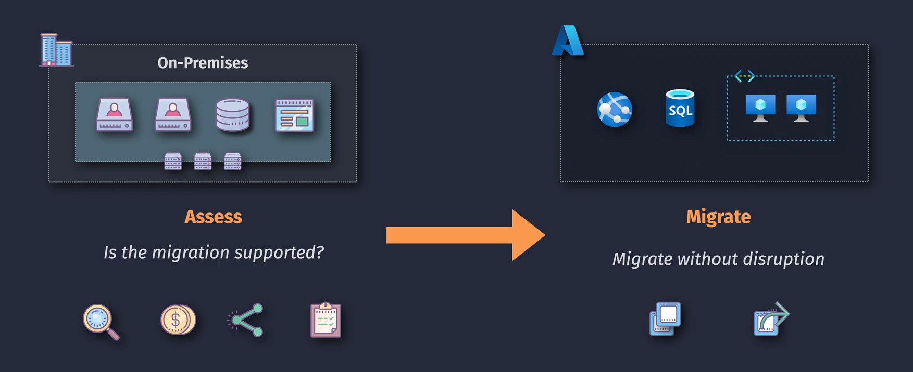
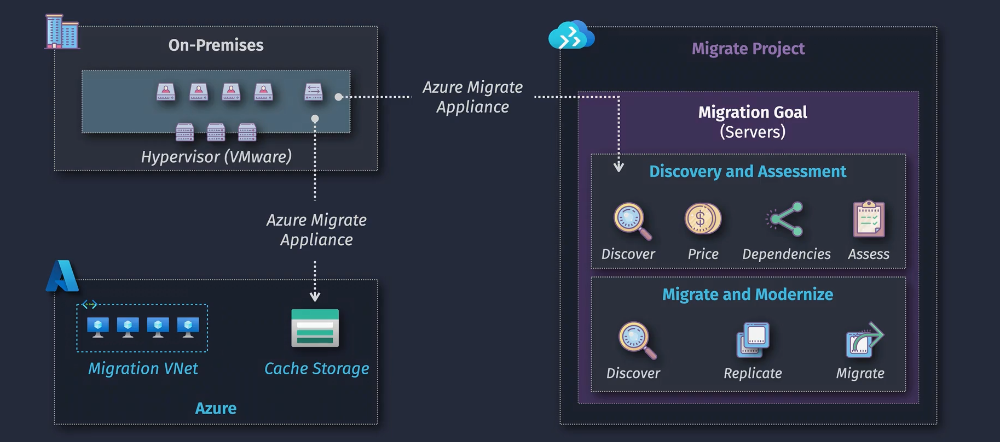
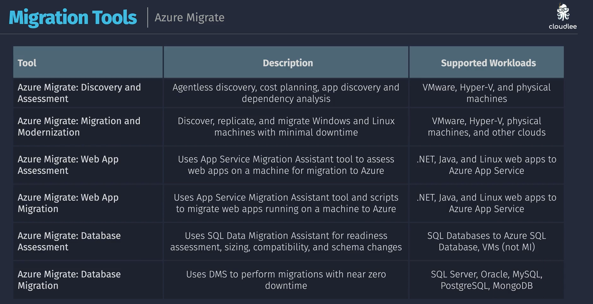

# 🚀 Azure Migrate — The Easy Explanation

## 🎯 What It Is

**Azure Migrate** is like a **moving assistant** that helps you move your **servers, databases, apps, and data** from your on-premises environment (or another cloud) **into Azure** — **safely, step by step**.

Think of it as **“the migration control center”** for Azure.
It doesn’t actually _move_ everything by itself — instead, it gives you **tools, assessments, and guidance** to plan and perform migrations.

---

  

---

## 🧠 Why We Need It

When you want to move workloads to Azure, you need answers first:

- 💰 How much will it cost in Azure?
- ⚙️ Which VM size should I choose?
- 🧾 Is my server or database even compatible with Azure?
- 🪄 How can I migrate without breaking my app?

Azure Migrate helps you answer all these questions _before and during migration._

---

## 🧩 Main Components

| Component                     | What It Does                                                                                                                         |
| ----------------------------- | ------------------------------------------------------------------------------------------------------------------------------------ |
| 🧭 **Discovery & Assessment** | Scans your environment (VMs, databases, web apps) and tells you what can be moved, what changes are needed, and how much it’ll cost. |
| 🚚 **Migration Tools**        | Actually move your machines, databases, and apps into Azure.                                                                         |
| 📊 **Central Hub (Project)**  | A single dashboard in Azure Portal where you manage the entire migration process.                                                    |

---

  

---

## 🏗️ Supported Workloads

Azure Migrate can move:

- 🖥️ **Servers/VMs** — from VMware, Hyper-V, or physical servers
- 💾 **Databases** — SQL, MySQL, PostgreSQL, etc.
- 🌐 **Web Apps** — from IIS or Tomcat
- 💡 **Virtual Desktops** — migrate to Azure Virtual Desktop
- 📦 **Containers & Data** — through integrated tools

---

## 🔄 The Migration Journey (Simple Flow)

### Step 1️⃣ — Discover

Install a small **Azure Migrate appliance** in your data center — it scans your servers and collects details (CPU, RAM, disk, dependencies).

### Step 2️⃣ — Assess

Azure Migrate analyzes that data:

- Tells you **compatibility issues**
- Suggests **right Azure VM sizes**
- Estimates **monthly costs**

### Step 3️⃣ — Migrate

Use the integrated tools (like _Server Migration_ or _Database Migration Service_) to actually move workloads to Azure.

---

## 🧰 Commonly Used Tools Inside Azure Migrate

| Tool                                 | Purpose                                            |
| ------------------------------------ | -------------------------------------------------- |
| **Server Assessment**                | Discover and analyze on-prem servers               |
| **Server Migration**                 | Move those servers to Azure                        |
| **Database Migration Service (DMS)** | Move SQL/MySQL/Postgres databases                  |
| **App Service Migration Assistant**  | Move web apps                                      |
| **Data Box**                         | Transfer data via physical device (for large data) |

---

## 🎨 Portal View

When you open **Azure Migrate** in Azure Portal, you’ll see:

1. **Create a Project**
2. Add Tools (Server, Database, Web App, etc.)
3. Perform Discovery → Assessment → Migration
4. Track progress and cost estimates in one place

---

## 💡 Simple Example

You have 10 on-prem Windows VMs.

➡️ You install the **Azure Migrate appliance**.  
➡️ It finds all 10 servers and sends details to Azure.  
➡️ Azure Migrate shows that:

- 8 are compatible,
- 2 need OS upgrades,
- Estimated monthly cost = \$350.
  ➡️ You run **Server Migration** → VMs move to Azure as IaaS VMs.
  🎉 Done — with monitoring and rollback options.

---

## 🛠️ Key Benefits

- ✅ Centralized hub for all migrations
- ✅ Pre-migration assessment & cost estimation
- ✅ Dependency analysis (see which apps talk to each other)
- ✅ Supports both online (live) and offline migrations
- ✅ Integrates with Azure Monitor and Cost Management

---

## 🔨 Migration Tools

  

---

## ⚡ Summary Table

| Concept         | Description                                    |
| --------------- | ---------------------------------------------- |
| **Purpose**     | Plan and perform migrations to Azure           |
| **Stages**      | Discover → Assess → Migrate                    |
| **Targets**     | VMs, databases, web apps                       |
| **Tools**       | Server Migration, DMS, App Migration Assistant |
| **Key Benefit** | Reduces risk and cost before moving to cloud   |
