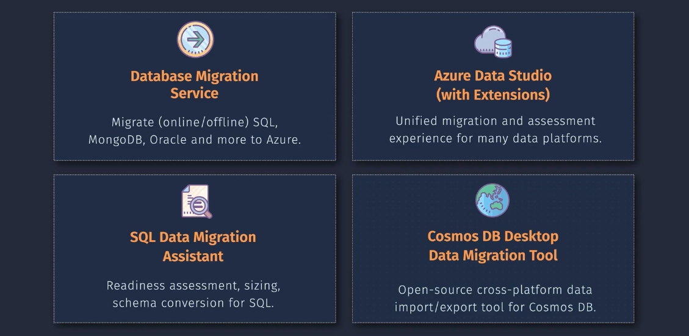
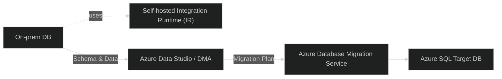

# 🌐 Azure Database Migration — The Complete Picture

## 🎯 What It Is

Azure Database Migration is **Microsoft’s managed solution** to move your **on-premises or cloud-hosted databases** (like SQL Server, Oracle, MySQL, PostgreSQL, or MongoDB) **into Azure** with minimal downtime.

Think of it like:

> "A guided, automated path to move both your database schema and data safely into Azure."

---

  

---

## 🧩 Core Tools for Database Migration

| Tool                                             | Purpose                                                                           | When to Use                                           |
| ------------------------------------------------ | --------------------------------------------------------------------------------- | ----------------------------------------------------- |
| **Database Migration Service (DMS)**             | Main service that performs **actual migration (online/offline)**                  | For production-grade migrations with downtime control |
| **Azure Data Studio (with Migration Extension)** | Unified GUI for migration assessment and execution                                | Best for small to mid migrations or first-time users  |
| **SQL Data Migration Assistant (DMA)**           | Pre-check tool that scans for **compatibility issues, sizing, schema conversion** | Always run first before migration                     |
| **Cosmos DB Desktop Migration Tool**             | CLI/GUI tool to import/export to **Azure Cosmos DB**                              | For JSON/NoSQL data movement                          |

---

  

---

## 🧠 How It Works — Step-by-Step (with Diagram Context)

### 1️⃣ Assessment Phase

- DBA runs **SQL Data Migration Assistant (DMA)** or **Azure Data Studio extension**
- It checks:

  - Compatibility (e.g., deprecated features)
  - Schema differences
  - Migration blockers

- Outputs a **readiness report** 📊

### 2️⃣ Prepare Migration

- Configure **Azure Database Migration Service (DMS)** in Azure Portal
- Choose **Self-hosted Integration Runtime** (if source DB is on-prem)
- DMS connects to your source (on-prem) and target (Azure SQL DB / MI / VM)

### 3️⃣ Migrate Schema

- Schema (tables, stored procedures, indexes, etc.) is transferred first
- Azure Data Studio uses **ADF Self-Hosted IR** (Integration Runtime) for connectivity
- Schema verified on Azure SQL target

### 4️⃣ Migrate Data

- Data is migrated from the source using **online (minimal downtime)** or **offline (full downtime)** mode
- Real-time sync supported via **Change Tracking / CDC** depending on engine

### 5️⃣ Validation & Cutover

- Validate migrated data (row counts, schema integrity)
- Once all data is in sync → perform **cutover** (switch apps to Azure endpoint)

---

## ☁️ Azure DMS Architecture Overview

### Key Components:

- **Azure Database Migration Service (DMS):** Central orchestrator
- **Self-hosted IR:** Secure bridge from on-prem to Azure
- **Azure Data Studio:** Management and assessment interface

---

## 🔁 Migration Modes

| Mode                  | Description                             | Downtime | Example Use Case  |
| --------------------- | --------------------------------------- | -------- | ----------------- |
| **Offline Migration** | Source DB taken offline during transfer | High     | Non-critical apps |
| **Online Migration**  | Continuous sync until final cutover     | Low      | Production apps   |

---

## 🚀 Example: Migrating SQL Server to Azure SQL Managed Instance

1. Install **DMA** → run readiness assessment
2. In Azure Portal → create **Database Migration Service**
3. Connect source SQL Server + target Managed Instance
4. Select databases → choose **online migration**
5. Start migration → monitor progress → validate
6. Perform final cutover once sync completes

---

## 💡 Best Practices

- ✅ Always run **DMA first** — it catches compatibility issues early
- ✅ Use **online mode** for production workloads
- ✅ Validate with checksum or row count post-migration
- ✅ Store migration logs in **Azure Monitor** for auditing
- ✅ For large datasets, ensure **network throughput (ExpressRoute or VPN)** is sufficient

---

## 🧭 Summary

| Stage      | Tool Used                                  | Purpose              |
| ---------- | ------------------------------------------ | -------------------- |
| Assessment | **Data Migration Assistant (DMA)**         | Check compatibility  |
| Planning   | **Azure Data Studio**                      | Plan migration steps |
| Execution  | **Azure Database Migration Service (DMS)** | Move schema + data   |
| Validation | **Azure Portal / Data Studio**             | Verify and cut over  |
