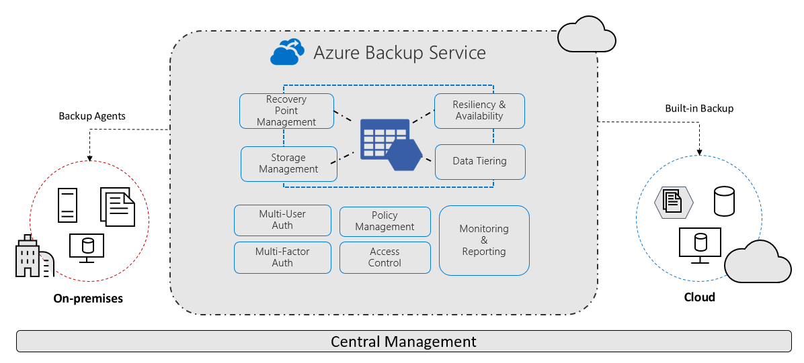
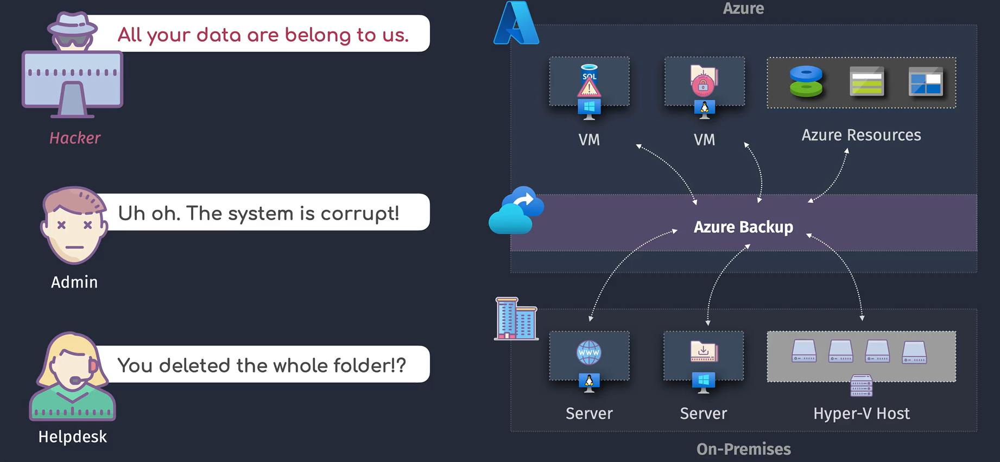
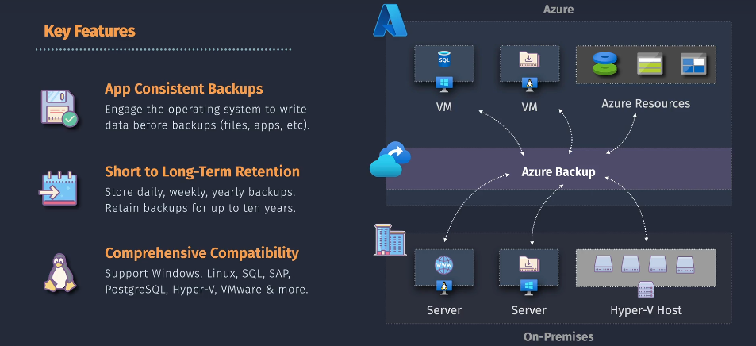
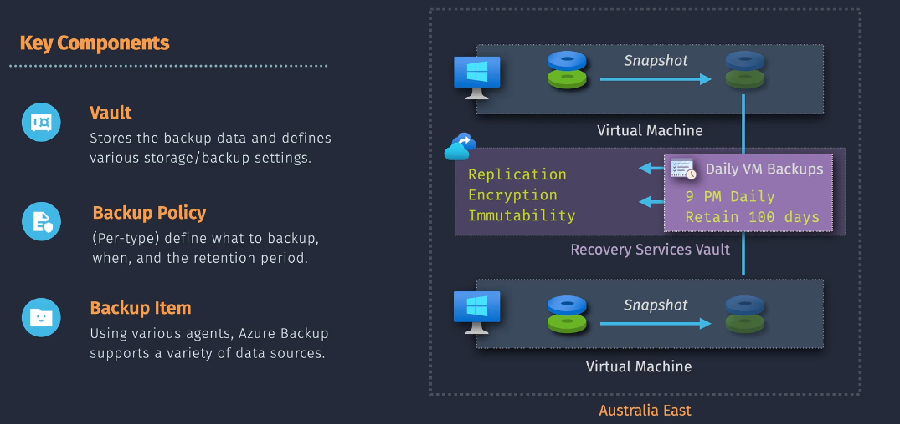

# 🔄 **Azure Backup**

_Azure Backup = your **always-on save button 🎮**_.

> 📖 **Azure Backup** is a **cloud-based backup service** by Microsoft that gives you a **simple, secure, and cost-effective** way to protect your data.

<div align="center">
  
</div>

---

## 🤔 **With/out Azure Backup Service**

- ❌ **Without**

<div align="center">
  
</div>

- ✅ **With**

<div align="center">
  
</div>

## ✨ **Key Features**

- **🗻 App Consistent Backups**  
  Ensures apps are in a clean, transaction-safe state when backed up. That means if you restore, your app starts properly without you fixing broken databases or corrupted states.

- **⌛ Short → Long-term Retention**  
  Keep your data for **days, months, or even years**. Whether you need a backup from last night or 7 years ago for compliance, Azure’s got you covered.

- **🦸 Comprehensive Compatibility**  
  ✅ Windows? ✅ Linux? ✅ Databases? ✅ SAP HANA?  
  It’s basically a **superhero backup tool** that doesn’t discriminate.

---

## 🗝️ Key Components

> Azure Backup works like a **team of heroes**, each with a job

<div align="center">
  
</div>

---

### 🎭 **1. Vault Types:**

#### 🏛️ **Recovery Services Vault**

- **Legacy model**, widely used for traditional workloads.
- Supports backup for:
  - Azure VMs
  - On-premises machines via MARS/MABS agents
  - SQL Server on Azure VMs
  - Azure File Shares
- Offers features like:
  - Soft delete
  - Cross-region restore
  - Immutable storage (WORM)
  - Azure RBAC integration

#### 🧩 **Backup Vault**

- **Modern, resource-manager–based vault** designed for newer workloads.
- Supports backup for:
  - Azure Blob Storage
  - Azure Database for PostgreSQL (Flexible Server)
  - Azure Files
  - 🆕 Azure Data Lake Storage
  - 🆕 Azure Elastic SAN
  - 🆕 Azure Kubernetes Service (AKS)
- Key benefits:
  - Centralized monitoring via Azure Business Continuity Center
  - Enhanced security and isolation
  - Better automation and scalability
  - Integration with newer backup policies and long-term retention

---

| Vault Type                        | Use Case                      | Best For                                     |
| --------------------------------- | ----------------------------- | -------------------------------------------- |
| **Recovery Services Vault (RSV)** | Legacy + Enterprise workloads | VMs, DBs, SAP HANA, Files, On-prem workloads |
| **Backup Vault**                  | Cloud-native, lightweight     | Azure IaaS workloads (VMs, Disks, Blobs)     |

> 👉 In production, you’ll usually see **Recovery Services Vault** for enterprise workloads, while **Backup Vault** is rising for simpler IaaS-first deployments.

---

### ⏰ **2. Backup Policy**

Your **Backup Policy** = your **game save schedule** 🎮.

- Defines **how often** to back up (daily, weekly).
- Defines **how long** to keep them (30 days, 1 year, forever).

---

### 📂 **3. Backup Item**

The actual thing you’re saving:

- File
- Folder
- VM
- Database
- Application

Each one is a **backup item** and gets managed individually.

---

## 👩🏻‍⚖️ **Agents and Tools**

### **📌 MARS Agent (Microsoft Azure Recovery Services Agent)**

- Installed on **Windows servers or client machines** (on-prem or Azure VM).
- Backs up **files, folders, and system state** directly to RSV.
- Works without System Center.

---

### **📌 MABS (Microsoft Azure Backup Server)**

- Based on **System Center DPM**.
- Backs up **apps + workloads** like:

  - SQL Server
  - SharePoint
  - Exchange
  - Hyper-V/VMware VMs

- Stores data locally first, then pushes to Azure (hybrid model).

---

### **📌 Azure IaaS VM Extension**

- Native extension inside Azure VM.
- Enables **snapshot-based backups** (crash-consistent or app-consistent).

---

### **📌 Application-aware backups**

- VSS writers for Windows, Pre/Post scripts for Linux.
- Ensures transactional consistency (SQL, Oracle, SAP HANA).

---

## 🪜 **Implementation Overview**

<div align="center">
  
</div>

---

1. **Create a Recovery Services Vault 🏰**

   ```bash
   az backup vault create \
     --resource-group myResourceGroup \
     --name myRecoveryVault \
     --location eastus
   ```

2. **Define Backup Policies ⏰**
   Example: Backup every day at 2 AM, keep for 30 days.

   ```bash
   az backup policy create \
     --resource-group myResourceGroup \
     --vault-name myRecoveryVault \
     --name myBackupPolicy \
     --backup-management-type AzureIaasVM \
     --policy @"policy.json"
   ```

   **policy.json**:

   ```json
   {
     "schedulePolicy": {
       "scheduleRunFrequency": "Daily",
       "scheduleRunTimes": ["2024-05-01T02:00:00Z"]
     },
     "retentionPolicy": {
       "retentionPolicyType": "LongTermRetentionPolicy",
       "dailyRetention": {
         "count": 30
       }
     }
   }
   ```

3. **Select Backup Items 🎮**

   ```bash
   az backup protection enable-for-vm \
     --resource-group myResourceGroup \
     --vault-name myRecoveryVault \
     --vm myVirtualMachine \
     --policy-name myBackupPolicy
   ```

4. **Start Backup Now 🔄**

   ```bash
   az backup protection backup-now \
     --resource-group myResourceGroup \
     --vault-name myRecoveryVault \
     --container-name myVMContainer \
     --item-name myVirtualMachine
   ```

---

## 🔐 **Security Features**

- **Encryption**

  - At rest: AES-256
  - In transit: TLS 1.2
  - Keys: Microsoft-managed, customer-managed (via Key Vault)

- **Soft Delete**

  - Retains deleted backup items for **14–30 days**.
  - Protects against accidental/malicious deletion.

- **Multi-User Authorization (MUA)**

  - Requires **additional approval** for critical actions (like deleting backups).
  - Integrates with **Entra ID**.

- **Immutable Backups (Preview)**

  - Once written, cannot be changed/deleted until retention expires.
  - Ransomware protection.

---

## 💭 **Backup Scenarios**

1. **Azure VM Backup**

   - Agentless, snapshot-based.
   - App-consistent with VSS/Linux scripts.

2. **On-Prem Backup (Hybrid)**

   - MARS → Direct to Azure.
   - MABS → Local storage + Azure (hybrid).

3. **Database Backup**

   - SQL inside VM.
   - SAP HANA backup (certified integration).

4. **Azure Files Backup**

   - Protects file shares.
   - File-level restore supported.

5. **Blob Backup**

   - Protects against accidental deletes/overwrites.
   - Point-in-time restore.

---

## 📊 **Monitoring & Reporting**

- **Azure Backup Reports** (via Log Analytics)
- Centralized view of backup health, failures, SLA compliance.
- Integration with **Azure Monitor** for alerts.

---

## 🏪 **Retention and Archiving**

- Short-term: daily/weekly/monthly backups.
- Long-term: yearly retention (up to 99 years!).
- Tiering: Active (Hot) → Archive (low cost for long-term).

---

## 🗂️ **Backup Consistency**

| 🔒 **Consistency Type**       | 📖 **Definition**                                                                     | ✅ **Best Use Case**                                            | 🔑 **Typical Recovery Types**                                               |
| ----------------------------- | ------------------------------------------------------------------------------------- | --------------------------------------------------------------- | --------------------------------------------------------------------------- |
| 📁 **File System Consistent** | Captures files at that moment without caring about running apps.                      | File servers, dev/test workloads, basic VM snapshots.           | - Item-level (files/folders) <br> - Full VM restore                         |
| ⚡ **Crash Consistent**       | Like a power cut: grabs memory + disk state, but apps may need repair.                | Non-critical VMs, workloads where downtime is ok.               | - VM-level recovery <br> - Full restore                                     |
| 🧩 **Application Consistent** | Works with VSS (Windows) or scripts (Linux) so apps flush transactions before backup. | Databases, ERP, production workloads where consistency matters. | - Point-in-time restore <br> - Item-level (DB, logs) <br> - Full VM restore |

---

## 🔄 **Recovery Types**

| 🔑 **Recovery Type**          | 🎯 **Purpose**                             | 🌟 **Example**                                         | ⚖️ **Best Paired With**           |
| ----------------------------- | ------------------------------------------ | ------------------------------------------------------ | --------------------------------- |
| 🗂️ **Item-level Recovery**    | Restore individual files/folders/DBs.      | Restore a lost report file without touching the VM.    | File system / App consistent      |
| 💻 **VM-level Recovery**      | Bring back entire VM.                      | Ransomware encrypted VM → roll back to snapshot.       | Crash consistent / App consistent |
| ⏳ **Point-in-time Recovery** | Roll back to exact moment.                 | Restore DB to 9:00 AM before bad deploy.               | App consistent                    |
| 🌍 **Cross-region Recovery**  | Recover in another Azure region.           | East US outage → restore in West US.                   | Any consistency type              |
| 🔄 **Full vs Partial**        | Restore everything or specific disks/apps. | Full = VM rehydration; Partial = restore only DB disk. | Depends on backup policy          |

---

👉 **Key takeaway:**

- If you want **speed** → crash/file system consistency is enough.
- If you want **safety** (apps & DBs clean) → always go with **application consistent backups**.
- Recovery can be **tiny (file)** or **huge (entire VM/region)** depending on your scenario.

---

## 🏁 **Summary**

Azure Backup Service is **not just a backup agent**, it’s a **complete ecosystem**:

- `Vaults` (**RSV**, **Backup Vault**)
- `Agents` (**MARS**, **MABS**)
- `Extensions` (for **VMs**, **apps**)
- `Secure storage` (**LRS/GRS/ZRS**)
- `Policies` for **scheduling** & **retention**
- `Integrated security` (**Soft Delete**, **MUA**, **Immutable backups**)
