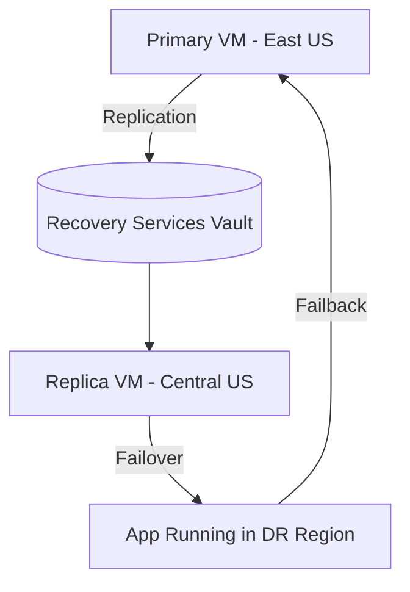

# 🧪 Lab 1 – Disaster Recovery for Azure VM (Region-to-Region DR)

This is the **most common** use case for ASR: replicating an **Azure VM** from one region (e.g., _East US_) to another (e.g., _Central US_).

---

## ⚙️ Step 1 – Create Recovery Services Vault

**Portal:**

1. Go to [Azure Portal](https://portal.azure.com).
2. Search **Recovery Services vaults** → _Create_.
3. Fill in:

   - **Name**: `MyRecoveryVault`
   - **Resource Group**: `MyRG`
   - **Region**: _East US_ (must be same as VM’s region).

4. Click **Review + Create → Create**.

**Azure CLI:**

```bash
az group create --name MyRG --location eastus

az backup vault create \
  --resource-group MyRG \
  --name MyRecoveryVault \
  --location eastus
```

**PowerShell:**

```powershell
New-AzRecoveryServicesVault `
   -Name "MyRecoveryVault" `
   -ResourceGroupName "MyRG" `
   -Location "EastUS"
```

---

## ⚙️ Step 2 – Enable Replication for VM

**Portal:**

1. Go to your vault → **Site Recovery** → _Replicate_.
2. Source: **Azure**.
3. Target: Select _Central US_.
4. Choose the VM(s) to protect (example: `MyAppVM`).
5. Configure **Target Resource Group**, **Target VNet/Subnet**, **Storage Account** for replicated disks.
6. Define **Replication Policy** (default = RPO 15 min).

**Azure CLI:**

```bash
az site-recovery protection-container-mapping create \
  --resource-group MyRG \
  --vault-name MyRecoveryVault \
  --fabric-name Azure \
  --protection-container MyProtectionContainer \
  --policy-name DefaultPolicy \
  --name MyProtectionMapping
```

---

## ⚙️ Step 3 – Test Failover

**Portal:**

1. Vault → **Replicated Items** → Select VM → _Test Failover_.
2. Choose Recovery Point (Latest processed / Latest app-consistent).
3. Pick a test network (don’t use production VNet).
4. VM will spin up in Central US.
5. Verify it boots, check app functionality.

👉 No downtime in production.

---

## ⚙️ Step 4 – Planned Failover (Real Disaster)

1. Vault → **Replicated Items → Failover**.
2. Choose recovery point.
3. VM starts in _Central US_.
4. Update DNS or Azure Traffic Manager → users routed to DR VM.

---

## ⚙️ Step 5 – Failback

Once East US is back:

1. Vault → _Replicated Items_ → _Failback_.
2. Azure syncs data back → workloads run again in East US.

---

### 🔎 Visual Workflow



---

## 📝 Final Summary

- **Lab 1 (Azure VM → Azure Region)**:

  - Create Vault → Enable Replication → Test Failover → Failover → Failback.
  - Ideal for cloud-native workloads.
