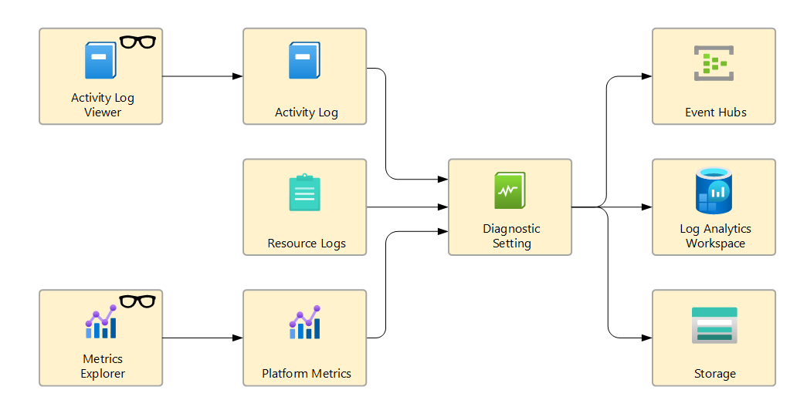
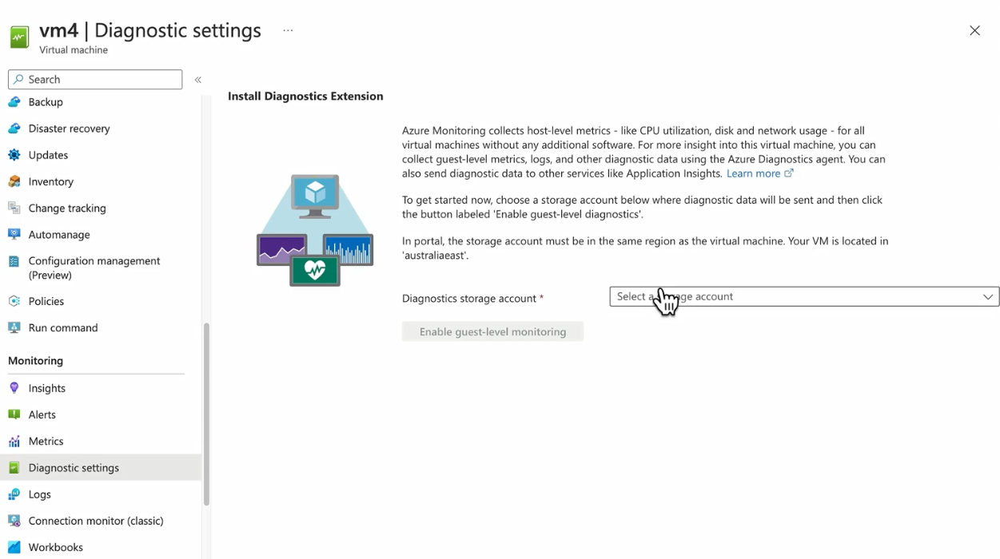
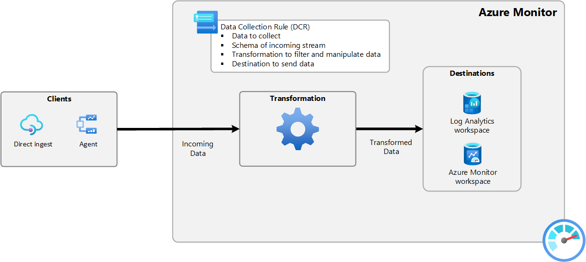

# 🪄 Azure Monitoring Data Collection

## ⁉️ The Core Question:

> _“How does Azure get telemetry (logs/metrics) from my resources?”_

Azure has **two big families of resources**:

- **PaaS services** (Storage, Key Vault, SQL, App Service)
- **IaaS Virtual Machines**

These two behave differently when it comes to monitoring.

---

## 📊 **1. Diagnostic Settings** (Agentless by Default)

> 📖 **Definition (official-ish):**  
> Diagnostic settings in Azure define **what telemetry data** you collect (logs & metrics) and **where to send it** (Log Analytics, Storage, Event Hub).
>
> ✅ Works for most **PaaS resources** like Key Vault, App Service, Cosmos DB.  
> ✅ No agent needed because the platform itself emits telemetry.

---

  

---

🎯 **Destinations you can choose in Diagnostic Settings:**

- **Azure Monitor Logs (Log Analytics) Workspace** → For querying with Kusto (KQL).
- **Storage Account** → Long-term archival.
- **Event Hub** → Stream to external SIEM/Splunk/etc.

⚡ Example: Add a Diagnostic Setting to Key Vault to send all “AuditEvent” logs to Log Analytics. Done. No agent.

---

## 🖥️ **The Special Case: Virtual Machines**

Here’s where the confusion begins.

### 🔹 What Azure can see **without an agent** (host-level):

- CPU %
- Disk IOPS
- Network In/Out
  (_collected directly by the Azure Hypervisor_)

👉 That’s why you can see **basic VM metrics** even without installing anything.

### 🔹 What Azure CANNOT see without an agent (guest-level):

- Windows Event Logs
- Linux syslog
- Custom app logs
- Performance counters inside the OS

👉 To get these, you need **something inside the VM** to grab them.

And that’s where two options come in:

---

## 🧩 **2. Two Ways to Collect Guest-Level Data from VMs**

### 🏷️ **Option A:** **Legacy Diagnostics Extension**

  

- Old-school way (still visible in portal UI like in your screenshot).
- Installs the “Azure Diagnostics Agent” inside the VM.

- Pushes guest-level logs/metrics to Storage, Log Analytics, or Event Hub.

> 💡 That’s why it says: _“Enable guest-level monitoring → pick a Storage account.”_

---

### 🏷️ **Option B:** **New Azure Monitor Agent (AMA) + Data Collection Rules (DCRs)**

  

---

- AMA is the **replacement for Diagnostics Extension**.
- Centralized and modern.
- Uses **Data Collection Rules (DCRs)** to define:

  - What data (logs, metrics, performance counters, custom logs)
  - From which resources
  - Sent to which destination(s)

> 👉 With AMA + DCR, you don’t configure storage/event hub in each VM anymore. Instead:
>
> - You create **DCR once**.
> - Assign it to multiple VMs.
> - AMA follows the rule and ships the data.

---

## 🧭 **Metrics vs Logs**

- **Metrics** → numeric, time-series, lightweight (CPU=75%).

  - Some come automatically (host metrics).
  - Some require AMA or extension (custom perf counters).

- **Logs** → detailed events, text records (login attempts, queries).

  - Always need a destination (Log Analytics, Storage, Event Hub).
  - Guest-level logs → require AMA or extension.

---

## 🚦 **So When Do You Use What?**

- **PaaS resource monitoring** → Just use Diagnostic Settings (no agent).
- **VM basic CPU/Disk/Network** → No agent needed.
- **VM guest logs (Event Viewer/syslog/custom logs)** →

  - Old way: VM Diagnostic Extension.
  - Modern way: Azure Monitor Agent (AMA) with DCRs.

---

## 🎯 **Why It’s Confusing**

- Azure Portal still shows **old Diagnostics Extension UI** in some places.
- AMA + DCR is the future (Microsoft is migrating).
- Both coexist today → hence your confusion.

---

## ⚡ **TL;DR**

- **Diagnostic Settings** = agentless configuration for telemetry destinations.
- **VMs are special**: host-level = agentless, guest-level = needs agent.
- **Diagnostics Extension (old)** = legacy way.
- **Azure Monitor Agent + DCR (new)** = modern way, flexible & centralized.
