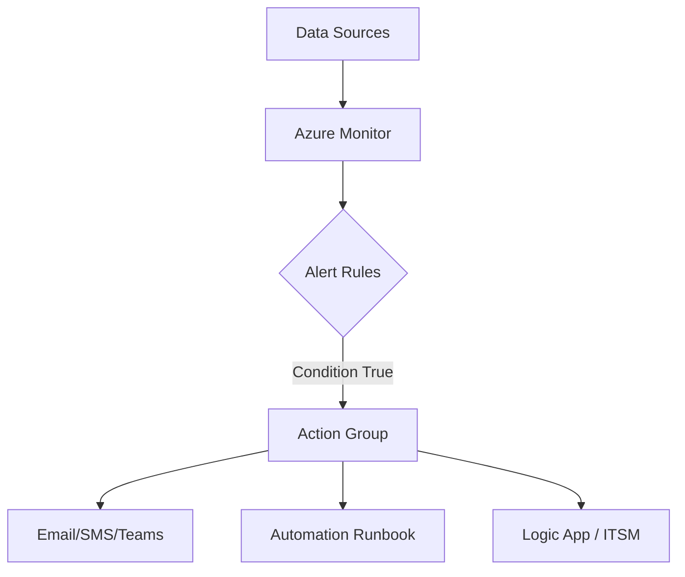

# 🧪 Lab Guide: Azure Monitor Alerts

## ⚡ Part 1: Metric Alerts Lab

📌 **Goal**: Alert when a VM’s CPU goes above 80% for 5 minutes.

---

### 🔹 Step 1: Open Azure Monitor

1. Go to **Azure Portal** → Search **Monitor** → Select **Alerts**.
2. Click **+ Create → Alert rule**.

---

### 🔹 Step 2: Select Scope

1. Under **Scope**, click **Select resource**.
2. Pick your **Virtual Machine** → **Apply**.

---

### 🔹 Step 3: Define Condition

1. In **Condition**, click **Add condition**.
2. Choose **Signal type = Metrics**.
3. Pick **Percentage CPU** metric.
4. Configure:

   - **Threshold**: Static
   - **Operator**: Greater than
   - **Value**: 80
   - **Aggregation**: Average
   - **Over**: Last 5 minutes

---

### 🔹 Step 4: Create Action Group

1. Click **Add Action Groups → + Create Action Group**.
2. Enter name: `Ops-CPU-Alert-AG`.
3. Notifications: Email = `ops-team@company.com`.
4. Actions: Optional — Add **Automation Runbook** (restart VM).
5. Save.

---

### 🔹 Step 5: Review & Create

Click **Review + Create** → ✅ Done.

💡 Test it: Stress the VM (`CPU Stress tool` inside VM). The alert should fire within 5–10 min.

---

## 📜 Part 2: Log Alerts Lab

📌 **Goal**: Alert if more than 10 failed logins occur in 5 minutes.

---

### 🔹 Step 1: Pre-req

- Make sure VM is sending logs to a **Log Analytics Workspace** (via **Diagnostic Settings + AMA extension**).

---

### 🔹 Step 2: Create Query

1. Go to **Azure Monitor → Logs**.
2. Select workspace → Paste this **KQL query**:

```kql
SigninLogs
| where ResultType != "0"
| summarize FailedAttempts = count() by IPAddress, bin(TimeGenerated, 5m)
| where FailedAttempts > 10
```

👉 This groups failed sign-ins by IP in 5-minute buckets.

---

### 🔹 Step 3: Save Query

- Click **Save → Save as Function** or directly use in alert.

---

### 🔹 Step 4: Create Alert Rule

1. In **Logs blade**, click **+ New Alert Rule**.
2. Scope: your **Log Analytics Workspace**.
3. Condition: Paste KQL query.

   - **Evaluation frequency**: 5 min
   - **Lookback period**: 5 min
   - **Threshold**: > 0 results

---

### 🔹 Step 5: Action Group

1. Reuse `Ops-CPU-Alert-AG` or create new.
2. Optionally: Add a **Logic App** → Block IP / Notify SOC.

---

### 🔹 Step 6: Review + Create

✅ Alert created.

💡 Test it: Try **wrong password login attempts** on VM → see if alert fires.

---

## 🛠️ Part 3: Activity Log Alerts Lab

📌 **Goal**: Alert if someone **deletes a VM**.

---

### 🔹 Step 1: Create Alert

1. Azure Portal → **Monitor → Alerts → + Create Alert Rule**.
2. Scope: **Subscription** (since Activity Logs are subscription-wide).

---

### 🔹 Step 2: Condition

1. Select **Signal type = Activity Log**.
2. Event Category = `Administrative`.
3. Operation Name = `Delete Virtual Machine`.

---

### 🔹 Step 3: Action Group

- Create Action Group → Notify **Security team via Teams webhook**.

---

### 🔹 Step 4: Review + Create

✅ Done.

💡 Test: Delete a test VM → The alert should fire immediately (Activity Logs are near real-time).

---

## 🔄 How Alerts Fit Together



- Metrics → Fast, numeric (CPU, Disk).
- Logs → Rich, custom conditions (KQL).
- Activity → Governance/security (resource changes).

---

## 💡 Best Practices for Labs

- **Always test alerts** before production.
- Use **dynamic thresholds** for metrics when baselines fluctuate.
- Route **critical alerts → PagerDuty/On-Call**, minor → Email only.
- Use **Action Groups wisely** (don’t spam same team with 100 alerts).

---

✅ By completing this lab, you can now:

- Build **Metric Alerts** (performance thresholds).
- Build **Log Alerts** (KQL-based).
- Build **Activity Alerts** (governance/security).
