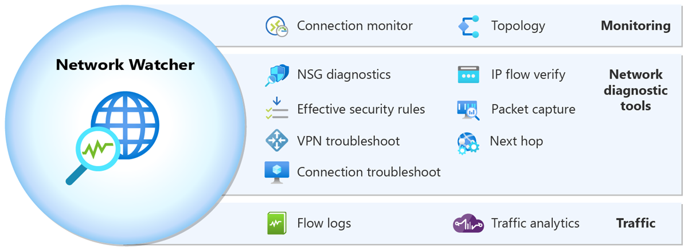
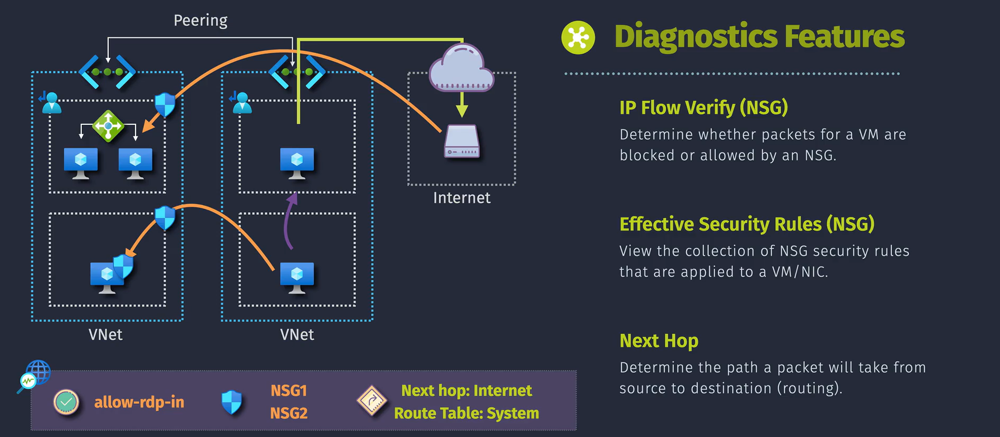
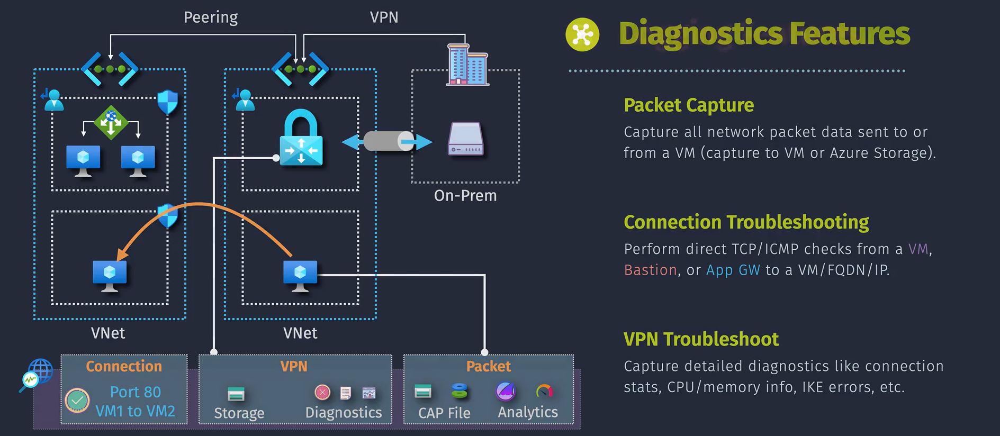
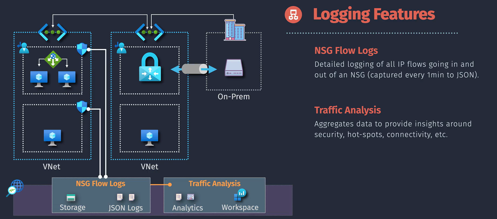

# 🌐 **Azure Network Watcher**

## 📖 **Introduction**

Azure Network Watcher is a **regional service** that provides:

- **Monitoring** 🔭 (Is my network healthy?)
  - Watch health & performance in real-time.
- **Diagnostics** 🩺 (Why isn’t this working?)
  - Debug routing, NSGs, and connectivity issues fast.
- **Logging** 📜 (What happened yesterday at 3am?)
  - Track flows & traffic for audits, compliance, and “aha!” moments.

---

  

---

---

## 🔭 **1. Monitor Features**

  

---

### 🗺️ **1.1 Topology**

- **What it does:** Builds a visual map of your VNet (subnets, NICs, VMs, NSGs).
- **Why it’s useful:** One glance = instant understanding of who’s plugged into what.
- **Example:** Like drawing your network on a whiteboard, but it updates itself.

💡 _Pro Tip:_ If a VM is “lonely” (not connected), Topology shows you right away.

---

### 🔄 **1.2 Connection Monitor**

- **What it does:** Continuously tests **end-to-end connectivity** between two endpoints (VM → DB, VM → Internet).
- **Why it’s useful:** Detects latency, packet drops, and intermittent failures.
- **Example:** Like having a ping & traceroute running 24/7 so you don’t have to.

💡 _Pro Tip:_ Integrates with **Azure Monitor Alerts** → get notified if latency spikes.

---

## 🩺 **2. Diagnostic Features**

  

  

---

### 🚦 **2.1 IP Flow Verify (NSG)**

- **What it does:** Tests if specific traffic (VM → Destination IP\:Port) is **Allowed/Denied** by NSGs.
- **Why it’s useful:** No more guessing which NSG rule won.
- **Example:** VM can’t talk to SQL DB → check if NSG is silently blocking port 1433.

---

### 🔐 **2.2 Effective Security Rules**

- **What it does:** Shows the **real security rules** applied to a NIC (after combining multiple NSGs).
- **Why it’s useful:** Sometimes your “Allow HTTP” is shadowed by a sneaky “Deny All.”
- **Example:** See why inbound RDP isn’t working when you _swear_ you added the rule.

---

### 🛣️ **2.3 Next Hop**

- **What it does:** Shows where traffic from a VM will go next (Internet, NVA, VPN, blackhole).
- **Why it’s useful:** Debug wrong UDRs (User Defined Routes).
- **Example:** Expecting traffic to internet but it’s going to your firewall → Next Hop shows it.

---

### 📦 **2.4 Packet Capture**

- **What it does:** Captures live packets on a VM NIC (saved as `.cap` file for Wireshark).
- **Why it’s useful:** Deep analysis when “pings don’t tell the full story.”
- **Example:** Debug TLS handshake failures between your app and API.

---

### 🔍 **2.5 Connection Troubleshooting**

- **What it does:** Actively tests connectivity from VM → Destination.
- **Why it’s useful:** Gives real reasons (NSG deny, DNS fail, route blackhole).
- **Example:** Why can’t my VM browse the internet? → Run this test, get instant cause.

---

### 🔒 **2.6 VPN Troubleshooting**

- **What it does:** Diagnoses VPN Gateway health & tunnels.
- **Why it’s useful:** Fixes “VPN is down” before the CIO calls you at 2am.
- **Example:** See why your site-to-site VPN won’t connect (shared key mismatch, IP issue, etc).

---

## 📜 **3. Logging Features**

  

---

### 📊 **3.1 NSG Flow Logs**

- **What it does:** Records **all allowed/denied traffic** at NSGs.
- **Why it’s useful:** Perfect for forensics & compliance.
- **Example:** Find out if a suspicious IP has been hammering your VM at night.

💡 _Pro Tip:_ Always pipe flow logs into **Log Analytics** → query with KQL later.

---

### 📈 **3.2 Traffic Analytics**

- **What it does:** Processes NSG flow logs → gives insights on bandwidth, patterns, anomalies.
- **Why it’s useful:** Detects bandwidth hogs & strange spikes.
- **Example:** Spot that one VM hogging 80% of outbound internet traffic 📡.

---

## 🪜 **Implementation Overview**

Think of it like setting up a **home surveillance system** 🏠:

1. **Enable Network Watcher** in your region (like installing cameras).
2. **Configure diagnostic tools** (like pointing cameras at doors).
3. **Connect data sources** (link VMs, VNets).
4. **Analyze & visualize** (use Topology & Analytics dashboards).
5. **Set alerts** (motion sensors 🚨).
6. **Respond** (send network team when something looks off).

---

## 🏁 **Summary**

- **Monitor Features** = keep an eye on health (Topology, Connection Monitor).
- **Diagnostic Features** = deep-dive troubleshooting (IP Flow, Next Hop, Packet Capture).
- **Logging Features** = record and analyze everything (Flow Logs, Traffic Analytics).
