# 🗺️ Application Map (Application Insights) — What / Where / How

## ❓ What is it?

**Application Map** is an **interactive topology** of your distributed app captured by **Application Insights**. It shows:

- **Nodes**: your services (Web Apps, APIs, Functions, containers) and external dependencies (SQL, Storage, Redis, Service Bus, HTTP).
- **Edges**: calls between nodes with **latency**, **throughput**, **failure rate**.
- **Drill-through**: click into **end-to-end transactions**, exceptions, and dependency details.

It’s your **bird’s-eye view** of microservices and their health.

---

## 🌍 Where does it live?

- In your **Application Insights** resource → **Investigate → Application Map**.
- Works across Azure hosting models: **App Service**, **Functions**, **AKS**, **ACA**, **VMs/containers**—as long as they emit AI telemetry with proper **distributed tracing correlation**.

---

## ⚙️ How it works (under the hood)

1. Your services use the **AI SDK/agent** to send telemetry:

   - **Requests** (incoming HTTP), **Dependencies** (outbound calls like SQL/HTTP/Service Bus), **Exceptions**, **Traces**.

2. The SDK injects/reads **W3C Trace Context** headers:

   - `traceparent`, `tracestate` (and legacy `Request-Id`, `Correlation-Context` for older stacks).

3. Application Insights correlates telemetry **by Operation Id** (traceId) and **Parent Id** (spanId).
4. The portal aggregates telemetry into a **graph** with metrics on each link.

> If a hop is missing correlation headers (e.g., custom HTTP client not using AI), that edge shows as **unconnected** or becomes a separate node.

---

## 🧱 Architecture & Data Model

```mermaid
---
config:
  layout: elk
  elk:
    mergeEdges: false
    nodePlacementStrategy: LINEAR_SEGMENTS
---
flowchart TD
  User[👤 User] --> Web["🌐 App Service (Frontend)"]
  Web -->|"HTTP Request (traceparent)"| API["🔧 App Service (Backend API)"]
  API -->|SQL Dependency| SQL["(🗃️ Azure SQL Database)"]
  API -->|Service Bus Dependency| SB["(📨 Azure Service Bus)"]
  SB --> Func[⚙️ Azure Function]
  Func -->|Process Message| API

  subgraph Insights[📈 Application Insights]
    Web -->|Telemetry| AI_Web[Web Telemetry]
    API -->|Telemetry| AI_API[API Telemetry]
    Func -->|Telemetry| AI_Func[Function Telemetry]
  end

  Insights -->|Aggregated View| Map[🗺️ Application Map]
```



- **Request telemetry** = inbound operation
- **Dependency telemetry** = outbound call from code
- **Operation Id** (traceId) stitches a single transaction across hops

---

## 🧪 Implementation (Enable & Wire Up)

### A) App Service / Functions (no code changes)

1. Attach or create **Application Insights** on your app.
2. For **.NET/Java** on App Service, enable **Agent/Auto-instrumentation** (via “Application Insights” blade).
3. Deploy. The agent auto-tracks common dependencies (HTTP, SQL, Azure SDKs).
   → After traffic, open **Application Map**.

**Good for**: quick wins, standard stacks.
**Note**: For custom protocols/background workers, add SDK (next).

---

### B) Code-first (.NET) — recommended for control & portability

#### 1) Add packages

```bash
dotnet add package Microsoft.ApplicationInsights.AspNetCore
# For Worker/Console: Microsoft.ApplicationInsights.WorkerService
```

#### 2) Minimal API / ASP.NET Core

```csharp
var builder = WebApplication.CreateBuilder(args);

// Reads connection string from env: APPINSIGHTS_CONNECTIONSTRING or appsettings
builder.Services.AddApplicationInsightsTelemetry();

var app = builder.Build();

// Example outgoing call (auto-tracked if using HttpClientFactory)
app.MapGet("/call-api", async (IHttpClientFactory factory) =>
{
    var client = factory.CreateClient();
    // AI injects W3C headers automatically
    var resp = await client.GetAsync("https://api.myservice.internal/ping");
    return Results.Ok(new { status = resp.StatusCode });
});

app.Run();
```

#### 3) appsettings.json

```json
{
  "ApplicationInsights": {
    "ConnectionString": "InstrumentationKey=...;IngestionEndpoint=..."
  }
}
```

#### 4) Ensure dependency collection

- Use **HttpClientFactory** (auto-collection & header propagation).
- For SQL, use **System.Data.SqlClient** or **Microsoft.Data.SqlClient** (auto).
- For Azure SDKs (Storage/Service Bus), modern clients emit dependencies; if not, add custom tracking (below).

#### 5) Custom dependency (when auto-detection doesn’t cover your call)

```csharp
using Microsoft.ApplicationInsights;
using Microsoft.ApplicationInsights.DataContracts;

public class MyRepo
{
    private readonly TelemetryClient _ai;
    public MyRepo(TelemetryClient ai) => _ai = ai;

    public async Task<bool> WriteCustomAsync()
    {
        var dep = new DependencyTelemetry(
            dependencyTypeName: "redis",
            target: "redis-cache:6379",
            dependencyName: "SET user:42",
            data: "SET user:42 ...");
        var sw = System.Diagnostics.Stopwatch.StartNew();
        try
        {
            // your call here
            await Task.Delay(30);
            dep.Success = true;
            return true;
        }
        catch (Exception ex)
        {
            dep.Success = false;
            dep.Properties["error"] = ex.Message;
            throw;
        }
        finally
        {
            sw.Stop();
            dep.Duration = sw.Elapsed;
            _ai.TrackDependency(dep);
        }
    }
}
```

#### 6) Propagate correlation if you roll your own HTTP

If you use raw `Sockets`/`HttpRequestMessage` without factory:

```csharp
var activity = System.Diagnostics.Activity.Current; // current span
if (activity != null)
{
    request.Headers.TryAddWithoutValidation("traceparent", activity.Id);
    if (!string.IsNullOrEmpty(activity.TraceStateString))
        request.Headers.TryAddWithoutValidation("tracestate", activity.TraceStateString);
}
```

> **Tip:** Stick to **HttpClientFactory** to avoid this boilerplate—the AI handler does it.

---

## 🔭 Reading the Map (What to Look For)

- **Thick edge / high latency** → potential bottleneck on that hop.
- **Red edge / high failure rate** → errors in that downstream service.
- **Orphan node** (no line back) → missing correlation (fix headers or custom dependency).
- **Clusters** → microservices you can group; click **“Group related components”**.
- **Drill in** → **“Investigate performance”**, **“Failures”**, **“Sample traces”**.

---

## 🧰 Useful KQL (find broken correlation & hot paths)

**1. Requests with no dependencies (possible missing tracking):**

```kusto
requests
| where timestamp > ago(1d)
| summarize count() by name, operation_Id
| join kind=leftanti (
    dependencies | where timestamp > ago(1d) | project operation_Id
) on operation_Id
```

**2. Top failing edges (dependency calls):**

```kusto
dependencies
| where timestamp > ago(1d)
| summarize count() , errors=countif(success == false), failureRate=100.0*countif(success==false)/count()
          , p95=percentile(duration,95)
    by type, target, name
| sort by failureRate desc, p95 desc
```

**3. Longest end-to-end traces:**

```kusto
requests
| where timestamp > ago(1d)
| summarize p95=percentile(duration,95) by operation_Name
| sort by p95 desc
```

---

## 🔐 RBAC, Data, Pricing

- **RBAC**: “**Application Insights Component Contributor**” (edit) or **Reader** (view).
- **Privacy**: telemetry includes URLs, dependency names, and exception text—review PII policy.
- **Cost**: based on **ingested telemetry**; Application Map itself is a **visualization** over that data. Tune sampling.

### Sampling (recommended)

- **Adaptive sampling** is **on by default** in ASP.NET Core (keeps representative telemetry).
- Configure if needed:

```csharp
builder.Services.Configure<TelemetryConfiguration>(cfg =>
{
    var processor = cfg.DefaultTelemetrySink.TelemetryProcessorChainBuilder
        .UseAdaptiveSampling(maxTelemetryItemsPerSecond: 5)
        .Build();
});
```

---

## 🧪 Scenario Checklist (to get a great map)

- ✅ **AI SDK** or **Agent** enabled in **every service**.
- ✅ **W3C Tracing** everywhere (modern AI does this).
- ✅ Use **HttpClientFactory** for outbound HTTP (auto headers).
- ✅ Let AI auto-collect **SQL/HTTP/Azure SDK** dependencies; add **TrackDependency** for custom calls.
- ✅ Ensure **Functions** have AI enabled (Functions Core Tools / host.json or portal).
- ✅ Prefer **one AI resource** per app/system (or connect via **Application Insights → “Application map (multi-component)”** with multiple resources).

---

## 🛠️ Troubleshooting Gaps

- **Edge missing**: verify dependency tracking; add `TrackDependency` or ensure proper SDK version.
- **Two separate nodes for same service**: they are sending to **different AI resources**—unify connection string or use “multi-component” view.
- **No linking between services**: missing W3C headers; use HttpClientFactory or manually add headers.
- **Containers**: confirm env var `APPINSIGHTS_CONNECTIONSTRING` and that the SDK is initialized in the app.
- **High cardinality in node names**: reduce noisy labels (e.g., path params) with telemetry processors.

---

## 🧩 Bonus: Workers / Queues / Service Bus

- AI auto-tracks **Service Bus** as a **dependency** when you send, and **request** when Functions trigger.
- To correlate **send → process** across Service Bus, use Functions’ built-in AI + **Azure.Messaging.ServiceBus** (it flows `Diagnostic-Id`/W3C context).
- If rolling your own, copy `traceparent` into custom message properties and restore in the consumer (advanced).

---

## ✅ TL;DR

- **Application Map** = topology + health of your distributed app.
- Works when you have **Requests + Dependencies** with **W3C correlation**.
- Enable via **AI agent** (App Service) or **SDK** (portable across AKS/ACA/VMs).
- Use **HttpClientFactory** & **modern SQL/Azure SDKs** to auto-track.
- Fill gaps with **TrackDependency** and manual **traceparent** propagation.
- Use **KQL** and **drill-downs** to go from map → root cause fast.

---

If you want, I can spin up a **mini sample** (Web → API → SQL + Service Bus) with **GitHub Actions** deploy and show how the **Application Map** lights up end-to-end in under 15 minutes.
