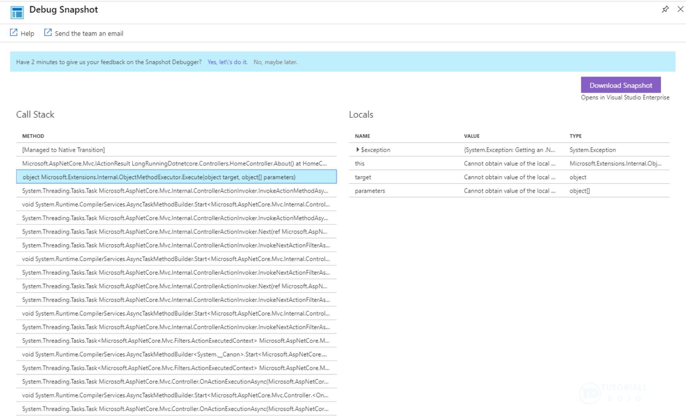
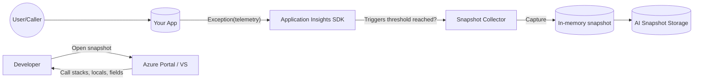

# 🧩 Snapshot Debugger (Application Insights)

## ❓ What is it?

**Snapshot Debugger** captures a **point-in-time memory snapshot** of your .NET app **at the moment an exception happens in production**—without pausing the process. You can later open that snapshot to see:

- Full call stack (async-aware), locals, fields
- Parameter values, captured state
- The exact line that threw (when PDBs/symbols are available)

Think of it as a **black box flight recorder** for exceptions in prod.

---

<div align="center">
  
</div>

---

## 🌍 Where does it exist?

- **Azure Application Insights** feature (aka “Snapshot Debugger”)
- Works with **.NET** (Framework & .NET 6/7/8) running on:

  - **Azure App Service / Functions** (Windows & most Linux scenarios)
  - **Containers (AKS, ACA, ACI), VMs, on-prem**

- You enable either:

  - **Code-based**: add the **Snapshot Collector** NuGet package
  - **Portal/Agent-based** (App Service): toggle Snapshot Debugger under your App Insights resource

> Java/Node have different “live debugging” stories; Snapshot Debugger here is **.NET-focused**.

---

## ⚙️ How it works (under the hood)

1. Your app runs with **Application Insights SDK** (+ **Snapshot Collector**).
2. When an exception is logged (or crosses a threshold), the **collector requests a snapshot**.
3. The runtime creates a **lightweight memory snapshot** (no pause).
4. Snapshot is **uploaded to Application Insights** (stored securely).
5. In the Portal, under **Failures → Exceptions**, you’ll see **“Open debug snapshot”**.
6. Open in **Portal** or **Visual Studio** to inspect code + locals.

### 🧠 Smart throttling

- By default, **only a few snapshots/day** are taken to keep overhead negligible.
- The collector deduplicates by exception “problem ID” (type + method + line).

---

## 🧱 Architecture at a glance

<div align="center">



</div>

---

## 🔐 Security & Access

- Snapshots may contain **sensitive locals/fields**. Viewing requires the built-in RBAC role:

  - **Application Insights Snapshot Debugger** (or higher like Contributor)

- You can **redact** or **exclude** fields/namespaces (see config below).
- Keep **PDBs (portable symbols)** with the deployment (or SourceLink) to see source/locals.

---

## 🧪 Implementation — 3 Ways

### A) **App Service Portal** (code-less on App Service/Functions)

> Easiest if you already run on App Service with App Insights.

1. **Attach Application Insights** to your Web App/Function (if not already).
2. In your **Application Insights resource** → **“Profiler / Snapshot Debugger”**:

   - Toggle **Snapshot Debugger: On**
   - (Optional) Enable Profiler

3. **Redeploy/restart** if prompted.
4. Trigger an exception → go to **Failures → Exceptions** → open snapshot.

**Pros**: fast, no code changes.
**Cons**: best supported on App Service Windows; for containers/VMs use code approach.

---

### B) **Code-first (NuGet)** — works everywhere (.NET)

> Most flexible. Works on AKS, ACA, ACI, VMs, on-prem.

#### 1) Packages

```powershell
dotnet add package Microsoft.ApplicationInsights.AspNetCore
dotnet add package Microsoft.ApplicationInsights.SnapshotCollector
```

#### 2) Program.cs (.NET 6+ minimal)

```csharp
using Microsoft.ApplicationInsights.SnapshotCollector;

var builder = WebApplication.CreateBuilder(args);

// Attach App Insights (reads connection string from env or appsettings)
builder.Services.AddApplicationInsightsTelemetry();

// Add Snapshot Collector with sane defaults
builder.Services.AddSnapshotCollector(options =>
{
    options.IsEnabled = true;
    options.IsEnabledInDeveloperMode = false;
    options.ThresholdForSnapshotting = 1;    // take snapshot on first hit of a new problem
    options.SnapshotsPerDayLimit = 30;       // default throttle
    options.ProblemCounterResetInterval = TimeSpan.FromMinutes(10);
    // options.ExcludeAssemblies = "Company.Secrets.*";         // optional
    // options.ExcludeTypes = "MyApp.Secret*, System.Security*"; // optional
});

var app = builder.Build();

// Sample route that throws
app.MapGet("/boom", () =>
{
    throw new InvalidOperationException("Demo exception for snapshot");
});

app.Run();
```

#### 3) Configuration (appsettings.json)

```json
{
  "ApplicationInsights": {
    "ConnectionString": "InstrumentationKey=YOUR_KEY;IngestionEndpoint=..."
  }
}
```

> **Deploy** with **portable PDBs** (default for modern SDK).
> Hit `/boom` a few times → check App Insights **Failures → Exceptions → Open debug snapshot**.

---

### C) **Containers / AKS / ACA**

- Use **B)** (NuGet) in your app image.
- Ensure **APPINSIGHTS_CONNECTIONSTRING** is set (or use managed identity with ingestion if configured).
- No special sidecars required for snapshots.
- For **ACA**, Snapshot Debugger works if Application Insights is enabled (workspace-based), and the app includes the Snapshot Collector.

---

## 🔧 Tuning & Redaction

### appsettings.json (advanced)

```json
{
  "ApplicationInsights": {
    "SnapshotCollectorConfiguration": {
      "IsEnabled": true,
      "SnapshotsPerDayLimit": 20,
      "ThresholdForSnapshotting": 1,
      "ExcludedNamespacePrefixes": ["MyApp.Secrets", "System.Security"],
      "ProblemCounterResetInterval": "00:10:00"
    }
  }
}
```

### Code (advanced)

```csharp
builder.Services.AddSnapshotCollector(o =>
{
    o.ThresholdForSnapshotting = 1;            // 1st time per problem
    o.SnapshotsPerDayLimit = 15;                // global throttle
    o.ProblemCounterResetInterval = TimeSpan.FromMinutes(5);
    o.ExtraInstrumentation = true;              // improve capture depth
    // o.Shuffle = false; // rarely needed
});
```

> **Tip:** If a class/property name is sensitive (e.g., `Password`), rename or mark it excluded with `ExcludeTypes`/`ExcludeAssemblies`.

---

## 🧭 Finding & Opening Snapshots

1. App Insights → **Failures** → **Exceptions**
2. Select a sample → **“Open debug snapshot”**
3. View call stacks, locals, parameters, captured instance fields
4. If symbols missing:

   - Ensure **PDBs** deployed (Portable)
   - Or set up **SourceLink** in your project

You can also download/open snapshots in **Visual Studio** (Enterprise) for a richer debugging view.

---

## 📉 Overhead & Limits

- Designed to keep overhead **very low** (snapshots are throttled).
- Default limits typically allow **~30 snapshots/day/app**.
- You can adjust the limits; App Insights **data ingestion** applies to pricing/retention.

---

## 🧪 Quick “Hello Snapshot” Test Script

1. Deploy the minimal sample above.
2. **Hammer** the endpoint:

   ```bash
   for i in {1..5}; do curl -s http://yourapp.azurewebsites.net/boom > /dev/null; done
   ```

3. Go to **Application Insights → Failures → Exceptions** → pick one → **Open debug snapshot**.

---

## 🛡️ RBAC you’ll need

Assign viewers one of:

- **Application Insights Snapshot Debugger** (least privilege to view snapshots)
- **Application Insights Component Contributor / Contributor** (broader)

---

## 🧰 Troubleshooting

- **No “Open debug snapshot” link?**

  - Snapshot collector not enabled or throttled
  - App Insights not attached or wrong connection string

- **No source/locals?**

  - PDBs missing; ensure **<DebugType>portable</DebugType>** and include symbols

- **Linux containers:** ensure your image has the required diagnostics dependencies (standard .NET runtime images are fine)

---

## 📌 When should you use it?

- Production incidents you **can’t repro locally**
- **Intermittent** exceptions
- **Async stack loss** suspicion
- Need **data values** from the failing line without adding logging everywhere

It’s one of the most **developer-friendly, low-friction** safety nets you can turn on for .NET apps running in Azure.

---

## 📚 **References:**

- <https://learn.microsoft.com/en-us/azure/azure-monitor/snapshot-debugger/snapshot-debugger-data>
- <https://docs.azure.cn/en-us/azure-monitor/snapshot-debugger/snapshot-debugger-troubleshoot>
