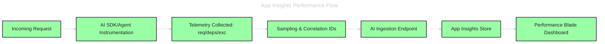
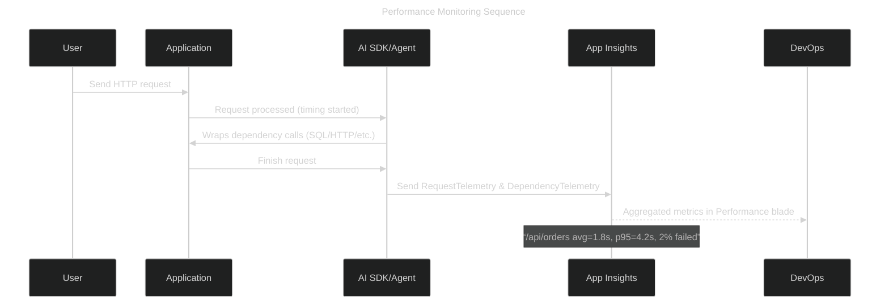

# ⚡ Application Insights Performance Feature

## 📖 Official definition (in human words)

The **Performance blade** in Azure Application Insights gives you a **bird’s-eye view of your app’s responsiveness**.
It continuously collects **telemetry about requests, dependencies, and exceptions**, then aggregates it into **performance metrics** like:

- Request duration (avg, p50, p95, p99)
- Failure rates
- Dependency call duration (SQL, HTTP, storage, etc.)
- Slowest endpoints & methods
- Live metrics (real-time)

👉 In short: **it tells you what is slow, how slow, and how often**.

---

## 🏗️ How it works under the hood

1. **SDK or Auto-instrumentation** injects telemetry collectors into your app.
2. Each incoming request is timed, tagged, and logged as a `RequestTelemetry` event.
3. Dependency calls (SQL, HTTP, Redis, Storage) are automatically tracked as `DependencyTelemetry`.
4. These events are sampled (to reduce noise) and shipped to Application Insights.
5. The **Performance blade** aggregates & visualizes this data → avg response time, percentile charts, and “top slowest requests.”

---

## 🧭 Flow: Performance data pipeline

---

## 🔍 What you see in the Performance blade

- **Top requests**: endpoints ranked by call count & avg duration.
- **Slowest requests**: sorted by latency.
- **Dependencies**: breakdown of SQL, HTTP, storage calls.
- **Percentiles**: not just averages — you see p50, p95, p99 (great for SRE/SLI/SLO).
- **Failure hotspots**: which requests fail most often.
- **Operation drill-down**: click into one request to see all dependency calls.

---

## 📜 Sequence: From user request to performance dashboard

---

## 🧪 Hands-on (5–10 min demo)

1. **Enable Application Insights**

   - In Azure Portal → go to App Service → **Application Insights → Turn On**.
   - Or via code: add AI SDK (`Microsoft.ApplicationInsights.AspNetCore`).

2. **Generate load**

   - Run simple load test (e.g., curl loop, JMeter, Azure Load Testing).

3. **Explore Performance blade**

   - Go to AI resource → **Investigate → Performance**.
   - Look at “Top requests” and “Slowest requests.”
   - Drill into one endpoint (e.g., `/api/orders`) → see dependency breakdown.

4. **Check percentiles**

   - Notice how p95 may be way higher than avg — useful for SLA/SLO analysis.

---

## 🧠 Cheat sheet

- **Purpose**: high-level performance view (which requests, how slow, how often).
- **Data type**: aggregated telemetry (requests, dependencies, exceptions).
- **Granularity**: endpoint/operation level (not line-of-code).
- **Best for**: SRE dashboards, SLA/SLO tracking, release performance regression.
- **Not for**: finding the exact code method — that’s Profiler’s job.
- **Killer tip**: always check **p95/p99** — averages hide customer pain.

---

✅ So: **Application Insights Performance = your app’s fitness tracker** 🏃‍♂️ (tells you which runs are slow and how often).
Later, if you need to know **which muscle is cramping (which line of code)** → that’s where **Profiler** kicks in.
