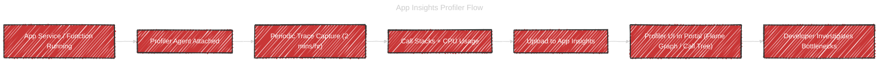
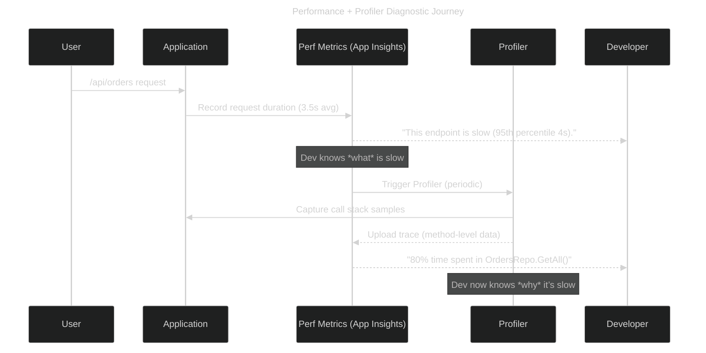

# 🔎 Application Insights Profiler Feature

## 📖 Official definition (humanized)

_**Application Insights Profiler** is a **code-level performance diagnostic tool**._

> Instead of just showing you _“endpoint X is slow”_ (like Performance does), Profiler tells you:  
> 👉 _“Inside endpoint X, method Y is eating 80% of CPU, calling SQL Z in a loop.”_

- Captures **call stacks & execution trees** while your app runs.
- Records **CPU usage per function** and time distribution.
- Runs **periodically** (short bursts, ~2 minutes/hour) to avoid overhead.
- Helps **developers** pinpoint _why_ something is slow.

---

## 🏗️ How Profiler works

1. Profiler attaches to your **App Service / Function / AKS pod / VM**.
2. It runs a **sampling profiler** (very low overhead).
3. Collects snapshots of the call stack across all threads.
4. Uploads these traces to Application Insights.
5. In the portal, you can view:

   - **Flame graphs** (hot path visualization).
   - **Call tree** (method hierarchy + % CPU time).
   - **Sampled traces** linked to the slow request in Performance.

---

## 🧭 Flow: Profiler trace pipeline



---

## 📜 Sequence: How Profiler complements Performance



---

## 🖼️ What you see in the portal

- **Profiler blade** (linked from Performance → “Investigate Profiler traces”):

  - **Call tree view**: expandable tree of methods.
  - **Flame graph view**: visual blocks showing where most time is spent.

- Example:

  - `/api/orders` total time = 3.8s
  - `OrdersRepository.GetAll()` = 3.2s (SQL query)
  - `JsonSerializer.Serialize()` = 0.4s

---

## 🧪 Hands-on (how to enable)

1. **Enable Profiler**:

   - Azure Portal → App Service → Application Insights → **Profiler → Turn On**.
   - Or CLI:

     ```bash
     az webapp config set --name <app> --resource-group <rg> --enable-app-insights-profiler true
     ```

2. **Trigger load**: run traffic (Profiler won’t start without requests).
3. **Wait ~1 hour**: Profiler collects its first 2-minute sample.
4. **View traces**:

   - Go to Application Insights → **Investigate → Profiler traces**.
   - Drill into slow request trace → inspect flame graph.

---

## 🧠 Cheat sheet

- **Performance blade** = _what’s slow (endpoint-level)_
- **Profiler** = _why it’s slow (code-level, method hot paths)_
- **Overhead**: minimal (sampling, short sessions).
- **Supported on**: App Service (Windows/Linux), Azure Functions, AKS, VMs (via SDK/agent).
- **Use it when**:

  - Performance blade shows a slow endpoint but you don’t know why.
  - Customers report intermittent slowness → Profiler trace captures the culprit.

---

✅ Summary:

- Profiler is **not the same as Performance** — it’s the **microscope 🔬** to Performance’s telescope 🔭.
- Use **Performance** first (to spot slow endpoints), then **Profiler** (to root-cause code-level issues).
