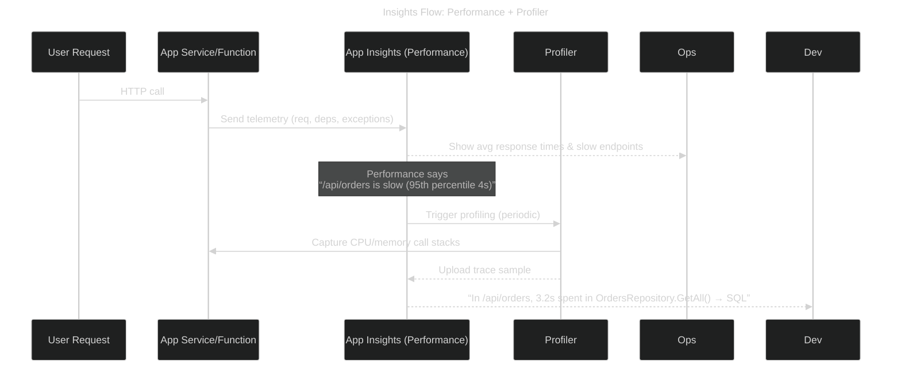

Great question — this is one of those “sounds the same, but actually not the same” Azure features. Let’s break it down in your preferred style 🚀

---

# 🔍 Application Insights Profiler vs. Performance Monitoring

## 🧩 Application Insights Performance (baseline feature)

When you enable **Application Insights** on an app (App Service, Function, AKS, VM, etc.), you get:

* **Metrics**: request rate, response time, dependency calls, exceptions.
* **Sampling & telemetry**: automatically collected data (requests, dependencies, exceptions, traces).
* **Performance blade in portal**: aggregated view of which requests are slowest, dependency failures, average response time trends.

👉 This is **continuous monitoring** — it shows **what** is slow and **how often**, but not always **why**.

---

## 🎯 Application Insights Profiler

Profiler is a **special feature** that takes **code-level performance snapshots** of your running app.

* **How it works**:

  * Runs lightweight profiling sessions (every ~1 hour, 2 minutes duration by default).
  * Captures CPU call stacks, hot paths, execution tree.
  * Lets you drill down to *“this line of code in method X is consuming 40% of the request time.”*
* **Where you see it**: In the **“Profiler traces”** section of Application Insights (linked from the Performance tab).
* **Supported on**: App Service (Windows & Linux), Functions, AKS with .NET/Java, and other supported runtimes.
* **Impact**: Very low overhead because it only runs in short bursts.

---

## 📊 Side-by-side Comparison

| Feature          | Performance (Metrics) ✅                             | Profiler (Deep Dive) 🔎                                                 |
| ---------------- | --------------------------------------------------- | ----------------------------------------------------------------------- |
| **Scope**        | Requests, dependencies, response times, failures    | Individual requests sampled at code-level                               |
| **Granularity**  | Aggregated (avg, p95, failure %)                    | Call stack trace, CPU time per method                                   |
| **When it runs** | Continuous telemetry                                | Periodic profiling sessions (lightweight sampling)                      |
| **Use case**     | Identify *which* endpoints or dependencies are slow | Pinpoint *why* they are slow (specific methods, loops, SQL calls, etc.) |
| **Typical user** | Ops/SRE team watching performance dashboards        | Developers debugging performance bottlenecks                            |

---

## 📜 Sequence of How They Work Together

---

## 🧠 Key Takeaways

* **Performance = What is slow** (macro-level: endpoints, dependencies).
* **Profiler = Why it is slow** (micro-level: methods, call stacks, hot paths).
* They are **complementary**, not the same.
* Usual workflow:

  1. Performance blade shows slow endpoint.
  2. Drill into Profiler trace to find the exact line or DB call.
  3. Fix code/config and redeploy.

---

✅ So: They are not the same. **Performance feature = aggregated monitoring**, **Profiler = deep diagnostic tool**.

👉 Think of **Performance as “weather report”** and **Profiler as “satellite image of the storm.”** 🌩️

---

Would you like me to also show you a **hands-on walkthrough** (Portal + CLI/SDK) of enabling Profiler on an App Service with a sample trace?
