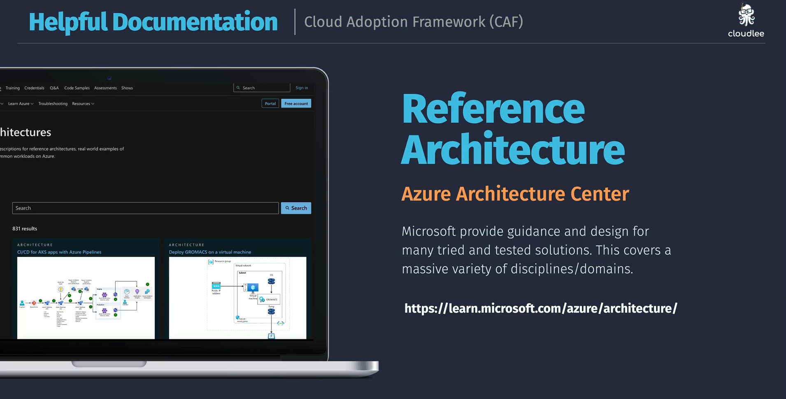

# Azure Architecture Center

The [Azure Architecture Center](https://learn.microsoft.com/en-us/azure/architecture/) is a comprehensive resource provided by Microsoft to help architects, developers, and IT professionals design and build solutions on Azure. It offers best practices, guidelines, and reference architectures to ensure that your applications are secure, scalable, and resilient.
It covers a wide range of topics including:

- 🏗️ **Design Patterns** — for building cloud-native applications
- 🔐 **Security** — best practices for securing your applications and data
- 🌐 **Networking** — guidance on designing robust network architectures
- 📦 **Microservices** — strategies for building and managing microservices-based applications
- 🛠️ **DevOps** — practices for continuous integration and delivery
- ☁️ **Cloud Migration** — strategies and tools for migrating workloads to Azure
- 📊 **Data & AI** — architectures for data processing and AI solutions
- 🖥️ **Compute** — guidance on using Azure compute services effectively
- 🗄️ **Storage** — best practices for data storage solutions
- 🧩 **Integration** — patterns for integrating applications and services
- 🧑‍💻 **Developer Tools** — resources for developers building on Azure
- 🧑‍💼 **Enterprise Solutions** — architectures for enterprise applications
- 🛡️ **Compliance** — ensuring your solutions meet regulatory requirements
- 📈 **Performance Optimization** — tips for optimizing application performance
- 🛡️ **Disaster Recovery** — strategies for ensuring business continuity
- 🌍 **Global Reach** — designing applications for a global audience

The Azure Architecture Center is an invaluable resource for anyone involved in designing or managing applications on Azure, providing the knowledge and tools needed to create effective cloud solutions.

