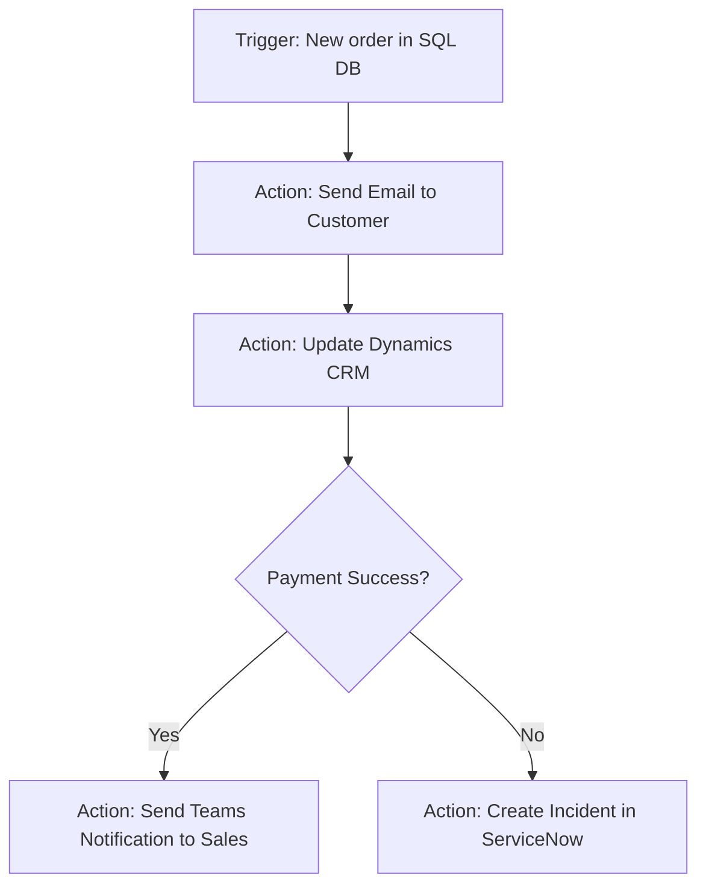

# ⚡ Azure Logic Apps

## 📌 1. What is Logic Apps?

👉 **Azure Logic Apps** is a **cloud service for workflow automation and integration**.
It lets you connect apps, data, and services together **without writing much code**.

Think of it like a **Lego builder for automation** 🧩 → drag, drop, and connect services.

- Automates **business workflows** (approvals, alerts, ticketing).
- Integrates with **Azure + external systems** (Office 365, Salesforce, SAP, ServiceNow, Twitter, etc.).
- Runs in the cloud, serverless (you don’t manage infrastructure).

---

  

---

## 📌 2. Real-World Example

### Scenario: E-commerce company

1. A new order is placed → Event in SQL DB.
2. Logic App picks it up → Sends confirmation email via Outlook.
3. Updates CRM (Dynamics 365).
4. If payment fails → Creates incident in ServiceNow.

👉 No coding → just connecting services.

---

## 📌 3. Core Concepts

| Concept       | Meaning                                 | Example                           |
| ------------- | --------------------------------------- | --------------------------------- |
| **Trigger**   | Starts the workflow                     | “When new email arrives”          |
| **Action**    | Step performed                          | “Send Teams message”              |
| **Connector** | Prebuilt integration with a service     | Outlook, SAP, Twitter, ServiceNow |
| **Workflow**  | The whole Logic App (trigger + actions) | Order → Email → Ticket            |
| **Run**       | Each execution of workflow              | Every time a new email arrives    |

---

## 📌 4. Why Use Logic Apps?

- 🖇️ **Integration** → connect on-prem + cloud apps.
- 🧑‍💼 **Business automation** → approvals, notifications, onboarding.
- ⚡ **Serverless** → pay-per-run, auto-scale.
- ⏱️ **Fast development** → no need to write full apps for simple automations.
- 🔌 **Connector library** → 1,000+ connectors (Azure services, SaaS, custom APIs).

---

## 📌 5. Example Workflow (Visual)

---

## 📌 6. Logic Apps vs Similar Services

| Service               | Best For                              | Example                                |
| --------------------- | ------------------------------------- | -------------------------------------- |
| **Logic Apps**        | Enterprise workflows & integrations   | Connect Azure + SAP + ServiceNow       |
| **Power Automate**    | Business users (low-code, Office 365) | HR onboarding approval flow            |
| **Azure Functions**   | Custom code (developer-driven)        | Write custom algorithm for fraud check |
| **Durable Functions** | Complex stateful workflows            | Orchestration of long-running jobs     |

👉 Exam keyword: Logic Apps = **integration + workflow automation at enterprise scale**.

---

## 📌 7. Pricing

- **Consumption Plan** → pay per run.
- **Standard Plan** → fixed cost, more performance, can run in **VNET / private envs**.

---

## 📌 8. Integration with DevOps

- Logic Apps can be managed as **code (ARM/Bicep/Terraform)**.
- Deploy via **Azure DevOps Pipelines**.
- Example: Deploy workflow JSON template → run integration tests.

---

## ✅ TL;DR

- **Azure Logic Apps** = Serverless **workflow automation + integration** service.
- Uses **triggers** (event) + **actions** (steps).
- Connects 1,000+ systems (Azure, SaaS, on-prem).
- Perfect for **approvals, ticketing, monitoring, data sync, messaging**.
- Exam keyword = _“workflow automation & integration”_.
