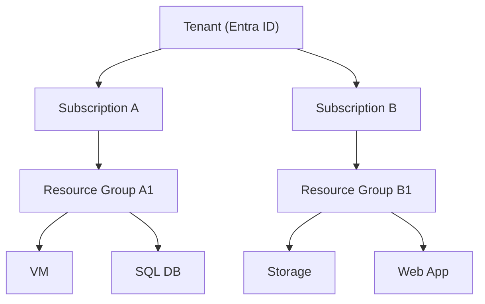

# 💳 Azure Subscriptions

> 📌 Official Definition:
> _A subscription in Azure is a logical unit of Azure services that is linked to an Azure account, used to provision and manage resources and track costs._

---

    

---

## 📘 What is an Azure Subscription?

An **Azure Subscription** is a **logical container** that links:

- **Azure services (VMs, databases, storage, etc.)**
- **Billing and usage tracking**
- **Access control (RBAC)**
- **Policy enforcement**

## 🧩 Azure vs AWS – Know the Difference

| Concept                   | Azure                                  | AWS                              |
| ------------------------- | -------------------------------------- | -------------------------------- |
| **Subscription**          | Billing + resource container           | **AWS Account**                  |
| **Tenant** (Directory)    | Identity boundary (Microsoft Entra ID) | AWS Org Root + Directory Service |
| **User Sign-in**          | Azure Account (email)                  | IAM/SSO Identity                 |
| **Role Assignment Scope** | MG → Subscription → RG → Resource      | Org → Account → Resource         |

> ✅ In Azure, **multiple subscriptions can live inside the same tenant**.
> In AWS, **each account is its own billing + security boundary**.

---

## 🎯 When to Use Multiple Subscriptions

| Use Case                   | Why Use Separate Subscriptions?                   |
| -------------------------- | ------------------------------------------------- |
| **Dev/Test vs Production** | Isolate environments and control who has access   |
| **Departmental Billing**   | Track usage per business unit                     |
| **Compliance or Security** | Apply different policies or regions per sub       |
| **Quota Separation**       | Avoid hitting limits on cores, IPs, storage, etc. |

---

## 🛠️ Key Capabilities of a Subscription

### 1. 🧾 **Billing Unit**

- Each subscription generates **its own invoice**.
- Azure Cost Management & Budgets are scoped per sub.

### 2. 🔐 **Access Management**

- Subscriptions are a scope for **RBAC**.
- Assign roles like `Reader`, `Contributor`, or `Owner`.

### 3. ⚖️ **Policy and Compliance**

- Azure Policy and Blueprints can be applied per sub.
- You can allow only certain VM sizes, tag requirements, regions, etc.

### 4. 📦 **Resource Group Container**

- Resources live in **Resource Groups**, which live in subscriptions.

---

---
