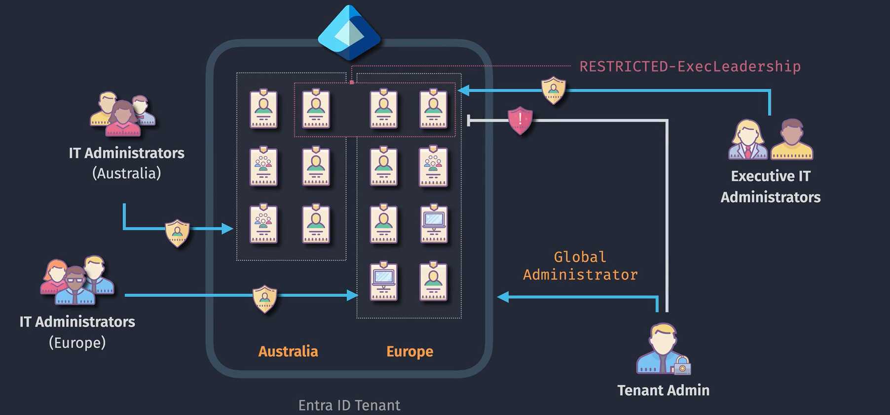

# 🏢 Administrative Units in Azure Entra ID

> 📖 _An Administrative Unit (AU) in Microsoft Entra ID (Azure AD) is a container of resources (users, groups, devices) that allows you to delegate administrative permissions over just those resources._
>
> 👉🏻 Translation: Think of it as **“RBAC scoping containers”** inside Azure AD. Instead of giving an admin global powers across your tenant, you can **restrict their scope** to just a department, country, or business unit.

---

  

---

## 🎯 Why Use Administrative Units?

- **Delegation at scale** → Give HR admins access only to HR users.
- **Scoped RBAC** → Limit helpdesk admins to reset passwords in a specific region.
- **Tenant segmentation** → Manage multi-geo, multi-department, or multi-school scenarios.
- **Compliance** → Enforce least privilege access.

👉 Without AUs, Azure AD roles apply **tenant-wide** (too much power 🔥).

---

## 🔑 Supported Scenarios

1. **Scoped Role Assignments**

   - Example: Assign `User Administrator` role scoped to the **HR AU**.
   - Result: Admin can manage only HR users (create, delete, reset passwords).

2. **Helpdesk Delegation**

   - Example: Assign `Password Administrator` scoped to **Region: Europe AU**.
   - Result: Helpdesk team in Europe can reset passwords for **only European users**.

3. **Education Scenarios (big use case!)**

   - Schools often use AUs:

     - One AU = one school.
     - Teachers get scoped roles to manage only their school’s users.

---

## 🧑‍💻 Creating and Using AUs

## Step 1: Create an AU

- **Portal**: Entra ID → Administrative Units → New Unit.
- Name it (e.g., _“HR Department”_).

## Step 2: Add Members

- Add **users**, **groups**, or **devices**.
- Example: Add all HR staff accounts + HR devices.

## Step 3: Assign Scoped Role

- Assign a built-in role to an AU.
- Example:

  - Role: `User Administrator`
  - Scope: _HR AU_
  - User: `Alice (HR Admin)`

👉 Alice can manage **only HR objects**, not Finance/IT/etc.

---

## 👥 Adding Groups to an Administrative Unit (AU)

When you **add a group** to an AU:

- You are **adding the group object itself**, not automatically all its members.
- The AU now contains that group, which means **scoped admins can manage the group** (e.g., rename group, add/remove members).
- **BUT** the _users inside the group are NOT automatically part of the AU_ unless you explicitly add them (individually or via dynamic rule).

👉 So: Adding a group ≠ adding all its members into the AU.

---

### 👉🏻 Example AU: **HR Department**

- You add **Group: HR-Staff** to the AU.

**Result:**

- Admins scoped to this AU can manage the **HR-Staff group** (change properties, manage membership).
- But if `Bob` is a member of HR-Staff, and you didn’t directly add `Bob` to the AU →

  - Scoped admins **cannot manage Bob’s user object** (e.g., reset Bob’s password).

---

### 🤔 How to Include All Users

If your goal is to let AU admins manage **users in a department**, you should:

1. Add **users directly** to the AU, OR
2. Use a **dynamic membership rule** (e.g., `user.department -eq "HR"`).

👉 That way, **all users in HR are automatically included in the AU**.

---

## 📌 Key Notes

- **Granularity**: AUs scope **directory roles**, not Azure resource roles (that’s RBAC in Subscriptions/Resource Groups).
- **Dynamic membership**: You can use **dynamic rules** (e.g., `department = HR`) to auto-assign users to an AU.
- **Licensing**: Requires **Azure AD Premium P1/P2**.
- **Supported roles**: Not all roles are scope-able. Common ones include:

  - User Administrator
  - Groups Administrator
  - Password Administrator
  - Authentication Administrator

---

## 🚫 Restricted Management Administrative Units (RMAU)

A **Restricted Management Administrative Unit** in Microsoft Entra ID is a special type of AU that prevents **Global Administrators** and other tenant-wide role holders from managing the objects inside it, unless they’ve been explicitly assigned a **scoped role** to that AU. Normally, a Global Admin can do anything (reset any password, delete any user, change any group), but with an RMAU, you can carve out a protected zone where only designated AU-scoped admins have control.

This is useful for **sensitive accounts** (executives, finance, politicians, or even Global Admins themselves), ensuring **least privilege and compliance** by protecting them from insider threats. Unlike normal AUs, where Global Admins still override, Restricted AUs enforce a true **administrative isolation boundary**.

👉 **Example:** Create an RMAU named _Board Members_, add CEO/CFO accounts, and assign a dedicated Security Admin scoped only to that AU. Even a Global Admin cannot reset the CEO’s password unless explicitly added.

⚠️ Key points:

- Global Admins can **see** objects but cannot **manage** them.
- Requires **Microsoft Entra ID Premium P1/P2**.
- Only certain roles can be scoped (User Admin, Password Admin, Groups Admin, etc.).
- Use cases: protecting VIPs, enforcing compliance rules, limiting insider risks.

👉 In short: **Normal AUs = Delegation with override**, **Restricted AUs = True isolation, even from Global Admins**.

---

## ✅ Example Scenarios

### Scenario 1: HR Delegation

- AU: `HR Department`
- Role: `User Administrator`
- Admin: `HR Ops Team`
- Result: HR admins can manage HR users (reset passwords, edit details) but can’t touch IT staff accounts.

---

### Scenario 2: Regional Helpdesk

- AU: `Europe`
- Role: `Password Administrator`
- Admin: `Europe Helpdesk`
- Result: They reset passwords for **only European users**.

---

### Scenario 3: School Tenant

- AU per **school** in a district.
- Teacher assigned `Groups Administrator` in their AU.
- Teacher can manage **class groups** only in their own school.

---

## ⚡ AWS Comparison (for you 🚀)

| Concept                 | Azure                                                | AWS Equivalent                                                                                                                                            |
| ----------------------- | ---------------------------------------------------- | --------------------------------------------------------------------------------------------------------------------------------------------------------- |
| Tenant                  | Entra ID Tenant                                      | AWS Organization Root Account                                                                                                                             |
| Subscription            | Azure Subscription                                   | AWS Account                                                                                                                                               |
| Management Group        | Groups subscriptions                                 | AWS Organizational Unit (OU)                                                                                                                              |
| **Administrative Unit** | Scoped container of users/groups for RBAC delegation | **No direct equivalent** — closest is **IAM policy with resource scoping** or **OU in AWS Organizations**, but AU is user/group-level, not account-level. |

👉 Key Difference:

- AWS **OUs** control accounts (billing, SCP policies).
- Azure **AUs** control **directory objects (users/groups/devices)**.

So, AUs sit **below Management Groups/Subs** → they’re about **identity/resource delegation**, not cost/infra grouping.

---

## 📝 Summary

- **AUs = Containers for users, groups, devices** to delegate administration.
- Provide **scoped RBAC** in Entra ID → solves “global role too powerful” problem.
- Very useful for **departments, geos, schools, compliance**.
- **AWS Analogy**: Closest to **OUs in AWS Organizations** but at _identity object level_, not account level.
- Require **Entra ID Premium P1/P2**.
- Adding a **group to AU** → AU admins can manage the group itself.
- It does **NOT** mean all group members are implicitly in the AU.
- If you want users inside managed, you must add them individually or via **dynamic membership**.
- **Global Administrator or Privileged Role Administrator Role:** Only users with these roles can create and manage AUs.
- **No Nested AU:** You cannot nest an AUs within another AUs.
