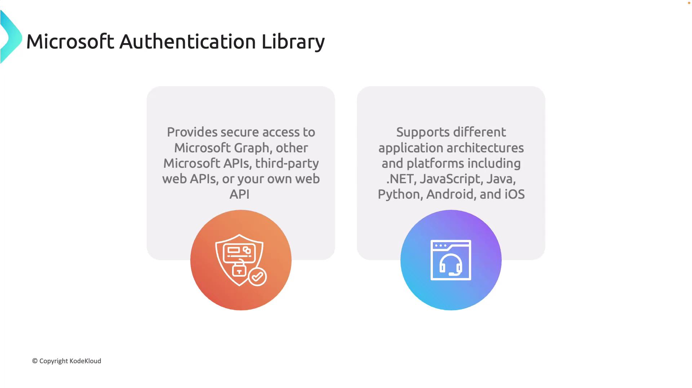
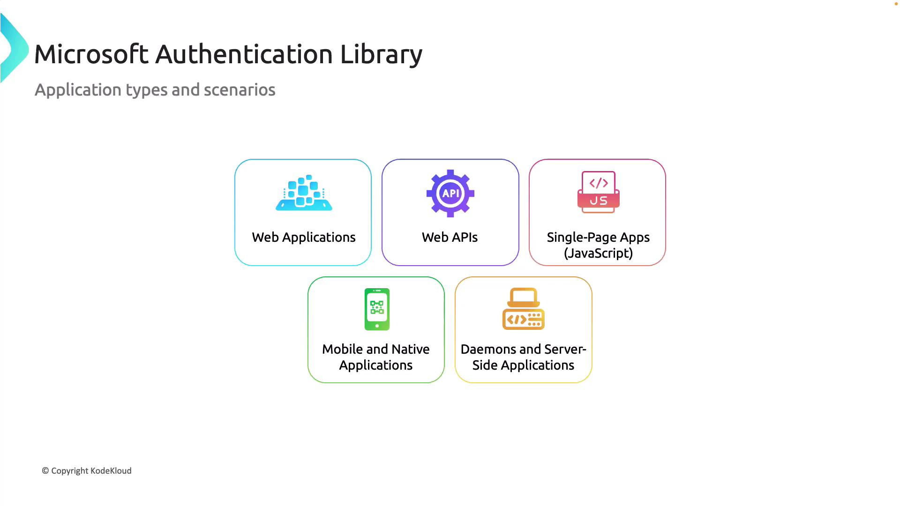
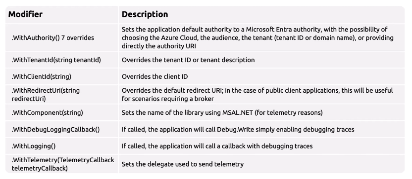
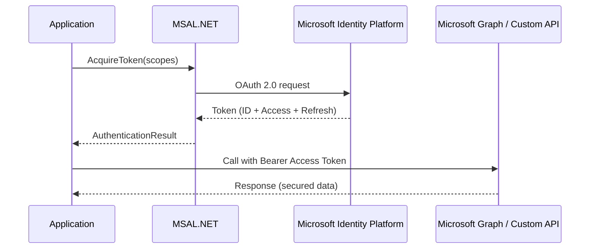

# 🔐 Microsoft Authentication Library (MSAL)

## 📖 What is MSAL?

The **Microsoft Authentication Library (MSAL)** is the official SDK to acquire **tokens** from the **Microsoft Identity Platform** (Microsoft Entra ID + Microsoft Accounts).

It provides a **unified way** to:

- Authenticate **users** and **applications**
- Acquire **ID tokens**, **Access tokens**, and **Refresh tokens**
- Call **Microsoft Graph** or your **custom APIs** securely

✅ Supported platforms:

- .NET / .NET Core
- JavaScript (SPAs, Node.js)
- Java
- Python
- Android / iOS

---

<div align="center">
  
</div>

---

## 🎯 Why MSAL?

- **One library → many scenarios** (web apps, mobile apps, daemons, APIs).
- **Token caching** (so you don’t need to re-prompt).
- **Multiple authentication flows** built-in.
- Replaced the old **ADAL** (Azure AD Authentication Library).
- Supports **multi-cloud and multi-tenant** authentication.

---

## 📌 Application Types & Scenarios

MSAL supports five big categories of applications:

| App Type                 | Example                      | How it authenticates                             |
| ------------------------ | ---------------------------- | ------------------------------------------------ |
| **Web Applications**     | ASP.NET, MVC                 | Browser redirect → code flow                     |
| **Web APIs**             | ASP.NET Web API              | Bearer token from caller                         |
| **SPAs (JavaScript)**    | React, Angular               | MSAL.js → Auth Code flow with PKCE               |
| **Mobile / Native apps** | iOS, Android, .NET MAUI, WPF | Interactive login (browser or embedded web view) |
| **Daemons / Services**   | Worker, CRON job             | Client credentials (app-only, no user)           |

---

<div align="center">
  
</div>

---

## 📌 Authentication Flows Supported by MSAL

MSAL abstracts the complexity of **OAuth 2.0** + **OpenID Connect**.

### 🔑 Main Flows

1. **Authorization Code Flow** (most common)

   - User signs in, app exchanges code for token.
   - For web apps, SPAs, mobile.

2. **Device Code Flow**

   - User enters code on another device to sign in.
   - For CLI tools, IoT, consoles.

3. **Client Credentials Flow**

   - App authenticates itself (daemon, API-to-API).
   - Requires **application permissions**.

4. **On-Behalf-Of Flow (OBO)**

   - API A calls API B, re-using user’s delegated token.

5. **Username/Password (ROPC)**

   - Legacy, insecure, not recommended.
   - Directly posts user credentials.

---

## 📌 MSAL.NET Structure

MSAL revolves around **Client Applications** that acquire tokens.

---

### 🅰️ Public Client Applications

- Used by **native apps** (desktop, mobile).
- No client secret.
- Example: WPF app, Xamarin app.

```csharp
IPublicClientApplication app = PublicClientApplicationBuilder
    .Create("<client_id>")
    .WithRedirectUri("http://localhost")
    .Build();
```

---

### 🅱️ Confidential Client Applications

- Used by **web apps, daemons, APIs**.
- Stores secrets or certificates.
- Example: ASP.NET API, background service.

```csharp
IConfidentialClientApplication app = ConfidentialClientApplicationBuilder
    .Create("<client_id>")
    .WithClientSecret("<client_secret>")
    .WithRedirectUri("https://myapp.azurewebsites.net")
    .Build();
```

---

### 🛠️ Important Classes & Methods

| Class / Interface                | Purpose                                                           |
| -------------------------------- | ----------------------------------------------------------------- |
| `IPublicClientApplication`       | Represents public apps                                            |
| `IConfidentialClientApplication` | Represents confidential apps                                      |
| `AcquireTokenInteractive()`      | User login (delegated)                                            |
| `AcquireTokenSilent()`           | Fetch token from cache                                            |
| `AcquireTokenForClient()`        | App-only tokens                                                   |
| `AcquireTokenByDeviceCode()`     | Device code flow                                                  |
| `AcquireTokenOnBehalfOf()`       | OBO flow                                                          |
| `AuthenticationResult`           | Returned object: `AccessToken`, `IdToken`, `ExpiresOn`, `Account` |

---

<div align="center">
  
</div>

---

## 📌 Advanced Customization

You can chain configurations when building apps:

```csharp
var app = ConfidentialClientApplicationBuilder.Create("<client_id>")
    .WithClientSecret("<secret>")
    .WithTenantId("<tenant_id>")
    .WithRedirectUri("https://myapp.com/auth")
    .WithAuthority(new Uri("https://login.microsoftonline.com/<tenant_id>"))
    .WithLogging((level, message, pii) => {
        Console.WriteLine($"MSAL [{level}] {message}");
    }, LogLevel.Verbose, enablePiiLogging: false)
    .Build();
```

Key options:

- `.WithTenantId()` → force single tenant
- `.WithAuthority()` → specify endpoint (AAD, B2C, national clouds)
- `.WithRedirectUri()` → redirect after login
- `.WithLogging()` → custom logging for debugging

---

## 📌 Example: Confidential Client in .NET

```csharp
using System;
using System.Threading.Tasks;
using Microsoft.Identity.Client;

class Program
{
    private static string tenantId = "<tenant-id>";
    private static string clientId = "<client-id>";
    private static string clientSecret = "<secret>";
    private static string[] scopes = { "https://graph.microsoft.com/.default" };

    static async Task Main(string[] args)
    {
        var app = ConfidentialClientApplicationBuilder.Create(clientId)
            .WithClientSecret(clientSecret)
            .WithAuthority(new Uri($"https://login.microsoftonline.com/{tenantId}"))
            .Build();

        try
        {
            var result = await app.AcquireTokenForClient(scopes).ExecuteAsync();
            Console.WriteLine($"✅ Access Token acquired:\n{result.AccessToken}");
        }
        catch (Exception ex)
        {
            Console.WriteLine($"❌ Error: {ex.Message}");
        }
    }
}
```

---

## 📌 Creating a Service Principal (Azure CLI)

To test app-only flow, create a service principal:

```bash
az ad sp create-for-rbac --name "MSALClientApp"
```

Example output:

```json
{
  "appId": "a9672fa3-c786-47a2-82ed-5eb947b715a7",
  "password": "Super-Secret-Value",
  "tenant": "1e0f2212-3d4c-4586-bbff-b6068c7ac64b"
}
```

Use these in your `.NET` confidential client setup (`clientId`, `clientSecret`, `tenantId`).

---

## 📌 Testing Your Token

- Copy access token.
- Go to [jwt.ms](https://jwt.ms).
- Decode the JWT → verify:

  - `aud` = target API (e.g., Graph)
  - `iss` = tenant issuer
  - `appid` = your app
  - `roles` / `scp` = granted permissions

---

## 📊 Mermaid Flow — MSAL Token Lifecycle

<div align="center">



</div>

---

## ✅ Exam & Real-World Cheat Sheet

- **Public client** → Desktop/Mobile → interactive login (no secret).
- **Confidential client** → Web apps/APIs → client secret or cert required.
- **Scopes** = Delegated (user).
- **App Roles (`.default`)** = Application (app-only).
- **MSAL handles caching + refresh automatically.**
- Always test tokens with **jwt.ms**.
