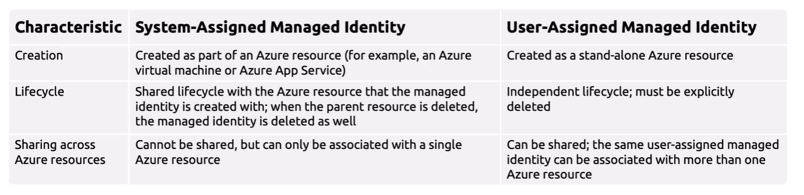
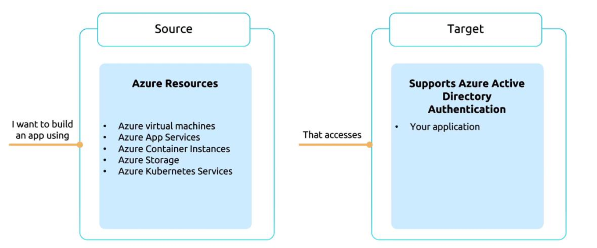
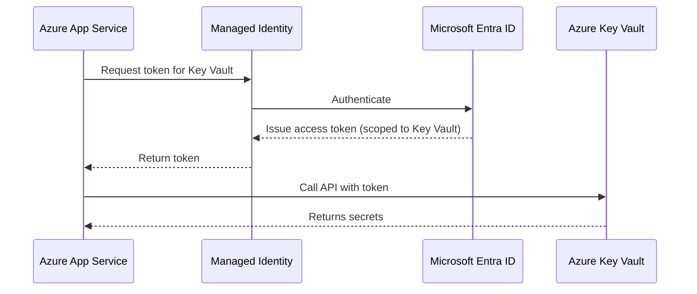
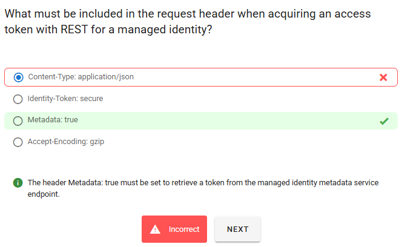

# 🧙‍♂️ Azure Managed Identities — Your Passwordless Sidekick

> “Why store secrets in code when Azure can manage them for you?” — A happy, secure developer somewhere.

---

<div align="center">
  
</div>

---

## 🌟 What Are Managed Identities?

A **Managed Identity (MI)** is just a **special Service Principal** that Azure creates and manages **for you**.

- Used by **Azure resources** (VM, App Service, Functions, etc.)
- Removes the need for you to handle Client ID + Secret.
- Rotation, creation, deletion → handled by Azure.

---

## 🤹‍♀️ Types of Managed Identities

| Type                | Scope                              | Lifecycle        | Example Use Case                          |
| ------------------- | ---------------------------------- | ---------------- | ----------------------------------------- |
| **System-assigned** | Tied to _one_ Azure resource       | Same as resource | Azure VM reads from Key Vault             |
| **User-assigned**   | Created as a _standalone_ identity | Independent      | One identity shared across many Functions |

---

<div align="center">
  
</div>

---

## 🎯 Use Cases

Managed identities are particularly useful when you need Azure resources—such as virtual machines, App Services, Container Instances, Container Apps, or Azure Kubernetes Service—to access other Azure services securely and without manual credential management. Any service supporting Azure AD (or Microsoft Entra ID) authentication can benefit from this setup.

<div align="center">
  
</div>

Example:

- Azure Function accessing Azure SQL, Blob, Key Vault
- Azure VM pulling config from App Configuration
- Azure Container Apps fetching secrets securely
- Azure Logic Apps calling protected APIs

---

## 🧪 Real-World Example

> Let's say your app hosted in **Azure App Service** needs to pull secrets from **Azure Key Vault**.

With managed identity:

- No client ID
- No client secret
- No password rotation
- No leaks in GitHub 😬

---

## 🧬 Flow Diagram (Mermaid Style)

<div align="center">



</div>

---

## 🧑‍💻 Example Code (C# — Key Vault Access)

```csharp
var credential = new DefaultAzureCredential(); // Automatically uses Managed Identity
var client = new SecretClient(new Uri("https://my-keyvault.vault.azure.net/"), credential);
KeyVaultSecret secret = await client.GetSecretAsync("ConnectionString");
Console.WriteLine(secret.Value);
```

✅ No credentials  
✅ Works on VMs, Functions, App Services, AKS, Logic Apps  
✅ Secure-by-default

---

## 🏗️ How to Enable It?

### 🔹 For System-Assigned MI

1. Go to your Azure resource (e.g., VM or Function)
2. Navigate to **Identity → System Assigned**
3. Set status to **On**
4. Azure creates a managed identity behind the scenes

### 🔹 For User-Assigned MI

1. Go to **Microsoft Entra ID → Managed Identities**
2. Click **New user-assigned identity**
3. Assign it to **multiple resources**

---

## 🔑 Assigning Permissions

> Managed Identities work by getting **Microsoft Entra tokens**, so they need permissions!

You assign roles using **Azure RBAC** (not App RBAC):

```bash
# Give your MI access to Key Vault as Reader
az role assignment create \
  --assignee "<managed-identity-id>" \
  --role "Key Vault Secrets User" \
  --scope "/subscriptions/<sub>/resourceGroups/<rg>/providers/Microsoft.KeyVault/vaults/<kv>"
```

---

## 🕳️ Managed Identity are SP behind the scene

**Managed Identities in Azure are essentially _specialized service principals_ that Azure creates and manages for you.**

---

### 🔎 How It Works

- **Service Principal Basics:**  
  A service principal is an identity in Microsoft Entra ID (Azure AD) that apps, scripts, or services use to authenticate. Normally, you create one manually and assign it credentials (client secret or certificate).

- **Managed Identity Relationship:**  
  When you enable a **Managed Identity** for an Azure resource (like a VM, Function, or App Service), Azure automatically provisions a **service principal in Entra ID** behind the scenes.

  - This service principal is tied to the lifecycle of the resource.
  - Azure rotates its credentials automatically.
  - You don’t see or manage the secret/certificate — Azure handles it.

- **Credential Flow:**
  - The resource requests a token from the **Azure Instance Metadata Service (IMDS)**.
  - IMDS issues a short-lived OAuth 2.0 token using the hidden service principal.
  - The resource then uses this token to access Azure services (e.g., Key Vault, Storage).

---

### ⚖️ Comparison: Service Principal vs Managed Identity

| Feature                   | Service Principal                     | Managed Identity                                    |
| ------------------------- | ------------------------------------- | --------------------------------------------------- |
| **Creation**              | Manual (you register app in Entra ID) | Automatic (Azure creates it for the resource)       |
| **Credential Management** | You manage secrets/certs              | Azure auto-rotates credentials                      |
| **Lifecycle**             | Independent of resource               | Bound to resource lifecycle                         |
| **Use Case**              | Cross-platform apps, external scripts | Azure-native resources (VMs, Functions, Logic Apps) |

---

### 🎯 Key Takeaway

- **Managed Identity = Service Principal + Automation.**
- It’s the same underlying identity type, but Azure abstracts away the credential management.
- If you delete the resource, its managed identity (service principal) is also deleted.

---

## 🛂 Token Under the Hood

The managed identity authentication flow involves several key steps:

### 1️⃣ Enable Managed Identity

Azure Resource Manager (ARM) receives a request to enable a system-assigned managed identity on a virtual machine (or any resource that supports managed identities).

### 2️⃣ Service Principal Creation

Once enabled, a service principal is automatically generated in Microsoft Entra ID (formerly Azure Active Directory) for the virtual machine’s identity.

### 3️⃣ VM Configuration Update

ARM configures the virtual machine by updating the Azure Instance Metadata Service with the newly created service principal's client ID and certificate.

### 4️⃣ Resource Access Provisioning

With the virtual machine now equipped with an identity, the service principal can be used to grant access to additional Azure resources.

### 5️⃣ Token Request

The code running on the virtual machine requests an access token from the Azure Instance Metadata Service endpoint, which is accessible only internally.

- It hits the **Instance Metadata Service (IMDS)** endpoint:

  ```ini
  GET http://169.254.169.254/metadata/identity/oauth2/token
  ```

### 6️⃣ JWT Acquisition

The access token is then used to contact Microsoft Entra ID to retrieve a JSON Web Token (JWT) using the pre-configured client ID and certificate.

### 7️⃣Resource Access

Finally, your application sends the JWT to services that support Microsoft Entra Authentication—such as Azure Key Vault or Azure Blob Storage—to access the required resources.

---

> 🚨 The header Metadata: true must be set to retrieve a token from the managed identity metadata service endpoint.
>
> <div align="left">
>   
> </div>

---

## 🧠 Important Notes

| Feature                    | System-assigned          | User-assigned            |
| -------------------------- | ------------------------ | ------------------------ |
| Tied to a single resource  | ✅ Yes                   | ❌ No                    |
| Reusable across services   | ❌ No                    | ✅ Yes                   |
| Survives resource deletion | ❌ No                    | ✅ Yes                   |
| Works with Kubernetes      | ✅ AKS workload identity | ✅ AKS workload identity |
| Assign roles (RBAC)        | ✅ via Azure RBAC        | ✅ via Azure RBAC        |

---

## 🏠 Application Identities vs 🏪 Managed Identities

| Feature                  | **Application Identity (Service Principal)** | **Managed Identity**                            |
| ------------------------ | -------------------------------------------- | ----------------------------------------------- |
| **Hosted Where?**        | Anywhere (on-prem, other cloud, or Azure)    | Only for Azure-hosted services (VMs, Functions) |
| **Credential Type**      | Client ID + Secret/Certificate               | No secrets – uses platform-level identity       |
| **When to Use**          | Custom apps, scripts, integrations, CI/CD    | Azure-native automation                         |
| **Used in OAuth2 Grant** | Client Credentials, Authorization Code       | Works natively without OAuth2 flow              |
| **Security Management**  | You manage secrets or certs                  | Azure rotates credentials automatically         |
| **Provisioned From**     | App Registration                             | Enabled directly on resource (e.g., VM)         |

---

## 🧠 Final Takeaways

- Use **Managed Identity** whenever Azure resources need to access each other securely.
- Forget about storing secrets in code. Use **DefaultAzureCredential** and let Azure do the rest.
- Prefer **User-assigned** MI for reusable identities across resources.
- No more `client_id` / `client_secret` headaches.
- Use Azure RBAC to **grant fine-grained access** to each resource.
