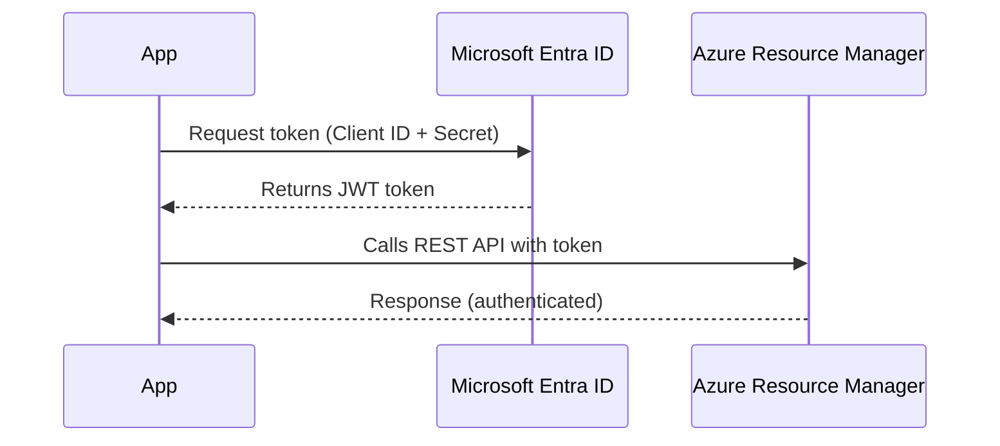

# 🔐 Application Identity in Microsoft Entra ID

> 📖 _An **Application Identity** in Microsoft Entra ID allows apps (not users!) to authenticate securely and access Azure resources, APIs, or external services — **without a user signing in**._

---

  

---

> 💡 **Application Identity** is a **loose umbrella term**, People use it to mean either:
>
> - The App Registration (global definition), or
> - The Service Principal (local instance).

## 🧩 Core Components of App Identity

| Component                  | Description                                                                |
| -------------------------- | -------------------------------------------------------------------------- |
| **App Registration**       | The blueprint of your app. Defines credentials, API permissions, redirects |
| **Enterprise Application** | The "live" instance of the app in your tenant (Service Principal)          |
| **Service Principal**      | The actual identity used to authenticate and authorize the app             |

🧠 TL;DR:

- **App Registration** = the design 💡
- **Enterprise App** = the deployed identity 🔧
- **Service Principal** = the authenticating actor 🕵️

---

## 📌 **Breakdown**

### 🔹 **App Registration**

- Created in **Entra → App registrations** blade.
- Defines the **application globally**:

  - Name, redirect URLs, secrets/certs, permissions.

- Only one definition exists in the “App factory.”

💡 Example: You build a SaaS app called `MyCRM`.

---

### 🔹 **Enterprise Application**

- Shows up in **Entra → Enterprise Applications**.
- This is the **local copy** of the app in your tenant.
- Created automatically when:

  - You register an app yourself, OR
  - You integrate a third-party SaaS (Salesforce, ServiceNow, etc.).

- This object stores:

  - Who’s assigned (users, groups)
  - Conditional Access policies
  - SSO configuration for this tenant

💡 Example: Contoso (your company) installs `MyCRM`. Now they have an **Enterprise Application** entry for it.

---

### 🔹 **Service Principal**

- The **identity behind the Enterprise Application**.
- It’s what actually **authenticates** (logs in) on behalf of the app.
- Holds:

  - **Client ID** (like a username)
  - **Secret/Certificate** (like a password)
  - Roles assigned (via RBAC)

💡 Example: The `MyCRM` Enterprise App has a **Service Principal identity** in your tenant. This is what gets a token to call Azure APIs.

---

---

## 📌 **Visual Diagram**

When we talk about **application identity** (via **App Registration** + **Service Principal**), it usually maps to the **OAuth2 client credentials grant type**, which looks like this:

> The app (not a user) authenticates to Azure Entra ID using its **Client ID** + **Secret/Certificate** to obtain an **access token**.

---

---

This is called the **Client Credentials Grant**.

- No user signs in
- Token represents the app
- Token can be scoped to resources (like `https://management.azure.com/`)

---

## 📌 **Example Story**

1. You create **App Registration** in Entra called `ContosoApp`.

   - Redirect URL = `https://contoso.com/auth/callback`
   - Permissions = Microsoft Graph → Read users

2. Entra automatically makes an **Enterprise Application** for it in your tenant.

   - You assign users/groups who can use it.
   - Apply Conditional Access.

3. The **Service Principal** is born along with the Enterprise Application.

   - It has a **Client ID** + Secret/Cert.
   - This identity can log in and request tokens.

4. Now, your Angular app uses the **SP identity** to request tokens and call APIs.

---

## 📌 **Where You See Them in the Portal**

- **App registrations** blade → for developers (blueprint level).
- **Enterprise applications** blade → for admins (who’s using it, assign users, configure SSO).
- **Service Principal** → you don’t see it directly, but it’s the identity record behind the Enterprise App.

---

## 📌 **Best Practices**

- 🔑 **Use App Registration** → to define app details.
- 🔐 **Use Enterprise Application** → to control tenant-level settings (users, CA policies).
- 🤖 **Use Service Principal** → in automation (pipelines, Terraform, scripts).
- ✅ Always use **least privilege** when assigning roles to SPs.
- 🚫 Don’t confuse **user identity** with **app identity** → apps should never use human accounts.

---

## 🏁 **TL;DR**

- **App Registration** = global blueprint of app (dev perspective).
- **Enterprise Application** = local instance of that app in your tenant (admin perspective).
- **Service Principal** = identity object used by the app to log in & get tokens.
- **App Identity** = generic term for either of the above.
- A Service Principal **always has an App Registration behind it** (yours or someone else’s).
- You can’t create a “standalone” SP.
- CLI/portal sometimes hides the App Registration from you, but it’s always there.
- If you don’t want to manage SPs manually, use **Managed Identities** (Azure handles both parts).
