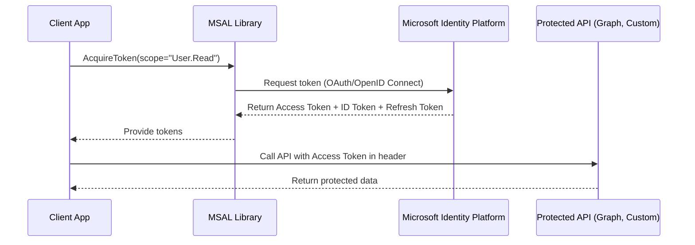

# 🔐 Microsoft Identity Platform + MSAL (Intro)

## 📖 What is the Microsoft Identity Platform?

Think of it as **Microsoft’s identity & access solution for apps**. It provides:

- **Authentication** ✅ (who you are)
- **Authorization** ✅ (what you can do)
- **Standards compliance** (OAuth 2.0, OpenID Connect)
- **Integration with Microsoft Entra ID** (formerly Azure AD) and Microsoft accounts

Basically, it’s the platform that lets your app sign in users, get tokens, and call **Microsoft APIs** (Graph, Outlook, etc.) or your own protected APIs.

---

## 🧭 Why Microsoft built it?

- Developers needed a unified way to integrate with Microsoft identities (Work/School via Entra ID + Personal Microsoft accounts).
- It replaced the old **Azure AD Authentication Library (ADAL)** with **MSAL**, providing:

  - Token caching
  - Silent token acquisition
  - Support for multiple account types (Org, Personal, Guest)
  - Cross-platform SDKs (.NET, Java, Python, JS, Android, iOS)

---

## 📦 Core Building Blocks

### 1️⃣ App Registrations

- You **register your app** in Entra ID (Azure portal).
- Defines:

  - Application (client) ID
  - Redirect URIs
  - Permissions (scopes)
  - Secrets/certs

👉 This creates the identity of your app in Microsoft Identity Platform.

---

### 2️⃣ Tokens

- **ID Token** → Who the user is (used for authentication, OpenID Connect).
- **Access Token** → What the app can do (used to call APIs, OAuth 2.0).
- **Refresh Token** → Get new tokens silently without re-login.

---

### 3️⃣ Scopes & Consent

- **Scopes** represent **permissions** (like Graph: `User.Read`).
- Users or admins must **consent** for the app to access those scopes.

---

### 4️⃣ Accounts

- Work/School accounts (in Entra ID tenants).
- Microsoft personal accounts (MSA: outlook.com, live.com).
- Guest users (B2B scenarios).

---

### 5️⃣ Protocols

- OAuth 2.0 → for **authorization**.
- OpenID Connect → for **authentication** (user sign-in).

---

## 🧠 What is MSAL?

- A client library from Microsoft.
- Handles token acquisition & caching for your app.
- Supports **interactive login, silent login, refresh, device code, client credentials** flows.
- Available for **.NET, Java, JavaScript, Python, iOS, Android**.

---

## 🔑 Common Authentication Flows with MSAL

| Flow                           | Who signs in?  | When to use?                              |
| ------------------------------ | -------------- | ----------------------------------------- |
| **Authorization Code (OAuth)** | User           | Web apps, SPAs                            |
| **Device Code**                | User           | Devices without browsers (IoT, CLI tools) |
| **Username/Password (ROPC)**   | User           | Legacy only (not recommended)             |
| **Client Credentials**         | App itself     | Daemon apps, background services          |
| **On-Behalf-Of (OBO)**         | User delegated | API → API scenarios                       |

---

## 📊 Mermaid Flow – MSAL Token Acquisition



---

## 🛠️ Implementation Steps (High-level)

### Step 1: Register Your App

- Go to **Azure Portal → Microsoft Entra ID → App registrations**.
- Register new app:

  - Get **Application (client) ID**
  - Configure redirect URIs (for web/SPAs/mobile)
  - Add permissions (API scopes like `User.Read`)

---

### Step 2: Install MSAL

For .NET apps:

```bash
dotnet add package Microsoft.Identity.Client
```

---

### Step 3: Initialize MSAL

```csharp
using Microsoft.Identity.Client;

var app = PublicClientApplicationBuilder.Create("<client-id>")
    .WithRedirectUri("http://localhost")
    .Build();
```

---

### Step 4: Acquire Token

```csharp
string[] scopes = { "User.Read" };
var result = await app.AcquireTokenInteractive(scopes).ExecuteAsync();

Console.WriteLine($"Access Token: {result.AccessToken}");
```

---

### Step 5: Call an API

```csharp
using var client = new HttpClient();
client.DefaultRequestHeaders.Authorization =
    new System.Net.Http.Headers.AuthenticationHeaderValue("Bearer", result.AccessToken);

var response = await client.GetStringAsync("https://graph.microsoft.com/v1.0/me");
Console.WriteLine(response);
```

---

## 📚 Cheat Sheet for AZ-204

- **Microsoft Identity Platform** = AuthN + AuthZ for apps via Entra ID.
- **MSAL** = SDK to acquire tokens (supports caching & multiple flows).
- **ID Token** = identity (who user is).
- **Access Token** = API access.
- **Refresh Token** = silent renew.
- **Push scenario keywords**:

  - “User signs into web app” → **Authorization Code Flow + MSAL**.
  - “Daemon app / background service” → **Client Credentials Flow + MSAL**.
  - “Device without browser” → **Device Code Flow + MSAL**.
  - “API calling another API” → **On-Behalf-Of Flow + MSAL**.
