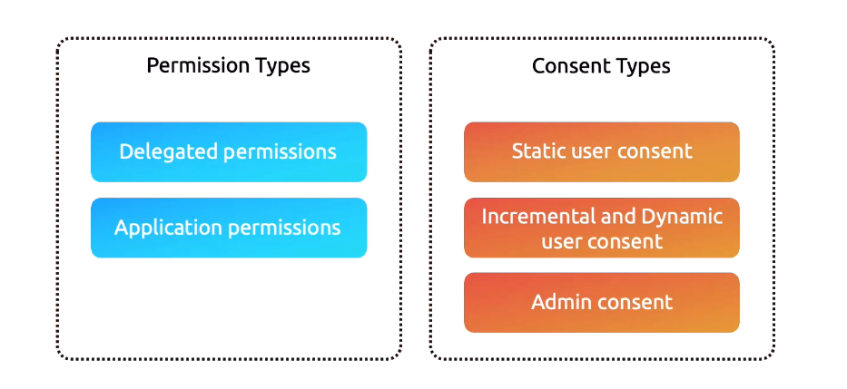
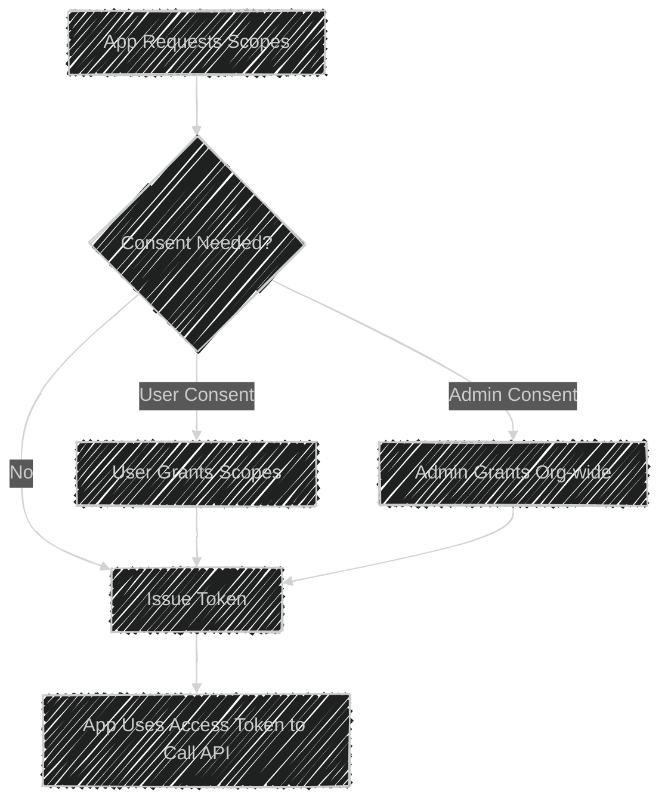

# 🔐 Microsoft Identity Platform — Permissions & Consent

## 📖 Why it matters

Every app built on the Microsoft Identity Platform needs to answer two key questions:

1. **Who signs in?** (authentication)
2. **What can the app do?** (authorization)

Permissions & consent define **what resources your app can access** and **who approves it**.

---

<div align="center">
  
</div>

---

## 📌 **Permission Types**

### 🅰️ **Delegated Permissions** (user + app)

- **Definition:** App acts **on behalf of a signed-in user**.
- **Token carries:** **Scopes** (OAuth 2.0 `scp` claim).
- **Effective rights = User rights ∩ Requested scopes**
- **When to use:**

  - Web/Mobile apps
  - APIs where a **user must be present**

- **Example:** User signs in and app requests `User.Read` → app can only read the signed-in user’s profile, not all users.

---

### 🅱️ **Application Permissions** (app-only)

- **Definition:** App calls APIs **without a signed-in user** (headless).
- **Token carries:** **App roles** (OAuth 2.0 `roles` claim).
- **Effective rights = Whatever the admin consented to** (no user restrictions).
- **When to use:**

  - Daemons, background services
  - API → API communication

- **Example:** A background service with `User.Read.All` reads the **entire tenant’s directory**.

---

## 📌 **Consent Models**

### 1️⃣ **Static User Consent**

- User grants **fixed set of permissions** at first login.
- Stored in tenant → no further prompts for those scopes.
- Good for simple apps with predictable permissions.

---

### 2️⃣ **Incremental / Dynamic User Consent**

- App asks for **minimal permissions initially** → requests **additional scopes later**.
- Prevents scaring users with huge consent prompts.
- Triggered by sending new `scope` values in an authorize request.
- **Optional:** `prompt=consent` forces a fresh consent screen.
- **Example:** Travel app first asks for `User.Read` → later asks for `Contacts.Read` only if user wants to share trip plans.

---

### 3️⃣ **Admin Consent**

- Some permissions (like `Directory.Read.All`) require **tenant admin approval**.
- Admin can:

  - Grant just for themselves
  - Or **tenant-wide consent** (on behalf of all users).

- Granted via:

  - **Portal**: Enterprise Applications → Permissions
  - **Admin consent endpoint**:

    ```ini
    https://login.microsoftonline.com/{tenant}/v2.0/adminconsent
      ?client_id={client_id}
      &redirect_uri={url}
      &state=12345
    ```

- Without admin consent → users see “Need admin approval”.

---

## 📌 Visual Flow

<div align="center">



</div>

---

## 📌 API Demo — Delegated vs App-only

### 🔹 Delegated (User present — Authorization Code flow)

**Step 1: Request code:**

```ini
GET https://login.microsoftonline.com/{tenant}/oauth2/v2.0/authorize
?client_id={client_id}
&response_type=code
&redirect_uri={redirect_uri}
&scope=openid profile email User.Read
```

**Step 2: Exchange code for tokens:**

```bash
curl -X POST https://login.microsoftonline.com/{tenant}/oauth2/v2.0/token \
  -d "client_id={client_id}" \
  -d "client_secret={secret}" \
  -d "grant_type=authorization_code" \
  -d "code={auth_code}" \
  -d "redirect_uri={redirect_uri}" \
  -d "scope=User.Read"
```

**Step 3: Call Microsoft Graph:**

```bash
curl -H "Authorization: Bearer {access_token}" \
  https://graph.microsoft.com/v1.0/me
```

---

### 🔹 Application (Headless — Client Credentials flow)

**Step 1: Admin grants app roles (once):**

**Step 2: App requests token:**

```bash
curl -X POST https://login.microsoftonline.com/{tenant}/oauth2/v2.0/token \
  -d "client_id={client_id}" \
  -d "client_secret={secret}" \
  -d "grant_type=client_credentials" \
  -d "scope=https://graph.microsoft.com/.default"
```

**Step 3: Call Graph as app:**

```bash
curl -H "Authorization: Bearer {access_token}" \
  https://graph.microsoft.com/v1.0/users
```

---

## 📌 Portal Touchpoints

- **App registrations → API Permissions**

  - Add **Delegated** or **Application** permissions.
  - Request Graph or custom API scopes.

- **Enterprise applications → Permissions**

  - Shows who has consented.
  - Admin can grant **org-wide consent**.

---

## ✍🏻 Exam-Ready Cheat Sheet

| Scenario                                    | Permission Type  | Consent Needed             | Example              |
| ------------------------------------------- | ---------------- | -------------------------- | -------------------- |
| User logs into SPA, app reads their profile | Delegated        | User consent               | `User.Read`          |
| Background service reads all users nightly  | Application      | Admin consent              | `User.Read.All`      |
| App asks for more permissions later         | Delegated        | User consent (incremental) | Add `Mail.Read`      |
| Sensitive Graph API (e.g., directory read)  | Delegated or App | Admin consent              | `Directory.Read.All` |

---

## 📌 Common Gotchas

- ❌ **“Insufficient privileges”** → App didn’t have consent for that scope.
- ❌ **`.default` confusion** → It means: _“Give me whatever permissions are already consented for this app in this resource”_, not “all permissions.”
- ✅ **Effective delegated permissions** = **user’s rights** ∩ **scopes requested**.
- ✅ Always use **least privilege** → request scopes only when needed.

---

## 🏁 Quick MSAL usage examples

### Delegated (Interactive, user present)

```csharp
var app = PublicClientApplicationBuilder.Create("<client_id>")
    .WithRedirectUri("http://localhost")
    .Build();

var result = await app.AcquireTokenInteractive(new[] { "User.Read" }).ExecuteAsync();
Console.WriteLine(result.AccessToken);
```

### Application (Headless, daemon/service)

```csharp
var app = ConfidentialClientApplicationBuilder.Create("<client_id>")
    .WithClientSecret("<secret>")
    .WithTenantId("<tenant_id>")
    .Build();

var result = await app.AcquireTokenForClient(new[] { "https://graph.microsoft.com/.default" })
                      .ExecuteAsync();
Console.WriteLine(result.AccessToken);
```

---

✅ **Key takeaway:**

- Delegated = user present → scopes → user consent.
- Application = no user → app roles → admin consent.
- Consent can be static, incremental, or admin-wide.
