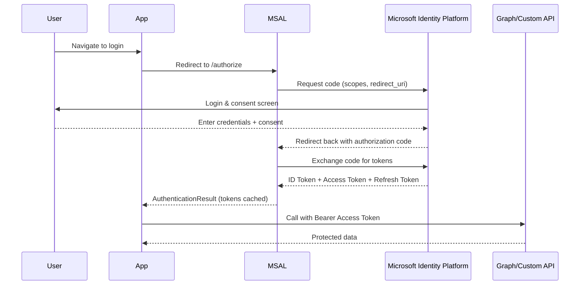

# 🔑 MSAL — Authorization Code Flow

## 📖 What it is

- The **standard OAuth 2.0 flow** for apps that need to sign in users.
- App gets an **authorization code** after the user signs in → exchanges it for an **ID token + Access token + Refresh token**.
- Used by **confidential** and **public** client apps.

---

## 🧭 When to Use

✅ Web apps (ASP.NET, ASP.NET Core MVC, Java Spring, etc.)  
✅ SPAs (React, Angular, Vue with MSAL.js — uses PKCE variant)  
✅ Mobile apps (Xamarin, MAUI, Android, iOS)

❌ Not used for daemons or headless apps (→ use client credentials flow instead).

---

## 🔄 Flow Breakdown



---

## 🔑 Key Pieces

- **Authorization endpoint**:
  `https://login.microsoftonline.com/{tenant}/oauth2/v2.0/authorize`

- **Token endpoint**:
  `https://login.microsoftonline.com/{tenant}/oauth2/v2.0/token`

- **ID token** = proves who the user is (used for sign-in).

- **Access token** = used to call APIs.

- **Refresh token** = used to silently get new tokens.

---

## 🛠️ Example: ASP.NET Core using MSAL.NET

### 1) Configure Confidential Client

```csharp
IConfidentialClientApplication app = ConfidentialClientApplicationBuilder
    .Create("<client_id>")
    .WithClientSecret("<client_secret>")
    .WithRedirectUri("https://localhost:5001/signin-oidc")
    .WithAuthority(new Uri("https://login.microsoftonline.com/<tenant_id>"))
    .Build();
```

---

### 2) Acquire Token (after user signs in)

```csharp
string[] scopes = { "User.Read" };

var result = await app.AcquireTokenByAuthorizationCode(scopes, authCode)
                      .ExecuteAsync();

Console.WriteLine($"Access Token: {result.AccessToken}");
```

---

### 3) Call Microsoft Graph

```csharp
using var client = new HttpClient();
client.DefaultRequestHeaders.Authorization =
    new System.Net.Http.Headers.AuthenticationHeaderValue("Bearer", result.AccessToken);

var response = await client.GetStringAsync("https://graph.microsoft.com/v1.0/me");
Console.WriteLine(response);
```

---

## 🔐 PKCE (Proof Key for Code Exchange)

- Extra security layer for **SPAs & mobile apps**.
- Prevents stolen codes being reused.
- MSAL.js / MSAL for mobile **handles PKCE automatically**.

---

## ⚡ Exam & Real-World Notes

- Authorization Code Flow = default for **interactive sign-in**.
- Always request **minimal scopes** (use incremental consent if needed).
- For SPAs → **must use PKCE** (Azure enforces it).
- Tokens are cached by MSAL (`AcquireTokenSilent()` reuses them).
- **Redirect URI** must match exactly what’s configured in the App Registration.
