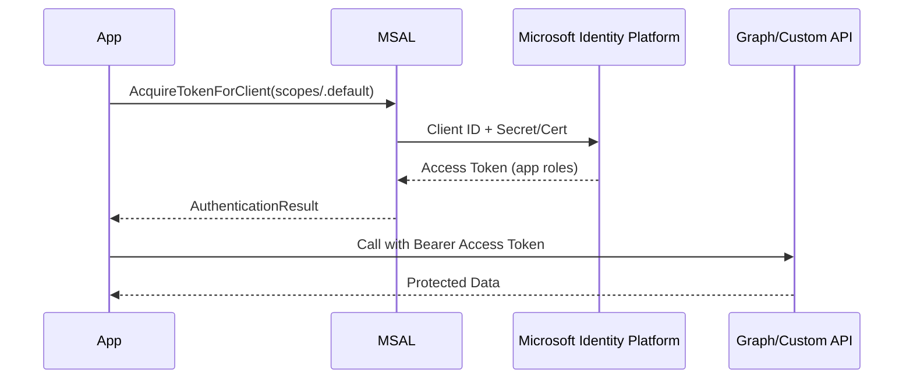

# 🤖 MSAL — Client Credentials Flow

## 📖 What it is

- An **OAuth 2.0 flow** where the **application authenticates itself** (no user involved).
- The app presents its **client ID + client secret** (or certificate).
- The Microsoft Identity Platform issues an **Access Token** with **application permissions** (app roles).
- The app can call **Microsoft Graph** or **custom APIs** directly.

---

## 🧭 When to Use

✅ Background jobs (cron, schedulers).  
✅ Daemons / services with no user context.  
✅ API-to-API calls (machine-to-machine).  
✅ Admin tools that need org-wide data.

❌ Not suitable for apps that require **delegated permissions** (user data).

---

## 🔄 Flow Breakdown

<div align="center">



</div>

---

## 📌 Endpoints

- **Token endpoint**:
  `POST https://login.microsoftonline.com/{tenant}/oauth2/v2.0/token`

---

## 📌 MSAL.NET Example — Daemon App

```csharp
using System;
using System.Threading.Tasks;
using Microsoft.Identity.Client;

class Program
{
    private static string tenantId = "<tenant_id>";
    private static string clientId = "<client_id>";
    private static string clientSecret = "<client_secret>";
    private static string[] scopes = { "https://graph.microsoft.com/.default" };

    static async Task Main(string[] args)
    {
        var app = ConfidentialClientApplicationBuilder.Create(clientId)
            .WithClientSecret(clientSecret)
            .WithAuthority(new Uri($"https://login.microsoftonline.com/{tenantId}"))
            .Build();

        try
        {
            var result = await app.AcquireTokenForClient(scopes).ExecuteAsync();
            Console.WriteLine("✅ Access Token acquired:");
            Console.WriteLine(result.AccessToken);
        }
        catch (Exception ex)
        {
            Console.WriteLine($"❌ Error: {ex.Message}");
        }
    }
}
```

---

## 📌 Important Details

- You must request the special scope:

  ```ini
  https://graph.microsoft.com/.default
  ```

  ➡️ This means “give me the **application roles** already granted via admin consent”.

- No `offline_access` or `refresh_token` — app just requests a new token when needed.

- Token contains `roles` claim (app roles), not `scp` (scopes).

---

## ⚙️ Creating Service Principal for App

Use **Azure CLI** to provision credentials:

```bash
az ad sp create-for-rbac --name "MyDaemonApp"
```

Output:

```json
{
  "appId": "11111111-2222-3333-4444-555555555555",
  "password": "super-secret-value",
  "tenant": "aaaa-bbbb-cccc-dddd"
}
```

- `appId` → clientId
- `password` → clientSecret
- `tenant` → tenantId

---

## ✍🏻 Real-World Example

- A daemon that **syncs users** nightly:

  - App-only permission → `User.Read.All` (application)
  - Admin must **grant consent** first
  - The app then calls Graph:

    ```http
    GET https://graph.microsoft.com/v1.0/users
    Authorization: Bearer <access_token>
    ```

---

## 📝 Exam & Real-World Notes

- **Client Credentials Flow** = **no user** → app identity only.
- Requires **Application permissions** in App Registration.
- Always needs **admin consent** (users can’t consent app roles).
- Token claim: `roles` not `scp`.
- Best practice: Use **certificates instead of client secrets** in production.

---

## ✅ Quick Recap

- Public apps → **delegated permissions** (users).
- Confidential apps + client credentials → **app-only permissions** (services).
- Token request uses `.default` scope to grab admin-consented app roles.
- Daemons, APIs, machine-to-machine → this is your go-to flow.
