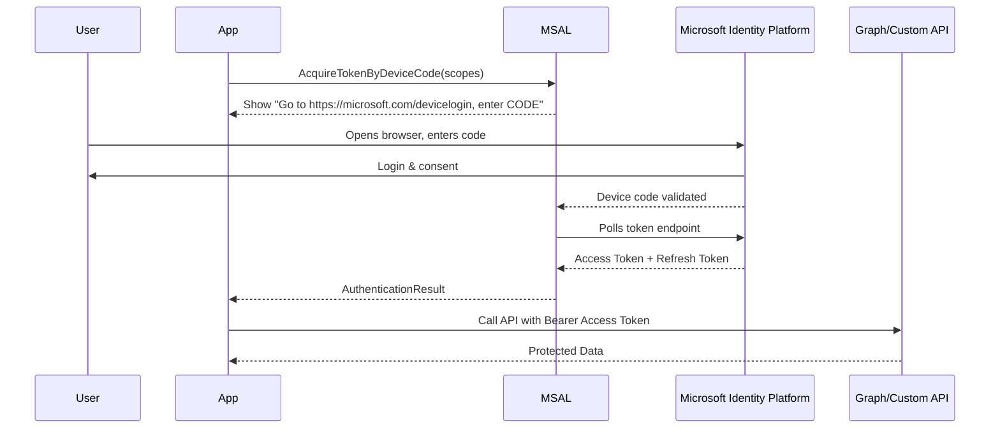

# 📟 MSAL — Device Code Flow

## 📖 What it is

- An **OAuth 2.0 flow** designed for devices or apps that **don’t have a browser** or **can’t open one easily** (CLI tools, IoT devices, terminals).
- The app displays a **code + URL**.
- The user opens a browser on another device, signs in, enters the code.
- Once authenticated, the app gets an **access token + refresh token**.

---

## 🧭 When to Use

✅ Command-line tools (e.g., Azure CLI itself uses this flow).  
✅ IoT devices with limited input capabilities.  
✅ Console apps for developers/admins.  
✅ Testing scenarios where opening a browser in-app isn’t convenient.

❌ Not suitable for web apps or SPAs (use **Authorization Code Flow** instead).

---

## 🔄 Flow Breakdown



---

## 📌 Endpoints

- **Device Code request**:
  `POST https://login.microsoftonline.com/{tenant}/oauth2/v2.0/devicecode`

- **Token request (polling)**:
  `POST https://login.microsoftonline.com/{tenant}/oauth2/v2.0/token`

---

## 📌 MSAL.NET Example — Console App

```csharp
using System;
using System.Threading.Tasks;
using Microsoft.Identity.Client;

class Program
{
    private static string clientId = "<client_id>";
    private static string tenantId = "<tenant_id>";
    private static string[] scopes = { "User.Read" };

    static async Task Main(string[] args)
    {
        var app = PublicClientApplicationBuilder.Create(clientId)
            .WithAuthority(AzureCloudInstance.AzurePublic, tenantId)
            .Build();

        try
        {
            var result = await app.AcquireTokenWithDeviceCode(scopes, callback =>
            {
                Console.WriteLine(callback.Message);
                // Example: "To sign in, use a web browser to open https://microsoft.com/devicelogin and enter code ABC123"
                return Task.CompletedTask;
            }).ExecuteAsync();

            Console.WriteLine("✅ Access Token acquired:");
            Console.WriteLine(result.AccessToken);
        }
        catch (MsalException ex)
        {
            Console.WriteLine($"❌ Authentication failed: {ex.Message}");
        }
    }
}
```

---

## ⚙️ How It Works Internally

1. App requests a **device code** → gets a message like:

   ```ini
   Go to https://microsoft.com/devicelogin
   Code: ABC123
   Expires in: 900 seconds
   ```

2. App displays message → **user signs in elsewhere**.
3. MSAL **polls the token endpoint** until:

   - ✅ Success (token returned)
   - ⏰ Timeout (code expired)
   - ❌ User denied

---

## 📌 Real-World Examples

- **Azure CLI**

  ```bash
  az login
  ```

  → Shows a code → you enter it in browser → you’re logged in.

- **Headless servers / IoT**
  Device prints a code → admin enters it on another device.

---

## 📌 Exam & Real-World Notes

- **Device Code Flow** = fallback when no browser or redirect is possible.
- User must manually **enter code at [https://microsoft.com/devicelogin](https://microsoft.com/devicelogin)**.
- App **polls** the identity platform until authentication succeeds.
- Still supports **incremental consent** (ask for new scopes later).
- Works with **delegated permissions** (on behalf of a user).
- **Admin consent** may still be required if app requests high-privilege scopes.

---

## ✅ Quick Recap

- Authorization Code Flow → normal apps with browsers.
- Device Code Flow → devices/CLIs without browsers.
- MSAL makes it easy: `AcquireTokenWithDeviceCode()` handles everything.
