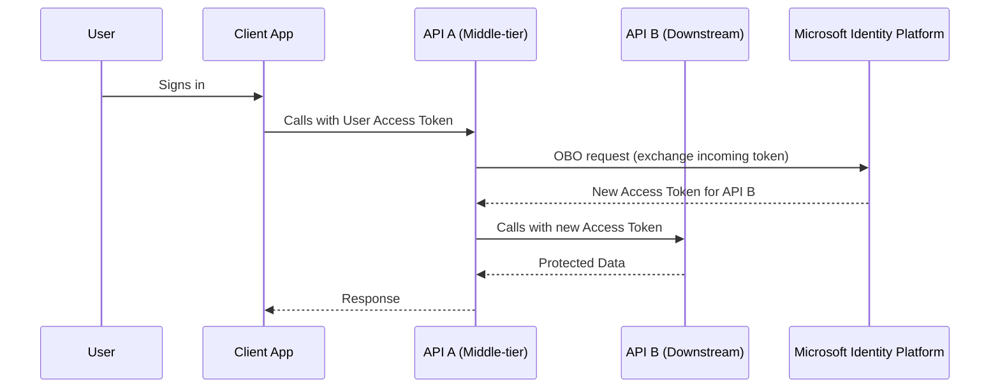

# 🔄 MSAL — On-Behalf-Of (OBO) Flow

## 📖 What it is

- An **OAuth 2.0 flow** where an **API (A)** calls another **API (B)** using the **user’s delegated token**.
- API A exchanges the **incoming access token** for a **new access token** to call API B.
- The new token carries **the same user context** (delegated permissions).

👉 In short: _API A calls API B “on behalf of” the signed-in user._

---

## 🧭 When to Use

✅ Microservices where one API needs to call another.  
✅ Middle-tier APIs forwarding user identity to downstream APIs.  
✅ Example:

- User signs into a front-end app →
- Front-end calls **API A** with user’s token →
- API A calls **API B** using OBO flow.

❌ Not used for app-only calls (use **Client Credentials Flow** instead).

---

## 🔄 Flow Breakdown



---

## 📌 Token Exchange (OBO request)

- API A receives an **access token** from client.
- Calls `/token` endpoint with:

  - `grant_type=urn:ietf:params:oauth:grant-type:jwt-bearer`
  - `requested_token_use=on_behalf_of`
  - `assertion=<incoming access token>`

---

## ✍🏻 MSAL.NET Example — API A acting on behalf of user

```csharp
using Microsoft.Identity.Client;
using System.Threading.Tasks;

public class TokenHelper
{
    private readonly IConfidentialClientApplication _confidentialClient;
    private readonly string[] _scopes = { "https://graph.microsoft.com/User.Read" };

    public TokenHelper(string clientId, string clientSecret, string tenantId)
    {
        _confidentialClient = ConfidentialClientApplicationBuilder.Create(clientId)
            .WithClientSecret(clientSecret)
            .WithAuthority(new Uri($"https://login.microsoftonline.com/{tenantId}"))
            .Build();
    }

    public async Task<string> GetAccessTokenOnBehalfOfAsync(string incomingAccessToken)
    {
        var userAssertion = new UserAssertion(incomingAccessToken);

        var result = await _confidentialClient
            .AcquireTokenOnBehalfOf(_scopes, userAssertion)
            .ExecuteAsync();

        return result.AccessToken;
    }
}
```

---

## ⚙️ How it Works Step by Step

1. User signs into client app → gets access token for API A.
2. Client calls **API A** with that token.
3. API A validates token, then creates a `UserAssertion`.
4. API A requests a new token **on behalf of the user** for **API B**.
5. API A calls **API B** with the new token.
6. API B enforces **delegated permissions**.

---

## 📝 Real-World Example

- **Front-end web app** lets user view files.
- App calls **API A** (File Service).
- API A calls **API B** (Microsoft Graph → OneDrive).
- API A must call Graph _on behalf of the signed-in user_.
- Without OBO → Graph would think API A is acting alone.
- With OBO → Graph enforces _user’s delegated rights_.

---

## 📌 Exam & Real-World Notes

- **OBO = delegated permissions across APIs.**
- Requires:

  - Both API A & API B registered in Entra ID.
  - API A must be configured as a **confidential client**.
  - User’s original token must include scope for API A.

- OBO fails if:

  - API A only has application permissions (not delegated).
  - User didn’t consent to downstream API permissions.

- Refresh tokens are handled automatically by MSAL.

---

## ✅ Quick Recap

- **Authorization Code Flow** → User signs into app.
- **Device Code Flow** → No browser, CLI/IoT.
- **Client Credentials Flow** → App-only, no user.
- **On-Behalf-Of Flow** → API → API with user context.
