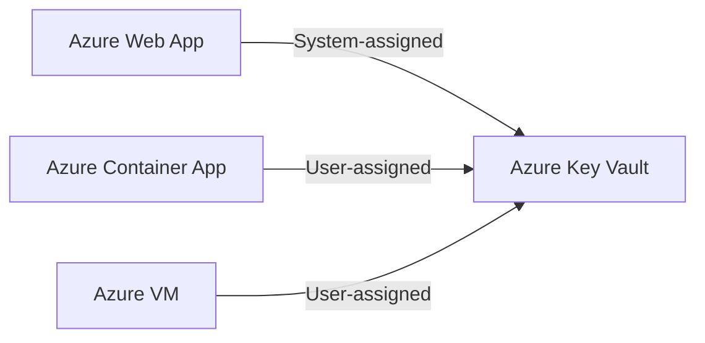

# 🛠️ Creating Azure Managed Identities (The Easy & Smart Way)

## 🔹 1. **System-assigned Managed Identity**

> Tied to a single resource like a VM, Function, or Web App. Automatically deleted when the resource is deleted.

---

### ✅ Use Case

An Azure Function reads secrets from Azure Key Vault using its **own identity**.

---

### 🌐 A. Azure Portal Steps

1. Go to your **Azure Function / VM / Web App** in the portal
2. Select **Identity** from the left menu
3. Under **System-assigned**, toggle **Status = On**
4. Click **Save**
5. Done! Azure creates the identity under the hood 🎩

Now assign it access:

1. Go to your **Key Vault**
2. Go to **Access Control (IAM)** → **Add role assignment**
3. Role: `Key Vault Secrets User`
4. Assign to: **Your resource name (managed identity)**

---

### 💻 B. Azure CLI Steps

```bash
# Enable system-assigned identity on a VM
az vm identity assign --name myVM --resource-group myRG

# Assign RBAC role (Key Vault access)
az role assignment create \
  --assignee-object-id <identity-object-id> \
  --role "Key Vault Secrets User" \
  --scope "/subscriptions/<sub>/resourceGroups/<rg>/providers/Microsoft.KeyVault/vaults/<vault-name>"
```

🔍 You can get the identity’s object ID via:

```bash
az resource show -g myRG -n myVM --resource-type "Microsoft.Compute/virtualMachines" --query "identity.principalId" -o tsv
```

---

### 🧪 Example in Code (.NET)

```csharp
var credential = new DefaultAzureCredential(); // this used system-assigned identity
var client = new SecretClient(new Uri("https://my-vault.vault.azure.net/"), credential);
var secret = await client.GetSecretAsync("DbPassword");
```

✅ Automatically uses system-assigned identity.

---

## 🔸 2. **User-assigned Managed Identity**

> A standalone identity you can assign to **multiple resources** — like a group login badge.

---

### ✅ Use Case

Several Azure Container Apps share the **same identity** to access Key Vault.

---

### 🌐 A. Azure Portal Steps

1. Search: **Managed Identities**
2. Click **Create**
3. Fill in:

   - Subscription
   - Resource Group
   - Region
   - Name (e.g., `app-access-identity`)

4. Click **Review + Create**

✅ Done — now it's visible in Microsoft Entra ID → Enterprise Applications too.

---

### 💻 B. Azure CLI Steps

```bash
# Create the managed identity
az identity create --name app-access-identity --resource-group myRG --location eastus

# Assign it to a VM or Web App
az webapp identity assign \
  --name myApp \
  --resource-group myRG \
  --identities app-access-identity

# Assign a role to the identity (Key Vault access)
az role assignment create \
  --assignee <identity-client-id> \
  --role "Key Vault Secrets User" \
  --scope "/subscriptions/<sub>/resourceGroups/<rg>/providers/Microsoft.KeyVault/vaults/<vault-name>"
```

---

### 🧠 How to Use in Code?

**User-assigned identities need their `clientId` passed explicitly**.

```csharp
string userAssignedClientId = "<your-managed-identity-client-id";
var credential = new DefaultAzureCredential(
  new DefaultAzureCredentialOptions {
    ManagedIdentityClientId = userAssignedClientId;
  }
);
//or
// var credential = new ManagedIdentityCredential(userAssignedClientId);

var client = new SecretClient(new Uri("https://my-vault.vault.azure.net/"), credential);
var secret = await client.GetSecretAsync("MyConnectionString");
```

🔑 Use the **Client ID** of the identity, not the resource itself.

---

## 🧠 Final Comparison

| Feature                   | System-assigned MI                     | User-assigned MI                             |
| ------------------------- | -------------------------------------- | -------------------------------------------- |
| Identity lifecycle        | Tied to resource                       | Independent of resource                      |
| Reusable across resources | ❌ No                                  | ✅ Yes                                       |
| Identity visible in Entra | ✅ Yes                                 | ✅ Yes (as Enterprise App)                   |
| CLI setup simplicity      | Very simple                            | Slightly more config required                |
| Authentication in code    | Automatic via `DefaultAzureCredential` | Manual `ManagedIdentityCredential(clientId)` |

---

## 🧪 Sample Architecture


