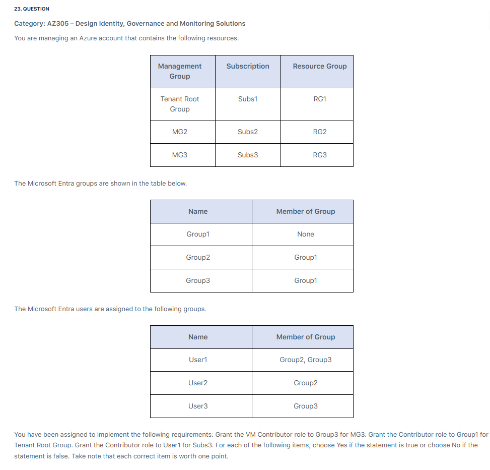
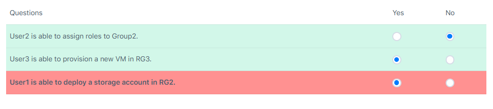

# ✍🏻 **Hands on Nested Groups**

<div align="center">
  
</div>

## 🧠 What the Question Is Testing

This scenario is from the **AZ-305 exam**, focusing on **identity, governance, and role assignment logic** in Microsoft Entra ID (formerly Azure AD). It’s testing your understanding of:

- **Nested group membership**
- **Role assignment inheritance**
- **How users gain access via group hierarchies**

---

## 📦 Breakdown of the Tables

### 1. **Group Membership Table**

| Group Name | Member of Group |
| ---------- | --------------- |
| Group1     | None            |
| Group2     | Group1          |
| Group3     | Group1          |

This means:

- `Group2` and `Group3` are **members of Group1**.
- So any **role assigned to Group1** will be **inherited by Group2 and Group3**.

### 2. **User Membership Table**

| User Name | Member of Group |
| --------- | --------------- |
| User1     | Group2, Group3  |
| User2     | Group2          |
| User3     | Group3          |

So:

- `User1` is in **Group2 and Group3**, which are both in **Group1**.
- `User2` is in **Group2**, which is in **Group1**.
- `User3` is in **Group3**, which is in **Group1**.

→ All three users are **indirectly members of Group1** via nested membership.

---

## 🤔 Your Confusion: “Why does Group2 show only Group1?”

You're asking: _“Shouldn’t Group2 show both its members (User2) and its parent (Group1)?”_

Here’s the key:

- The table is showing **who Group2 is a member of**, not who is a member of Group2.
- So `Group2 → Group1` means Group2 is nested inside Group1.
- The **user-to-group table** separately shows who belongs to Group2.

It’s a **directional relationship**:

- Group2 is a **child of Group1**.
- User2 is a **child of Group2**.
- Therefore, User2 is a **grandchild of Group1**.

---

## 🧪 Visual Analogy

```plaintext
Group1
├── Group2
│   └── User2
├── Group3
│   └── User3
└── (User1 is in both Group2 and Group3)
```

So when you assign a role to **Group1**, all nested members (Group2, Group3, and their users) inherit that role.

---

## ✅ **Answers**

<div align="center">
  
</div>

### ✅ Question 1: **User2 is able to assign roles to Group2**

**Answer: ❌ No.**

**Why:**

- **Role assignment** is a **privileged action**—you need to have **Owner** or **User Access Administrator** role at the scope (e.g., subscription or resource group).
- The scenario does **not mention** User2 having any such role.
- Being a member of Group2 (which is nested in Group1) **does not grant role assignment rights** unless explicitly assigned.

---

### ✅ Question 2: **User3 is able to provision a new VM in RG3**

**Answer: ❌ No.**

**Why:**

- RG3 belongs to **Subs3**, which is under **MG2**.
- The Contributor role is assigned to **User1** for Subs3—not User3.
- User3 is in Group3 → Group1, but **Group1 is not assigned any role for Subs3 or RG3**.
- Therefore, **User3 has no permissions** on RG3.

---

### ✅ Question 3: **User1 is able to deploy a storage account in RG2**

**Answer: ❌ No.**

**Why:**

- RG2 is under **Subs2**, which is under **MG2**.
- Group1 is assigned the **Contributor role** at the **Tenant Root Group** level.
- User1 is in Group2 and Group3 → both are nested in Group1.
- However, **Azure RBAC does not support role inheritance through nested groups**.
- Only **direct members** of Group1 receive Contributor access.
- Therefore, **User1 cannot deploy resources in RG2** unless added directly to Group1.

> ⚠️ Even if nested RBAC were supported (which it isn’t), **the scope of the role assignment doesn’t reach RG2** because Tenant Root Group is only have sub1 not sub2 and rg2 is in sub2.

---

### 🧠 Summary Table

| Question                         | Answer | Reason                                                       |
| -------------------------------- | ------ | ------------------------------------------------------------ |
| User2 can assign roles to Group2 | ❌ No  | No role assignment rights granted                            |
| User3 can provision VM in RG3    | ❌ No  | No role or group assignment at Subs3                         |
| User1 can deploy storage in RG2  | ❌ No  | Nested group membership does not grant inherited RBAC access |
