# 🔐 Azure Conditional Access

> 📖 _Conditional Access is the tool used by Azure Active Directory (now Microsoft Entra ID) to bring signals together, make decisions, and enforce organizational policies for securing resources._

---

  

  

## 🎯 **Why Conditional Access?**

Passwords alone = weak.
Conditional Access allows you to enforce **context-aware, adaptive access controls** based on:

- Who is logging in (user/group/role).
- From where (location/IP).
- Using what (device compliance, OS).
- To what (apps/resources).
- Under what conditions (risk level, session context).

👉 It’s the **heart of Zero Trust security** in Azure.

---

## 🛠️ **How It Works**

```mermaid
flowchart TD
    A[User attempts to sign in] --> B[Azure AD evaluates conditions]
    B --> C{Policies match?}
    C -->|No| D[Access denied ❌]
    C -->|Yes| E[Apply controls: MFA, compliant device, session limits]
    E --> F[Access granted ✅]
```

---

## 🧑‍💻**Building a Conditional Access Policy**

  

---

### 1️⃣ Step 1: Choose **Assignments** (When the policy applies)

- **Users/Groups** → Who does this affect?
- **Cloud apps/actions** → Which app/resource (e.g., SharePoint, Teams, All cloud apps).
- **Conditions** → Context signals:

  - **Sign-in risk** (low/medium/high from Identity Protection).
  - **Device platform** (iOS, Android, Windows, macOS).
  - **Location** (trusted IP ranges, countries).
  - **Client apps** (browser, mobile app, legacy protocols).
  - **Device state** (compliant with Intune or not).

---

### 2️⃣ Step 2: Choose **Access Controls** (What to enforce)

_if_ conditions is hit, then you have to options:

- **Block access:** Access denied.
- **Grant acccess:** Access allowed _if_ your extra required options are met such as:

  - Require MFA.
  - Require compliant device.
  - Require Hybrid Azure AD Join.
  - Require terms of use acceptance.

---

### 3️⃣ Step 3: Configure **Session Controls**

Fine-tune what happens _during_ the session:

- Limit user experience (e.g., block download, use app-enforced restrictions).
- Sign-in frequency (force re-auth every X hours).
- Persistent browser session (stay signed in or not).

---

## **Example Scenarios**

### **1. Require MFA for risky logins**

- **Assignments**: All users, all cloud apps.
- **Conditions**: Sign-in risk = Medium or High.
- **Grant**: Require MFA.

👉 If login looks suspicious (new country, strange IP), user must do MFA.

---

### **2. Block legacy authentication**

- **Assignments**: All users.
- **Conditions**: Client apps = legacy protocols (IMAP/POP).
- **Access Control**: Block access.

👉 Old clients bypass MFA → block them.

---

### **3. Allow only corporate devices**

- **Assignments**: HR group → HR app.
- **Conditions**: Device platform = Windows.
- **Grant**: Require compliant device.

👉 HR app is sensitive, so only Intune-compliant company devices can access it.

---

## ⚡ **Key Notes**

- Conditional Access policies are **if-then statements**: _If_ user is X, accessing Y, under Z condition → _then_ enforce rule.
- Policies apply at **sign-in time** and sometimes continuously (session controls).
- **Testing tip**: Always exclude at least one admin account from your policy, or you might lock everyone (including yourself 😅) out.

---

## 🔄 Continuous Access Evaluation (CAE)

- **CAE** enhances Conditional Access by **re-evaluating access mid-session** when critical events occur:
  - User password reset or account disabled
  - Location/IP change
  - Token theft or export
- This avoids waiting for token expiration (typically 1 hour) and enforces policies **near real-time**.

---

### 🛡️ Example Use Case

> If a user signs in from Cairo and then suddenly switches to a VPN in Germany, CAE can **revoke access instantly** if location-based policies are in place.

---

## 📌 **Summary**

- **Conditional Access = Adaptive, context-based access rules** in Azure AD (Entra ID).
- Built from:

  - **Assignments** (who/what/conditions).
  - **Access controls** (block or grant with requirements).
  - **Session controls** (fine-grained restrictions).

- Enforces **Zero Trust**: _Never trust, always verify_.
- Real-world use cases: MFA for risky logins, blocking legacy auth, device compliance enforcement.

## 📚 **References**:

- [Microsoft Entra Conditional Access Documentation](https://learn.microsoft.com/en-us/azure/active-directory/conditional-access/overview)
