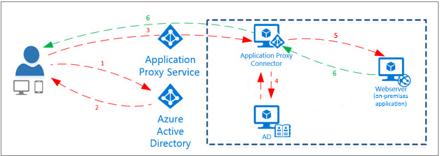
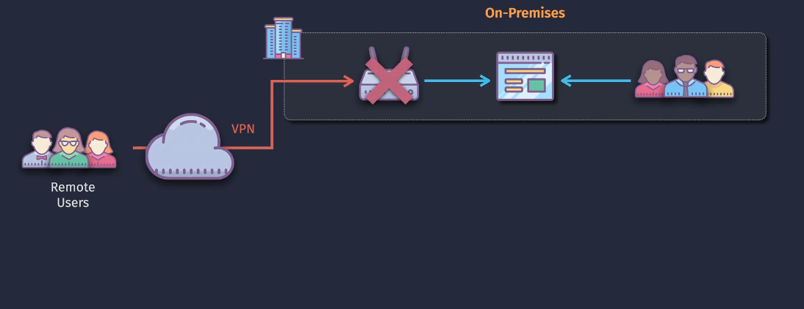
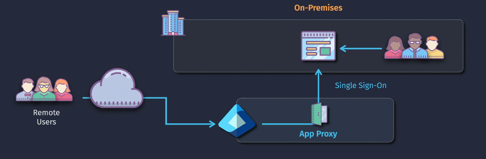
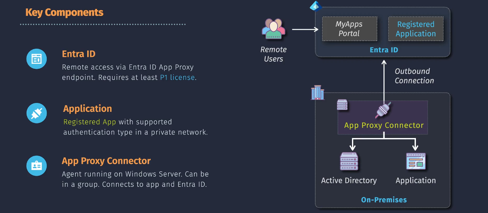
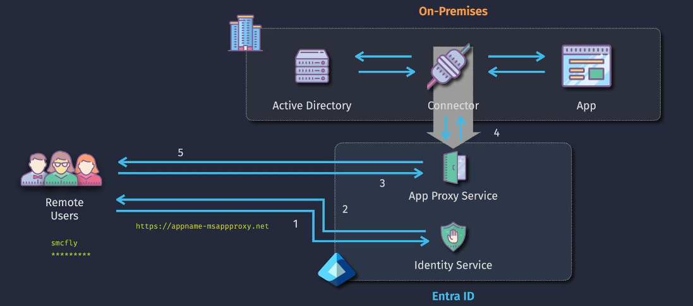
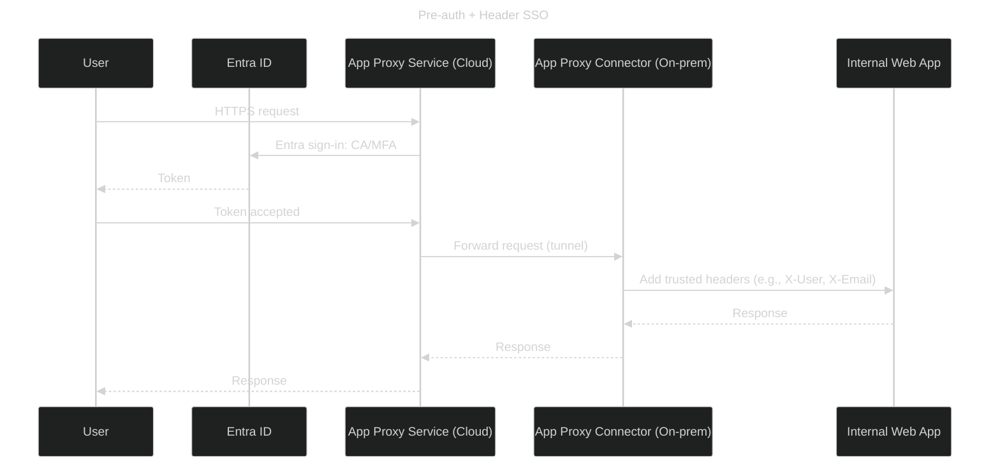

# 🔌 **Entra ID Application Proxy**

> 📖 Official Definition: **Entra ID Application Proxy** securely publishes **`internal` HTTP/HTTPS apps** (SharePoint, Jira, custom .NET/Java sites, RD Web, etc.) to the internet using **outbound-only connectors** and **Entra ID pre-authentication** (MFA, Conditional Access, SSO).

  

## 🧰 **What it is App Proxy**

**Microsoft Entra Application Proxy** allows users to securely access on-premises applications from anywhere, without needing a VPN. It provides **secure remote access** and **single sign-on (SSO)** capabilities, making it easy for users to connect to internal applications as if they were cloud-based.

- Using VPN

  

- Using Entra Application Proxy

  

---

## 🧩 **Core components**

  

1. **Identity & Policy**

   - Microsoft Entra ID does the heavy lifting: sign-in, MFA, device compliance, risk, conditional access, app roles, groups.
   - Requires **Azure AD Premium P1** license (per user).

2. **Application Proxy Service (cloud)**

   - The Entra service that fronts your external URL (e.g., `https://myapp-contoso.msappproxy.net` or a custom domain) and orchestrates auth + routing.

3. **Application Proxy Connector(s) (on-prem)**

   - Lightweight Windows agent services you install inside your network.  
     They establish **outbound TLS** connections to the service—no inbound ports needed.
   - Deployed in **Connector Groups** for HA & locality.

4. **Published Application (Enterprise App registration in Entra)**
   Holds:

   - **Internal URL** (where the connector goes inside (e.g., `http://appserver.local/...`, `http://localhost:8443/...`))
   - **External URL** (what users hit from outside (e.g., `https://myapp-contoso.msappproxy.net` or a custom domain))
   - **Pre-authentication** mode (**Entra ID** or **Passthrough**)
   - **SSO mode** (Kerberos Constrained Delegation, Header-based, SAML to backend, Forms replay, etc.)
   - **User/Group assignments** & **Conditional Access**.

---

## 🏗️ **How it all fits** (high level)

  

---

## 🎯 **Pre-authentication & SSO options** (when Entra pre-auth is ON)

- **Entra ID pre-auth**: user signs in to Entra first; CA/MFA/device rules enforced.
- **SSO to backend** (pick one based on your app):

  - **KCD (Kerberos Constrained Delegation)** → for Windows Integrated Auth (IWA/NTLM/Kerberos) apps. Connector gets a Kerberos ticket on behalf of the user and talks to the app as the user.
  - **Header-based SSO** → connector injects trusted headers (e.g., `X-User`) after Entra validates identity.
  - **SAML to backend** → if your app accepts SAML.
  - **Form-based (password replay)** → for legacy apps (last resort).

- **Passthrough** pre-auth: skip Entra sign-in at the edge; users authenticate **only** at the app. (Use sparingly—no CA at the edge.)

---

## 🔐 **Why it’s secure**

- **No inbound firewall**: connectors dial out to Entra over HTTPS/WebSockets.
- **Identity at the edge**: CA, MFA, sign-in risk before the app is touched.
- **Isolated trust**: you never expose your internal hostnames or AD directly to the internet.
- **Per-app exposure**: publish _only_ what’s needed (least privilege for networks).

---

## ⚙️ **Flow** (Header-based SSO)

---

## 🛠️ **Step-by-step setup**

1. **Plan the app**

   - Identify **internal URL** (`http(s)://appserver.local/...`)
   - Choose **pre-auth** (Entra vs Passthrough).
   - Pick **SSO mode** (KCD/header/SAML/forms) if using Entra pre-auth.

2. **Prepare on-prem**

   - Stand up **2+ Windows servers** (domain joined) for connectors (HA).
   - Ensure outbound internet to Microsoft endpoints over **443** (and CRL/updates).
   - If **KCD**:

     - Set SPN for the app pool/service account:
       `setspn -S HTTP/appserver.local CONTOSO\svcApp`
     - On the **connector computer object** in AD, enable **Constrained Delegation** to that SPN.

3. **Install the connector**

   - Download from Entra portal → run installer as admin.
   - Sign in with an account that can register connectors.
   - Verify “**Connected**” status; place it into a **Connector Group**.

4. **Publish the application**

   - Entra admin center → **Enterprise applications → New application → On-premises application**.
   - Set **External URL** (custom domain encouraged) & **Internal URL**.
   - Select **Connector Group**.
   - Choose **Pre-authentication** and **SSO** method; finish SSO details.

5. **Assign users/groups & policies**

   - Give users/groups access to the app.
   - Add **Conditional Access** (MFA, device, network, sign-in risk).
   - (Optional) Enable app roles/claims for downstream authorization.

6. **Custom domain & certificates**

   - Map `myapp.contoso.com` to the App Proxy endpoint.
   - Use **managed certs** (recommended) or bring your own.

7. **Test end-to-end**

   - From the internet, browse the **external URL**.
   - Confirm Entra sign-in, SSO, and app behavior.
   - Validate logout, cookie paths, and large upload scenarios if relevant.

8. **Scale & harden**

   - Add more connectors to the group for **HA/load** (stateless, round-robin).
   - Separate connector groups by **region** or **latency** domain.
   - Monitor sign-ins, CA outcomes, connector health.
   - Limit Passthrough apps; prefer Entra pre-auth.

---

## 📌 **Capabilities & limits**

**✅ Supports:**

- HTTP/HTTPS web apps, WebSockets, long polling
- IWA via **KCD**, header-based SSO, SAML, forms
- Conditional Access, MFA, device & identity conditions
- Multiple apps per connector group, HA & LB

**⚠️ Considerations:**

- It’s **not** a generic VPN (no SMB/RPC/SQL native ports).
- Large file uploads/timeouts depend on app + connector settings.
- For KCD, ensure correct **SPN**s and **delegation**; clock skew matters.
- Keep connector servers patched; monitor updater service.

---

## 🧠 **Mental model**

- **Connector = outbound bridge**
- **App Proxy service = smart reverse proxy + identity gate**
- **Entra ID = policy brain**
- **Your app stays internal** while users enjoy secure, seamless access from anywhere.

---

## 🧪 **Troubleshooting tips**

- **403 after sign-in?** Check app assignment/CA.
- **401 at backend with KCD?** Verify SPN, delegation list, and which object (connector computer) is trusted for delegation.
- **Header SSO not working?** Confirm app trusts the reverse proxy headers and they aren’t stripped by the app or intermediate proxies.
- **Random disconnects?** Check outbound firewall inspection/SSL break; allow the connector to reach Microsoft endpoints without tampering.
- **Latency**: Place connector group **close to the app** and choose the closest cloud region for the App Proxy service (automatic).

## 📚 **References**

- [Microsoft Entra Application Proxy Documentation](https://learn.microsoft.com/en-us/azure/active-directory/app-proxy/what-is-application-proxy)
