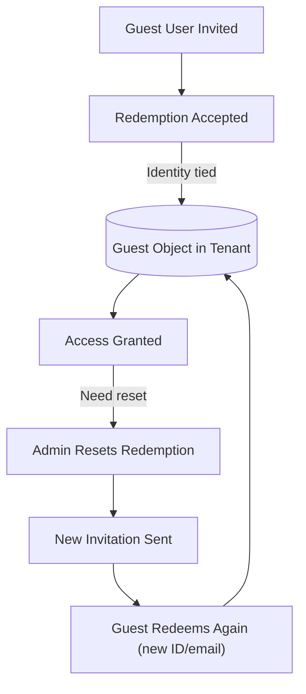
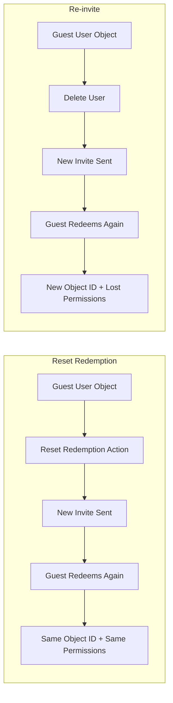

# 🔄 Azure B2B Guest Users & Reset Redemption

## 🟢 Introduction

In Azure Active Directory (now **Microsoft Entra ID**), external users (guests) can be invited into your tenant for **B2B collaboration**. When invited, they receive a **redemption link** which they must accept to activate their guest account.

But what if:

- The user redeemed the invitation with the wrong email/identity provider?
- Their original account was deleted or changed?
- You need them to redeem again, without losing all their access assignments?

👉 This is where **Reset Redemption** comes in.

---

## 📌 What is Reset Redemption?

**Reset Redemption** is a feature that allows administrators to **reset the redemption state of a B2B guest user**.

- It **does not delete the user object**.
- It allows the guest to **redeem the invitation again**, possibly using a **different identity provider or email**.
- It **preserves**:

  - User **Object ID**
  - **Group memberships**
  - **App role assignments**
  - **Access permissions**

💡 Think of it as hitting a **“Reset button”** on the guest’s invitation acceptance, without wiping out their history in your tenant.

---

## 🏗 How Redemption Normally Works

1. You invite `guest@contoso.com`.
2. They click the invitation link and **redeem** it with a Microsoft account, work account, or social ID.
3. That external identity is tied permanently to the guest object.

❌ Without reset, if they later need to use `newguest@contoso.com`, you’d have to **delete and re-invite**, losing permissions.

---

## 🔧 How Reset Redemption Works

When you **reset redemption**:

- The user object remains.
- A new invitation is sent.
- The guest redeems the invite again, using a new identity.
- Access and group assignments are preserved.

---

## ⚙️ Permissions Required

To use reset redemption, you need one of the following roles at tenant scope:

- **User Administrator**
- **Helpdesk Administrator**

---

## 🚀 Ways to Reset Redemption

### 1️⃣ Microsoft Entra Admin Center (UI)

1. Go to [Entra Admin Center](https://entra.microsoft.com).
2. Navigate: **Users** → Find the guest user.
3. On the profile page, look for **Reset redemption status** under B2B collaboration.
4. Click **Reset** → a new invitation will be sent.

---

### 2️⃣ Microsoft Graph API

You can programmatically reset redemption with the Graph API:

```http
POST https://graph.microsoft.com/v1.0/invitations
Content-Type: application/json

{
  "invitedUserEmailAddress": "newemail@domain.com",
  "sendInvitationMessage": true,
  "inviteRedirectUrl": "https://myapps.microsoft.com",
  "invitedUser": {
    "id": "<guestUserObjectId>"
  },
  "resetRedemption": true
}
```

Key part 👉 `"resetRedemption": true`

---

### 3️⃣ PowerShell (Microsoft Graph SDK)

```powershell
Connect-MgGraph -Scopes "User.ReadWrite.All"

# Find existing guest user
$user = Get-MgUser -Filter "startsWith(mail,'old@domain.com')"

# Send new invitation with reset redemption
New-MgInvitation `
  -InvitedUserEmailAddress $user.Mail `
  -InviteRedirectUrl "https://myapps.microsoft.com" `
  -ResetRedemption `
  -SendInvitationMessage `
  -InvitedUser $user
```

---

## 📊 Real-World Scenarios

- ✅ **Email Change**: Guest changed companies, now uses `user@newdomain.com`. Reset redemption lets them re-redeem with the new email.
- ✅ **Account Recovery**: Original guest account deleted in their home tenant, but you need them to regain access without re-provisioning everything.
- ✅ **Wrong ID Used**: User redeemed with a personal Microsoft account but should have used a corporate account. Reset redemption fixes this.

---

## ⚠️ Limitations & Caveats

- 🔹 Not supported in all setups — for example, some **Multitenant Organization (MTO)** scenarios.
- 🔹 Can cause **OID collisions** if multiple invites map to the same object.
- 🔹 Only works for **B2B guest users**, not for internal accounts.
- 🔹 Resetting does **not** remove existing group memberships or permissions — by design.

---

## 🖼 Visual Workflow

<div align="center">



</div>

---

## ✅ Summary

- **Reset Redemption** = allows a B2B guest to redeem an invitation again.
- Keeps the **user object, groups, app assignments** intact.
- Useful for email changes, identity provider switches, or account resets.
- Can be done via **Entra Admin Center, Graph API, or PowerShell**.
- Watch out for **MTO limitations** and **OID collisions**.

---

## 📊 Feature Comparison Table

| Feature / Behavior          | **Reset Redemption**                                                                                 | **Re-invite (Delete + Invite again)**                                                 |
| --------------------------- | ---------------------------------------------------------------------------------------------------- | ------------------------------------------------------------------------------------- |
| **User object (Object ID)** | ✅ Preserved (same Object ID remains)                                                                | ❌ New object created (new Object ID)                                                 |
| **Group memberships**       | ✅ Preserved                                                                                         | ❌ Lost (must be re-added manually)                                                   |
| **App role assignments**    | ✅ Preserved                                                                                         | ❌ Lost (must be reassigned)                                                          |
| **Access permissions**      | ✅ Preserved                                                                                         | ❌ Lost (must be re-provisioned)                                                      |
| **User sign-in identity**   | 🔄 Can change (new email/ID provider at redemption)                                                  | 🔄 Can change (based on invite)                                                       |
| **Audit history**           | ✅ Preserved (same user object)                                                                      | ❌ Lost (new user object has fresh history)                                           |
| **Effort required**         | 🔹 Low – single reset action                                                                         | 🔹 Higher – delete, re-invite, reassign permissions                                   |
| **Use cases**               | - Email change (new domain) <br> - Wrong account used for redemption <br> - External account deleted | - You want a completely clean user object <br> - User shouldn’t keep past assignments |
| **Risk**                    | 🔸 Possible OID collision if mismanaged                                                              | 🔸 Risk of access gaps until assignments are re-provisioned                           |

---

## 🧠 Easy Rule of Thumb

- ✅ **Use Reset Redemption** if you want to **keep all access intact** but allow the guest to redeem the invite again with a new identity.
- ❌ **Use Re-invite** if you want a **completely fresh start**, wiping all group memberships, app roles, and audit history.

---

## 🖼 Visual Side-by-Side



---

## ⚡ Real-World Scenarios

- **Reset Redemption**

  - Linda’s email changed from `linda@contoso.com` → `linda@newco.com`.
  - You reset redemption, she redeems again with the new address.
  - All her Teams, SharePoint, and app access stay intact.

- **Re-invite**

  - John was a contractor whose account must be wiped clean.
  - You delete him and re-invite when he rejoins.
  - He gets a fresh user object, no leftover permissions.

---

## ✅ Summary

- **Reset Redemption** = Same guest object, same permissions, new redemption.
- **Re-invite** = New guest object, new permissions, everything must be reassigned.

---

👉 Think of **Reset Redemption** as _“Give them a new key but keep the same house”_,
while **Re-invite** is _“Demolish the house and build them a new one from scratch.”_ 🏠🔑
